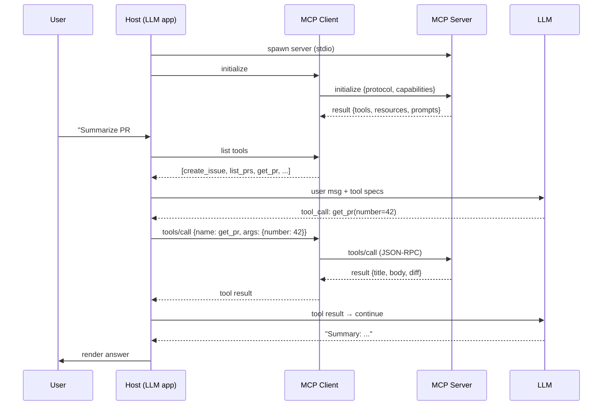

# MCP (Model Context Protocol)

## TL;DR

**MCP is USB-C for LLM tools.** Before MCP, every AI app invented its own way to connect a model to external systems (databases, file systems, GitHub, Slack). That meant N agents × M tools = N×M custom integrations. MCP defines a single open protocol where any MCP-compatible host (Claude Desktop, Cursor, your own app) can talk to any MCP **server** (a small program exposing tools, resources, or prompts) through a standard JSON-RPC interface. Build a server once, every host can use it.

> 💡 **Key Insight:** MCP is not a framework or a library — it's a **protocol**. Like HTTP, its value comes from everyone agreeing on the shape of the messages.

---

## The Mental Model

**Think of MCP like the Language Server Protocol (LSP) for AI.**

Before LSP, every editor (VS Code, Vim, IntelliJ) built its own integration with every language (Python, Go, Rust). LSP flipped the matrix: language authors write one LSP server, editor authors write one LSP client, and everything connects. MCP does the same for LLMs ↔ external tools.

| Real world (LSP) | MCP concept |
|------------------|-------------|
| VS Code, Vim, etc. (the editor) | **MCP host** (Claude Desktop, Cursor, your agent) |
| Python/Go/Rust language server | **MCP server** (GitHub server, Postgres server, Slack server) |
| LSP JSON-RPC protocol | MCP JSON-RPC protocol |
| "Go to definition" request | `tools/call` request |
| Syntax highlighting config | MCP `resources` |

---

## Why It Exists (Problem → Solution)

**Problem:** Every AI coding tool needs "read a file," "run a command," "search GitHub." Every app invented its own tool-calling interface. An MCP tool server you'd write for Claude Desktop didn't work with Cursor, and vice versa. The agent ecosystem was fragmented.

**What came before:**
- **Per-framework plugin systems** — LangChain Tools, OpenAI plugins, custom function-calling JSON. Each incompatible with the others.
- **Ad-hoc integrations** — every agent hard-coded its GitHub/DB/file access. Duplicate work, no reuse.

**What changed:** Anthropic released **MCP** in late 2024 as an open protocol. The analogy everyone used: *USB-C for AI*. Within a year, hosts (Claude Desktop, Cursor, Zed, Cline) and servers (filesystem, GitHub, Postgres, Slack, Puppeteer, hundreds more) adopted it. Today it's the default way to extend a coding agent.

---

## Core Concepts

### 1. Host, Client, Server

**One-liner:** Three roles. The host embeds an LLM, the client manages one server connection, the server exposes tools/resources.

**Analogy:** An editor (host) manages one LSP client connection per project, talking to one language server per language. MCP is the same pattern.

**Technical:**
- **Host** — the LLM app (Claude Desktop, Cursor, your custom agent). Runs the model.
- **Client** — a component inside the host. One client per server connection. Manages the JSON-RPC session.
- **Server** — a separate process. Exposes capabilities. Runs locally (stdio) or remotely (HTTP/SSE).

```
┌─────────────── Host (Claude Desktop) ───────────────┐
│  LLM  ←→  Client A ──stdio──→ Server (filesystem)   │
│           Client B ──http───→ Server (GitHub)       │
│           Client C ──stdio──→ Server (Postgres)     │
└─────────────────────────────────────────────────────┘
```

**Common misconception:** ❌ "MCP server = a big backend service." ✅ Usually a small local process (e.g., a Python/TypeScript CLI) launched by the host. Some are remote, but the common case is local.

---

### 2. Three Primitives: Tools, Resources, Prompts

**One-liner:** MCP servers expose three kinds of things — things the model *does* (tools), things the model *reads* (resources), things the model *says* (prompts).

| Primitive | What it is | Who controls | Example |
|-----------|------------|--------------|---------|
| **Tools** | Functions the model can call | Model-chosen | `run_sql(query)`, `create_issue(repo, title)` |
| **Resources** | Read-only data with a URI | Host/user-chosen | `file:///path/to/code.py`, `db://users/table` |
| **Prompts** | Reusable prompt templates | User-chosen | `/summarize-pr`, `/review-security` |

**Analogy:**
- Tools = verbs the intern can execute
- Resources = documents on their desk to reference
- Prompts = workflows on a stickie ("when user asks X, do Y")

**Common misconception:** ❌ "Tools and resources are the same thing with different names." ✅ Tools have side effects and are model-initiated. Resources are read-only data the host attaches to context.

---

### 3. Transport (stdio / HTTP)

**One-liner:** MCP speaks JSON-RPC over either **stdio** (local process) or **HTTP + SSE** (remote).

**Analogy:** Same conversation, different phone lines. Stdio is a direct intercom (same machine). HTTP/SSE is a phone call across the internet.

**Technical:**
- **stdio** — host spawns server as a subprocess, reads/writes JSON-RPC on stdin/stdout. Fast, secure, local only.
- **HTTP + SSE / Streamable HTTP** — server runs as a web service. Auth, scaling, multi-tenant.

**Rule of thumb:** Start with stdio. Go HTTP only when you need remote/shared access.

---

### 4. Capability Negotiation

**One-liner:** On connect, host and server exchange what they support — version, tools, resources, prompts, sampling.

**Analogy:** USB-C handshake — the cable and the device negotiate speed and power before data flows.

**Technical:** The first exchange is `initialize` with protocol version + capability lists. Either side can refuse if they can't match. No feature-sniffing hacks — capabilities are declared.

---

### 5. Sampling (Server → Model)

**One-liner:** A server can ask the host to run an LLM completion for it — letting the server use the host's model without embedding its own API key.

**Analogy:** The intern (server) asks their manager (host) to make a phone call on their behalf — the manager has the company phone, the intern doesn't need their own line.

**Technical:** Server sends a `sampling/createMessage` request. Host approves (with user consent), runs it, returns the completion. Enables server-side reasoning without every server needing provider credentials.

**Common misconception:** ❌ "Sampling is how the model calls tools." ✅ No — that's **tool calls**. Sampling is the *reverse*: a server asking the model for help.

---

### 6. Security & Trust Boundaries

**One-liner:** MCP servers run with the host's permissions and can read/write real things. Treat them like installed plugins, not web pages.

**Technical issues to know:**
- **Prompt injection via tool output** — a malicious server can return text that hijacks the agent ("now run `rm -rf`")
- **Token exfiltration** — servers see tool arguments, which may include secrets
- **Confused deputy** — the model acts on behalf of a server's instructions without user consent
- **Supply chain** — installing a random MCP server is installing code

**Mitigations:**
- User confirmation for destructive tools
- Allowlist servers; pin versions
- Scope credentials narrowly per server
- Treat tool outputs as untrusted input

**Common misconception:** ❌ "The sandbox protects me." ✅ Most hosts run servers with user-level file and network access by default. There is no sandbox unless you built one.

---

## How It Actually Works (Step-by-Step)

A typical conversation flow:



1. Host **launches** the configured MCP server (or connects to remote URL)
2. Host & server **handshake** via `initialize` — exchange protocol version + capabilities
3. Server advertises **tools / resources / prompts**
4. User asks something; host passes the tool specs to the LLM
5. LLM emits a **tool_call**; host forwards it to the server via the client
6. Server executes, returns result
7. Host feeds result back to LLM; loop until the LLM returns a final answer
8. User sees the response; full trace is logged

---

## Code in Practice

### Example 1: Minimal MCP server (Python, stdio)

```python
# pip install mcp
from mcp.server.fastmcp import FastMCP

mcp = FastMCP("demo")

@mcp.tool()
def add(a: int, b: int) -> int:
    """Add two numbers."""
    return a + b

@mcp.tool()
def word_count(text: str) -> int:
    """Count words in the given text."""
    return len(text.split())

@mcp.resource("greeting://{name}")
def greet(name: str) -> str:
    """A personalized greeting."""
    return f"Hello, {name}!"

if __name__ == "__main__":
    mcp.run()  # speaks stdio JSON-RPC
```

Register with Claude Desktop (`claude_desktop_config.json`):

```json
{
  "mcpServers": {
    "demo": {
      "command": "python",
      "args": ["/path/to/demo_server.py"]
    }
  }
}
```

### Example 2: Minimal MCP server (TypeScript)

```ts
// npm install @modelcontextprotocol/sdk
import { McpServer } from "@modelcontextprotocol/sdk/server/mcp.js";
import { StdioServerTransport } from "@modelcontextprotocol/sdk/server/stdio.js";
import { z } from "zod";

const server = new McpServer({ name: "demo-ts", version: "1.0.0" });

server.tool(
  "fetch_title",
  { url: z.string().url() },
  async ({ url }) => {
    const res = await fetch(url);
    const html = await res.text();
    const title = html.match(/<title>(.*?)<\/title>/i)?.[1] ?? "(no title)";
    return { content: [{ type: "text", text: title }] };
  },
);

await server.connect(new StdioServerTransport());
```

### Example 3: Using MCP programmatically as a client

```python
# Connect to a server, list its tools, call one
import asyncio
from mcp import ClientSession, StdioServerParameters
from mcp.client.stdio import stdio_client

async def main():
    params = StdioServerParameters(command="python", args=["demo_server.py"])
    async with stdio_client(params) as (read, write):
        async with ClientSession(read, write) as session:
            await session.initialize()
            tools = await session.list_tools()
            print("tools:", [t.name for t in tools.tools])
            result = await session.call_tool("add", {"a": 2, "b": 3})
            print("result:", result.content[0].text)

asyncio.run(main())
```

---

## Gotchas & Pitfalls

- ❌ "MCP is a framework for building agents." → ✅ It's a **protocol**. You still need an agent loop (or a host like Claude Desktop) to use servers.
- ❌ "If I add an MCP server, the model automatically knows how to use it." → ✅ Tool *descriptions* teach the model. Weak descriptions → weak tool use. Write them carefully.
- ❌ "Tools and resources are interchangeable." → ✅ Tools = actions (model-triggered). Resources = context data (host/user-selected). Don't collapse them.
- ❌ "Running someone's MCP server is safe because it's just JSON-RPC." → ✅ It's arbitrary code with your filesystem access. Vet servers like you'd vet a CLI.
- ❌ "I'll build my tool use directly against the Anthropic API — MCP is extra layers." → ✅ For one app and one tool, fine. As soon as you want to reuse tools across apps (or benefit from the ecosystem), MCP wins.
- ❌ "MCP competes with LangChain/LangGraph." → ✅ It complements them. LangGraph orchestrates agents; MCP is how those agents talk to external systems. Use both.
- ❌ "I need to deploy a server to use MCP." → ✅ The common case is a **local subprocess over stdio**. No deployment needed.

---

## When to Use / When NOT to Use

**Use MCP when:**
- You want to extend a coding/agent host (Claude Desktop, Cursor, Zed) with custom tools
- You're building an agent and want to reuse community servers (GitHub, filesystem, Postgres, Slack, etc.)
- You want to standardize tool integrations across multiple internal agents
- You want user-controlled, opt-in tool installation (server configs are per-user)

**Skip MCP when:**
- You're building a single app with a fixed set of tools — native function calling is simpler
- You need tight coupling with framework-specific features (e.g., LangGraph state passing in-process)
- Your "tool" is a pure in-process function that never needs to be shared
- Latency budget is razor-thin — MCP adds one IPC/network hop

---

## Production Notes

### Transport choice drives everything

| Transport | Typical latency overhead | Deploy model | Use when |
|-----------|--------------------------|--------------|----------|
| **stdio** | <5 ms | Child process of the client | Local dev tools, desktop agents, single-user CLIs |
| **HTTP (SSE/streamable)** | 20–100 ms LAN, 100–500 ms internet | Separate service | Multi-user, cloud-hosted, needs scaling/monitoring |

stdio is free but single-user and single-machine. HTTP costs a hop but gives you auth, rate limiting, horizontal scaling, and normal web ops.

### Cost

MCP itself is free — it's just a protocol. Costs come from:
- **What the tools do** (API calls, DB reads, compute) — unchanged vs rolling your own.
- **Token cost of tool definitions** — large MCP servers can add 1–3K tokens to every agent call. Mitigation: only register the tools this agent actually needs; cache the system prompt.

### Latency (p50 / p95)

| Step | stdio p50 / p95 | HTTP p50 / p95 |
|------|-----------------|----------------|
| Tool discovery (`tools/list`) | <5 ms / 20 ms | 30 ms / 200 ms |
| Tool call (excl. tool work) | <5 ms / 20 ms | 30–80 ms / 300 ms |
| Full tool round-trip | depends on the tool | depends on the tool |

The MCP overhead is rarely the bottleneck — the tool's own work (API calls, DB queries) dominates.

### Failure modes

- **Server crash / disconnect** — client must handle reconnect and tool re-discovery. Don't cache tool schemas forever.
- **Version mismatch** — client expects a tool that the server removed or renamed. Mitigation: semver your server, surface capabilities in `initialize`, feature-detect before calling.
- **Slow tool blocks the agent loop** — one hung tool freezes the whole agent. Mitigation: per-tool timeout (5–30 s typical) with a clear error back to the model.
- **Untrusted server** — a malicious MCP server returns prompt-injection payloads or exfiltrates your data. Mitigation: only run servers you trust; in production, isolate servers per-tenant; sanitize outputs before returning to the model.
- **Auth drift** — OAuth tokens expire mid-session. Mitigation: refresh-on-401 in the client transport layer.
- **Schema-validation failure** — tool returns the wrong shape. Mitigation: validate on both sides; return a structured error to the model so it can retry correctly.

### What to monitor (HTTP servers)

- **Connection error rate** — how often clients fail to initialize.
- **Per-tool call latency p50/p95** and **error rate** by tool name.
- **Active session count** and **session duration** (memory pressure signal).
- **Auth failure rate** per tenant.
- **Tool-schema change events** — any change should bump a version and trigger client re-discovery.

See [agents-tool-use.md](agents-tool-use.md) for how agents consume these tools and [../ml-ops/safety-guardrails.md](../ml-ops/safety-guardrails.md) for injection defenses.

---

## Related Concepts (The Map)

- **Tool use / function calling** — MCP is a **wire format** for function calling. The model-facing mechanics are the same.
- **LSP (Language Server Protocol)** — direct architectural ancestor. If you know LSP, you know MCP.
- **LangChain / LangGraph** — orchestration frameworks; MCP is how their agents can reach external tools in a standard way.
- **OpenAI plugins / ChatGPT actions** — earlier, vendor-specific attempts at the same problem; MCP is the open alternative.
- **Claude Agent SDK** — Anthropic's SDK for building agents; consumes MCP servers natively.
- **HTTP + REST** — parallel: REST standardized web APIs, MCP standardizes LLM ↔ tool APIs.

---

## Cheat Sheet

**Key terms:**
- **Host** — the LLM app (runs the model)
- **Client** — one connection manager inside the host
- **Server** — exposes tools/resources/prompts
- **Tool** — a callable function (model-initiated)
- **Resource** — readable data with a URI (user/host-attached)
- **Prompt** — reusable template
- **Sampling** — server asks host to run an LLM call
- **stdio** — default local transport (subprocess)

**JSON-RPC methods you'll see:**
```
initialize              handshake
tools/list              list tools
tools/call              invoke a tool
resources/list          list resources
resources/read          fetch a resource
prompts/list            list prompts
prompts/get             fetch a prompt
sampling/createMessage  server → host LLM request
```

**Remember this (top 3):**
1. **Protocol, not library.** MCP defines messages; many SDKs exist.
2. **Three primitives:** tools (actions), resources (data), prompts (templates).
3. **Trust matters.** A server has the host's permissions. Vet what you install.

---

## Self-Check Questions

1. What's the difference between a tool and a resource in MCP?
2. Why would you use MCP instead of just calling Anthropic's function-calling API directly?
3. What does "sampling" mean in MCP, and who initiates it?
4. Your host connects to 3 MCP servers. How many clients does it have?
5. Why is LSP the most accurate analogy for MCP?

<details>
<summary>Answers</summary>

1. **Tools** are actions the model decides to invoke — they can have side effects. **Resources** are read-only data with URIs that the host or user attaches to context. Different control flow (model-initiated vs. user/host-initiated) and different semantics (mutating vs. fetching).
2. Reuse and standardization. With direct function calling, every app reimplements GitHub/filesystem/Postgres tools. With MCP, a community server works across every compliant host, and you can publish your own internal servers to multiple internal agents.
3. Sampling is when the **server** asks the **host** to run an LLM completion. The server initiates; the host (with user consent) runs the model and returns the result. Lets servers do reasoning without their own API credentials.
4. Three — one client per server connection. Clients are 1:1 with servers.
5. Both solve the N×M integration problem with a single protocol. LSP: editors × languages. MCP: hosts × tools. Both use JSON-RPC, both have capability negotiation, both spawn local subprocesses as the default transport.
</details>

---

## Go Deeper

- **Official MCP spec (modelcontextprotocol.io)** — the source of truth; read the "Introduction" and "Architecture" sections first
- **Anthropic "Introducing MCP" announcement** — the rationale and original vision
- **MCP servers repo (github.com/modelcontextprotocol/servers)** — reference implementations; read one end-to-end (filesystem or GitHub) to internalize the patterns
- **Python SDK & TypeScript SDK docs (on modelcontextprotocol.io)** — tightest feedback loop: build a server in 15 minutes
- **"Why MCP is the USB-C of AI" — community blog posts and talks** — good for the "pitch it in 2 minutes" framing
