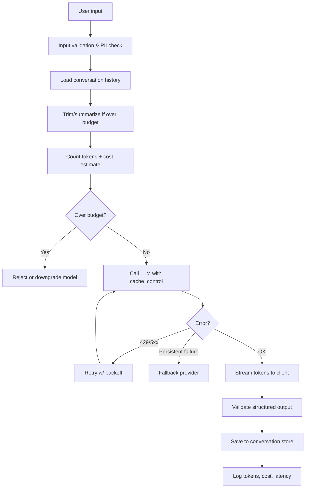

# Production LLM Patterns

## TL;DR

Shipping an LLM feature is easy. Shipping one that's **fast, cheap, reliable, and predictable** is a different job. Production LLM patterns are the techniques that turn a prototype into a system you'd put in front of real users — prompt caching to cut costs, streaming to cut perceived latency, structured outputs to stop string-parsing JSON, token budgeting to stay inside context windows, and multi-turn state to make conversations actually work.

> 💡 **Key Insight:** The model is only ~30% of a production LLM system. The other 70% is the plumbing around it — caching, retries, formatting, state, and cost control. That plumbing is what AI Engineers get paid for.

---

## The Mental Model

**Think of an LLM API call like a restaurant kitchen order.**

A naive app sends every ticket from scratch, waits for the entire meal to be plated, pays full menu price, and hopes nothing burns. A production app pre-preps common ingredients (caching), hands food out course-by-course (streaming), uses a standardized order format the kitchen can't misread (structured outputs), watches the pantry (token budgeting), and keeps a tab open per diner (multi-turn state).

| Real world (restaurant) | Technical concept |
|-------------------------|-------------------|
| Pre-chopped mise en place | Prompt caching |
| Serving courses as they're ready | Streaming responses |
| Printed order ticket format | Structured outputs / JSON mode |
| Pantry inventory check | Token counting / budgeting |
| Customer's running tab | Conversation state |
| Backup supplier when one's out | Provider fallback |
| Kitchen re-plating a dropped dish | Retry with backoff |

---

## Why It Exists (Problem → Solution)

**Problem:** A naive `client.messages.create(...)` call is expensive, slow, fragile, and stateless.
- Every call re-processes the full prompt → you pay for the same system prompt 10,000 times a day
- Users stare at a blank screen for 3–15 seconds → feels broken
- The model returns free-form text → you regex-parse JSON and it breaks weekly
- Long conversations blow the context window → the model "forgets" mid-session
- The API hiccups → your whole feature goes down

**What came before:** Early LLM apps (2022–2023) did all of this naively. They were demos, not products.

**What changed:** Providers added prompt caching (90% discount on cached tokens), streaming, structured outputs, and function calling. Engineers built reliability layers on top. Today, if your LLM feature doesn't use these, you're leaving money, speed, and reliability on the table.

---

## Core Concepts

### 1. Prompt Caching

**One-liner:** Tell the provider "this chunk of the prompt rarely changes — keep it warm so I don't pay full price every call."

**Analogy:** Like browser HTTP caching. The server (provider) holds a pre-computed version of your prefix. You get a ~90% discount on cached input tokens and lower latency.

**Technical:** Mark a prefix of your prompt (system instructions, long docs, few-shot examples) as cacheable. The provider stores the computed KV-cache for ~5 minutes. Subsequent calls that share that exact prefix reuse it.

```python
# Anthropic example — cache a long system prompt
import anthropic

client = anthropic.Anthropic()

response = client.messages.create(
    model="claude-sonnet-4-6",
    max_tokens=1024,
    system=[
        {
            "type": "text",
            "text": LONG_SYSTEM_PROMPT,  # e.g., 10K tokens of docs/rules
            "cache_control": {"type": "ephemeral"},  # cache this block
        }
    ],
    messages=[{"role": "user", "content": "What's the refund policy?"}],
)
# Second call with same system prompt → 90% cheaper input, faster TTFT
```

**Common misconception:** ❌ "Caching caches the *response*." ✅ Caching caches the *prompt computation* (KV-cache). The model still generates a fresh response; you just skip re-processing the prefix.

**When it pays off:** System prompts >1024 tokens, reused across many requests, within a short TTL window.

---

### 2. Streaming

**One-liner:** Send tokens to the user as they're generated instead of waiting for the full response.

**Analogy:** A printer that prints line-by-line vs. one that waits until the whole document renders. Same total time, but the user starts reading immediately.

**Technical:** Use the streaming endpoint. You get Server-Sent Events (SSE) back; each event contains a delta (new text). Time-to-first-token (TTFT) drops from 3–10s to ~500ms perceived.

```python
# Streaming with Anthropic SDK
with client.messages.stream(
    model="claude-sonnet-4-6",
    max_tokens=1024,
    messages=[{"role": "user", "content": "Write a haiku about caching."}],
) as stream:
    for text in stream.text_stream:
        print(text, end="", flush=True)  # render token by token
```

```tsx
// Frontend: Vercel AI SDK handles streaming for you
import { useChat } from 'ai/react';

function Chat() {
  const { messages, input, handleSubmit, handleInputChange } = useChat();
  // messages update as tokens arrive — no manual SSE parsing
  return (/* render messages */);
}
```

**Common misconception:** ❌ "Streaming makes it faster." ✅ It doesn't reduce total latency — it reduces *perceived* latency. Total tokens/sec is the same.

---

### 3. Structured Outputs (JSON Mode / Tool Use)

**One-liner:** Force the model to return valid JSON matching a schema you define — no more regex-parsing responses.

**Analogy:** A form with required fields vs. a free-text comment box. You *know* what you'll get back.

**Technical:** Define a JSON schema (or Pydantic/Zod model). The provider constrains generation to match it. Function calling is the same mechanism — the "function parameters" are your schema.

```python
from pydantic import BaseModel
import anthropic

class Classification(BaseModel):
    sentiment: str  # "positive" | "negative" | "neutral"
    confidence: float
    topics: list[str]

client = anthropic.Anthropic()

tools = [{
    "name": "classify",
    "description": "Classify a user review",
    "input_schema": Classification.model_json_schema(),
}]

response = client.messages.create(
    model="claude-sonnet-4-6",
    max_tokens=512,
    tools=tools,
    tool_choice={"type": "tool", "name": "classify"},  # force this tool
    messages=[{"role": "user", "content": "The UI is beautiful but it crashes."}],
)

result = Classification(**response.content[0].input)  # type-safe
```

**Common misconception:** ❌ "JSON mode guarantees valid JSON so I don't need validation." ✅ Still validate. Models can emit schema-valid JSON with semantically nonsense values (e.g., `confidence: 1.5`).

---

### 4. Token & Cost Management

**One-liner:** Know your token counts before you send, and log every call's cost.

**Analogy:** Watching a data plan on a phone. You stay cheap by knowing what you're spending in real time, not at the end of the month.

**Technical:** Use the provider's tokenizer to count before sending. Track input/output tokens per request. Aggregate cost per user / per feature / per day. Set hard caps.

```python
# Count tokens before sending
from anthropic import Anthropic
client = Anthropic()

token_count = client.messages.count_tokens(
    model="claude-sonnet-4-6",
    messages=[{"role": "user", "content": prompt}],
)
if token_count.input_tokens > 180_000:
    raise ValueError("Prompt too long — summarize or chunk first")
```

**Pricing (as of 2026) — ballpark, always verify current rates:**

| Model family | Input $/1M tok | Output $/1M tok | Cached input |
|--------------|----------------|-----------------|--------------|
| Claude Haiku  | ~$1   | ~$5   | ~90% off |
| Claude Sonnet | ~$3   | ~$15  | ~90% off |
| Claude Opus   | ~$15  | ~$75  | ~90% off |

**Common misconception:** ❌ "Bigger model = better, always use Opus." ✅ Use Haiku for classification/extraction, Sonnet for most generation, Opus only when the task genuinely needs it. 10x cost savings is easy to leave on the table.

---

### 5. Context Window Strategy

**One-liner:** Context windows are big but not infinite — and the model's attention degrades in the middle of long prompts.

**Analogy:** A giant whiteboard. Yes, it fits 200K tokens. But if you write an essay in the middle, nobody reads it — they read the top and the bottom ("lost in the middle" problem).

**Technical:** Strategies for long contexts:
- **Truncation:** Drop oldest turns (simple, loses history)
- **Summarization:** Replace old turns with an LLM-generated summary
- **Sliding window + pinned system:** Keep system prompt + last N turns
- **RAG:** Don't shove everything in context — retrieve the relevant bits
- **Hierarchical summarization:** Summarize summaries for very long sessions

```python
# Simple sliding window
def trim_history(messages, max_turns=10):
    # Keep system + last N user/assistant pairs
    return messages[-(max_turns * 2):]
```

**Common misconception:** ❌ "200K context = I can dump everything." ✅ Models have recency and primacy bias. Critical instructions go at the **start and end**. Middle = graveyard.

---

### 6. Multi-Turn Conversation State

**One-liner:** The API is stateless. *You* are responsible for remembering the conversation.

**Analogy:** A call center where every call goes to a different agent. The *customer* has to re-explain the context — unless you build a CRM that hands the agent the history.

**Technical:** Store messages in your database keyed by `conversation_id`. On each request, load history, append new turn, send to model, append response, save. Decide your trimming/summarization policy up front.

```python
# Minimal conversation store
class Conversation:
    def __init__(self, system_prompt: str):
        self.system = system_prompt
        self.messages: list[dict] = []

    async def send(self, user_msg: str) -> str:
        self.messages.append({"role": "user", "content": user_msg})
        resp = await client.messages.create(
            model="claude-sonnet-4-6",
            max_tokens=1024,
            system=self.system,
            messages=self.messages[-20:],  # sliding window
        )
        reply = resp.content[0].text
        self.messages.append({"role": "assistant", "content": reply})
        return reply
```

**Common misconception:** ❌ "The model remembers previous messages." ✅ It remembers **only what you send in the current request**. No magic session.

---

### 7. Retries, Fallbacks & Rate Limits

**One-liner:** Providers fail. Plan for it.

**Analogy:** A CDN with origin failover. Primary goes down → fail over to secondary → serve stale if needed.

**Technical:**
- **Retry with exponential backoff** on 429 (rate limit) and 5xx
- **Provider fallback:** If Anthropic is down, fail over to OpenAI with an adapted prompt
- **Circuit breaker:** Stop hammering a failing provider
- **Request coalescing:** De-duplicate identical in-flight requests

```python
import asyncio
from anthropic import Anthropic, RateLimitError, APIStatusError

async def call_with_retry(prompt: str, max_attempts=4):
    delay = 1.0
    for attempt in range(max_attempts):
        try:
            return await client.messages.create(
                model="claude-sonnet-4-6",
                max_tokens=1024,
                messages=[{"role": "user", "content": prompt}],
            )
        except (RateLimitError, APIStatusError) as e:
            if attempt == max_attempts - 1:
                raise
            await asyncio.sleep(delay)
            delay *= 2  # exponential backoff
```

---

> 🧠 **Quick recall — answer out loud before scrolling on** (all answers are above):
> 1. What exactly does prompt caching cache — the response or something else?
> 2. What does streaming change: total latency, perceived latency, or tokens/sec?
> 3. Why validate structured outputs even when the schema is enforced?
> 4. Where do critical instructions go in a long context, and why?
> 5. Edit one word at the START of your cached system prompt — what happens to cost?

---

## How It Actually Works (Step-by-Step)

A production request flowing through a well-built LLM stack:



1. **Validate input** — block obvious garbage, scan for PII/prompt injection
2. **Hydrate context** — pull conversation history from DB
3. **Trim** — apply your budget policy (sliding window, summarize, etc.)
4. **Budget check** — count tokens, estimate cost, abort if over
5. **Call model** — with cache markers on the stable prefix, streaming on
6. **Retry / fallback** — handle 429s and 5xx transparently
7. **Stream + validate** — send tokens to client, validate any structured output
8. **Persist** — save the new turn to conversation store
9. **Observe** — log tokens in/out, cost, latency, cache hit rate

---

## Code in Practice

### Example 1: Minimal production-shaped call

```python
import anthropic, time

client = anthropic.Anthropic()

def ask(prompt: str, system: str) -> dict:
    t0 = time.time()
    resp = client.messages.create(
        model="claude-sonnet-4-6",
        max_tokens=1024,
        system=[{
            "type": "text",
            "text": system,
            "cache_control": {"type": "ephemeral"},
        }],
        messages=[{"role": "user", "content": prompt}],
    )
    return {
        "text": resp.content[0].text,
        "input_tokens": resp.usage.input_tokens,
        "cached_tokens": resp.usage.cache_read_input_tokens,
        "output_tokens": resp.usage.output_tokens,
        "latency_ms": int((time.time() - t0) * 1000),
    }
```

### Example 2: Streaming + structured output + retry

```python
import anthropic, asyncio
from pydantic import BaseModel, ValidationError

class Answer(BaseModel):
    summary: str
    action_items: list[str]

client = anthropic.AsyncAnthropic()

async def structured_call(user_msg: str, attempts=3) -> Answer:
    last_err = None
    for i in range(attempts):
        try:
            resp = await client.messages.create(
                model="claude-sonnet-4-6",
                max_tokens=1024,
                tools=[{
                    "name": "respond",
                    "description": "Return summary + action items",
                    "input_schema": Answer.model_json_schema(),
                }],
                tool_choice={"type": "tool", "name": "respond"},
                messages=[{"role": "user", "content": user_msg}],
            )
            return Answer(**resp.content[0].input)
        except (ValidationError, anthropic.APIStatusError) as e:
            last_err = e
            await asyncio.sleep(2 ** i)
    raise last_err
```

### Example 3: Conversation with budget-aware trimming

```python
import anthropic

client = anthropic.Anthropic()
MAX_INPUT = 150_000  # stay well under model limit

class Chat:
    def __init__(self, system: str):
        self.system = system
        self.history: list[dict] = []

    def _fits(self, candidate: list[dict]) -> bool:
        count = client.messages.count_tokens(
            model="claude-sonnet-4-6",
            system=self.system,
            messages=candidate,
        )
        return count.input_tokens < MAX_INPUT

    def _trim(self) -> list[dict]:
        # Note: count_tokens is itself an API call, so in production you'd
        # cache per-message counts (content is immutable once appended) and
        # only re-count when history changes — not on every trim iteration.
        msgs = list(self.history)
        while msgs and not self._fits(msgs):
            msgs = msgs[2:]  # drop oldest user+assistant pair
        return msgs

    def send(self, user_msg: str) -> str:
        self.history.append({"role": "user", "content": user_msg})
        resp = client.messages.create(
            model="claude-sonnet-4-6",
            max_tokens=1024,
            system=[{"type": "text", "text": self.system,
                     "cache_control": {"type": "ephemeral"}}],
            messages=self._trim(),
        )
        reply = resp.content[0].text
        self.history.append({"role": "assistant", "content": reply})
        return reply
```

---

## Gotchas & Pitfalls

- ❌ "I'll add caching later." → ✅ Add cache markers from day one. Retrofitting means moving prompt structure around, which invalidates every cache entry.
- ❌ "Streaming is just a UX nicety." → ✅ It's also a **timeout avoider** — long responses without streaming hit gateway timeouts (30–60s).
- ❌ "Tool use is only for agents." → ✅ It's the cleanest way to get reliable structured output for *any* task — classification, extraction, scoring.
- ❌ "Temperature 0 = deterministic." → ✅ Not fully — kernel nondeterminism and load-balancing across GPU nodes still cause small variations.
- ❌ "Long context solved retrieval." → ✅ Stuffing 100K tokens costs 10×–100× more than a well-tuned RAG retrieval and performs worse on mid-context recall.
- ❌ "Log the prompt and response and I'm done." → ✅ Also log: model version, token counts (in/out/cached), latency, cost estimate, conversation_id, user_id. Without these, debugging is guesswork.
- ❌ "I'll use the biggest model to be safe." → ✅ Route by task complexity. Classification → Haiku. Chat → Sonnet. Hard reasoning → Opus. 5–10x cost swing.

---

## When to Use / When NOT to Use

**Use these patterns when:**
- You have any LLM feature going to real users
- Cost per request matters (i.e., always, once you scale past a demo)
- Latency matters (chat, search, autocomplete)
- You depend on structured output anywhere in the pipeline

**When you can skip some of them:**
- **Prototype or internal demo** — streaming/caching optional
- **Single-shot batch jobs** — streaming unnecessary
- **Tiny system prompts** — caching won't help (needs ~1K+ tokens)
- **Stateless classification** — no conversation state needed

---

## Production Notes

### Cost — what each pattern actually saves

| Pattern | Cost impact | Break-even |
|---------|-------------|-----------|
| Prompt caching | ~90% off cached input tokens | Pays off at >2 calls/5min against a stable ≥1K-token prefix |
| History trimming (sliding window + summary) | Linear reduction in input tokens | Always, past ~10 turns |
| Model tiering (Haiku for classify, Sonnet for generate) | 5–15× cheaper on classification steps | Always, when you have a routing step |
| Tool use / JSON mode | Fewer re-tries on format errors | Pays off if your current JSON-failure rate > 2% |

The biggest single-lever win is caching a stable system prompt. A 2K-token cached prefix across 50K Sonnet requests/day saves ~$250/day vs uncached.

### Latency — perceived vs actual

| Metric | What it is | How to move it |
|--------|-----------|---------------|
| TTFT (p50) | Time to first streamed token | Caching drops TTFT by 30–60% on long prompts |
| Full response | TTFT + (output tokens × ms/tok) | Smaller model, or fewer output tokens |
| Perceived latency | What the user feels | Streaming — halves perceived latency even if total is unchanged |

Target: TTFT p95 under 1.5 s on chat surfaces. Anything past 3 s and users think you're broken.

### Failure modes

- **Cache invalidation cascade** — someone edits a word in the cached prefix; cache hit rate crashes to 0% and cost doubles. Mitigation: golden-hash your cached prefix in CI.
- **History bloat OOM** — unbounded conversation grows past context window; request 400s. Mitigation: hard cap on turn count + summarize overflow.
- **Retry storm** — every client retrying a 5xx amplifies the outage. Mitigation: exponential backoff + jitter + circuit breaker (see [../ml-ops/reliability-patterns.md](../ml-ops/reliability-patterns.md)).
- **Partial stream** — stream dies mid-response; client renders a half-sentence. Mitigation: detect stream-end markers, resume or clearly error.
- **Tool-call loop** — model calls the same tool repeatedly with similar args. Mitigation: max-steps cap + dedupe identical calls.
- **Silent model drift** — provider ships a snapshot update, behavior shifts. Mitigation: pin versions, run evals on every bump.

### What to monitor

- **Cache hit rate** per endpoint (target >80% for stable workloads).
- **TTFT p50/p95** and **full-response p95**, per model and feature.
- **Retry count distribution** — rising p95 retries = upstream degrading.
- **Tokens-per-request distribution (in + out)** — output-side long tail = prompt bug.
- **$/request by feature** with a daily budget alert.
- **Format-validation failure rate** on structured outputs.

See [../ml-ops/llm-observability.md](../ml-ops/llm-observability.md) for how to wire these into Langfuse/Helicone, and [evals.md](evals.md) for guarding quality against regressions.

---

## Related Concepts (The Map)

- **RAG** — retrieval augmentation is *complementary* to these patterns; RAG decides *what* goes in the prompt, these patterns decide *how* you send it
- **Agents & Tool Use** — tool use is one of these patterns (structured output); agents stack multiple tool calls in a loop
- **Evals** — you need evals to know if a pattern change (new cache structure, trimmed history) degraded quality
- **LLM Observability** — the monitoring layer that surfaces whether your caching / retries / budgets are actually working
- **Rate limiting (web)** — if you know token bucket / sliding window from web backends, provider rate limiting is the same mental model

---

## Cheat Sheet

**Key terms:**
- **TTFT** — time to first token (streaming latency)
- **KV-cache** — the internal state reused by prompt caching
- **Context window** — max input+output tokens the model can handle
- **Tool use / function calling** — structured-output mechanism
- **Exponential backoff** — retry delay doubles each attempt

**The pattern in one glance:**
```
validate → load history → trim → budget check → call (w/ cache + stream)
         → retry/fallback on failure → validate output → persist → observe
```

**Remember this (top 3):**
1. **Cache the stable prefix.** System prompts and few-shot examples are ~90% cheaper when cached.
2. **Stream to the user, validate structured output.** Perceived latency drops, parsing bugs vanish.
3. **You own the state.** The API is stateless; conversation memory is your problem.

---

## Self-Check Questions

1. You add 3 new system-prompt rules at the top of your prompt and cache invalidation spikes. Why?
2. Your chat feature works great at 5 turns but hallucinates old facts at 50 turns. What's happening and how do you fix it?
3. A teammate says "streaming makes the model faster." What do you correct?
4. You switch from Sonnet to Haiku and quality drops on extraction tasks. Was that the wrong call?
5. Why is tool use sometimes a better choice than JSON mode for structured output?

<details>
<summary>Answers</summary>

1. Adding text at the *start* shifts every downstream token's position, so the cached KV-cache prefix no longer matches. Put new rules *before* or *after* your cacheable block, but keep the cached block byte-stable.
2. Context window pressure + "lost in the middle." Fix: sliding window, summarization of old turns, or RAG over chat history.
3. Streaming doesn't change tokens/sec or total latency — it only reduces *perceived* latency (TTFT).
4. Not necessarily. Use evals, not vibes — run both models against a golden set. If Haiku's F1 is acceptable, the 5–15x cost saving is worth it. If it's not, upgrade selectively.
5. Tool use gives the model a clearer semantic signal ("you are calling this function"), often produces better-grounded outputs, and supports richer schemas (nested objects, enums). JSON mode is simpler but blunter.
</details>

---

## Go Deeper

- **Anthropic docs — Prompt Caching** (docs.anthropic.com/en/docs/build-with-claude/prompt-caching) — authoritative on cache_control, TTL, pricing
- **"Lost in the Middle" — Liu et al. 2023** — empirical evidence that models ignore mid-context information; shapes how you order prompts
- **Vercel AI SDK docs** — best practical reference for streaming LLMs to a JS/TS frontend; your frontend background will make this feel familiar
- **OpenAI Cookbook — Production best practices** — provider-specific but the reliability patterns (retries, idempotency) transfer
- **Simon Willison's blog (simonwillison.net)** — continuously updated practitioner notes on what's actually working in production LLM work
