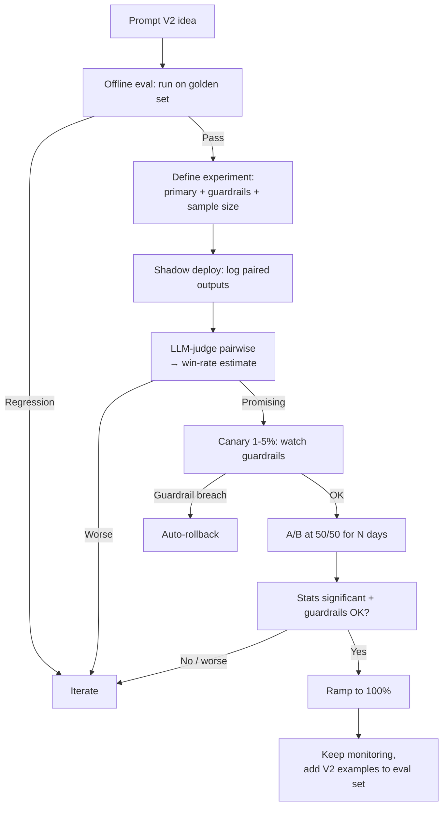

# LLM Experimentation (A/B Testing & Shadow Deploys)

## TL;DR

You can't prove a new prompt / model / retrieval strategy is *actually* better just by eyeballing evals — user behavior in production is the ground truth. **Experimentation** is the discipline of running **A/B tests**, **shadow deployments**, and **canary rollouts** to measure causal impact of changes on real users. You randomly split traffic between variants, track the same metrics on both arms (quality, cost, latency, user engagement), and decide with statistics — not vibes. Essential when the change is big (new model, new prompt architecture) or risky (safety, cost).

> 💡 **Key Insight:** Offline evals tell you if a change *could* be good. A/B tests tell you if it *is* good for real users. You need both. Offline catches regressions cheaply; online catches what your eval set didn't think of.

---

## The Mental Model

**Think of experimentation like a controlled drug trial.**

You have a new treatment (prompt V2). You don't just give it to everyone and hope — you give it to half the patients (treatment group), keep the other half on the old treatment (control group), measure outcomes on both, and run statistical tests to see if the difference is real or random noise. Only then do you "approve" it for everyone.

| Real world (clinical trial) | Experimentation concept |
|-----------------------------|-------------------------|
| Control group (old treatment) | Variant A (current prompt) |
| Treatment group (new drug) | Variant B (new prompt) |
| Random patient assignment | Hash-based user/session bucketing |
| Blinded observation | Same metrics pipeline on both arms |
| P-value, confidence interval | Statistical significance test |
| Early stopping for harm | Guardrail metrics + kill-switch |
| Dose escalation | Canary: 1% → 5% → 25% → 100% |

---

## Why It Exists (Problem → Solution)

**Problem:** You ship "improved" prompt V2. Overall pass rate on your eval set went from 87% → 91%. You deploy to 100% of users. A week later:
- CSAT dropped 6 points (users don't like V2's tone)
- Cost per conversation rose 30% (V2 is more verbose)
- Safety incidents doubled (V2 is looser with refusals)

Your eval set didn't cover any of those. **Real users reveal what tests miss.**

**What came before:**
- Deploy-and-pray — ship to everyone, watch dashboards, roll back if complaints spike
- Vibe-based decision-making — "seems better" without measurement

**What changed:** AI teams adopted the web-experimentation playbook — feature flagging, A/B assignment, guardrail metrics, early stopping — adapted for LLM-specific metrics (quality/cost/latency). Platforms like **Statsig, LaunchDarkly, GrowthBook, Optimizely** handle the plumbing; **Langfuse / Braintrust / LangSmith** integrate experiment tags with LLM traces.

---

## Core Concepts

### 1. A/B Testing (Online Experiment)

**One-liner:** Randomly split users between two variants and measure outcomes.

**Analogy:** Two identical pizza stores except one uses the new sauce recipe. Same menu, same location, same prices. After 1000 orders, which store gets more repeat customers?

**Technical essentials:**
- **Randomization** — deterministic hash of `user_id` → bucket (so same user sees same variant)
- **Primary metric** — the ONE thing you care about (task success rate, CSAT, revenue)
- **Guardrail metrics** — things that must not get worse (safety incidents, cost/call, latency P95)
- **Sample size** — how many users you need before stats are meaningful (varies with effect size + metric variance)
- **Power analysis** — before running, decide the minimum detectable effect you care about

```python
import hashlib

def assign_variant(user_id: str, experiment: str) -> str:
    key = f"{experiment}:{user_id}".encode()
    bucket = int(hashlib.sha256(key).hexdigest(), 16) % 100
    return "B" if bucket < 50 else "A"  # 50/50 split
```

**Common misconception:** ❌ "Run for 3 days and pick the winner." ✅ You need enough *events* for stats to be meaningful — could be days or weeks depending on traffic and effect size. Peeking early inflates false positives.

---

### 2. Shadow Deployment

**One-liner:** Run variant B in parallel with A but **don't show B's output to users** — compare them offline.

**Analogy:** An apprentice shadowing a surgeon. The apprentice does their own (silent) version of every decision; the mentor compares notes after. Nobody is harmed if the apprentice is wrong.

**Technical:** For each real request, send it to both A and B. User gets A's response. B's response is logged, scored by LLM-judge or stored for human review.

**When it shines:**
- First test of a risky new model
- Verifying cost/latency without user impact
- Collecting paired outputs (same input, both variants) → gold for pairwise LLM-judge

**Downside:** 2x cost (you run both). No behavioral signal (users never see B, so you don't learn CSAT impact).

```python
async def serve(user_msg: str, user_id: str):
    # Shadow: run both, user gets A, we log both
    a_task = asyncio.create_task(variant_a(user_msg))
    b_task = asyncio.create_task(variant_b(user_msg))
    a = await a_task
    try:
        b = await asyncio.wait_for(b_task, timeout=5.0)
        log_shadow(user_id, user_msg, a, b)
    except asyncio.TimeoutError:
        pass
    return a
```

---

### 3. Canary Rollout

**One-liner:** Gradually increase traffic to the new variant: 1% → 5% → 25% → 50% → 100%.

**Analogy:** Canary in a coal mine. You don't send the whole crew — you send the bird first and watch for trouble.

**Why it's different from A/B:** A/B tests run at a planned split for a fixed duration to compute stats. Canaries are about **safety** — early detection of catastrophic regressions. Often overlap: you canary at 5%, watch guardrail metrics, then expand to 50/50 for the A/B phase.

**Kill-switch criteria (decide BEFORE rollout):**
- Error rate > X% above baseline → auto-rollback
- Cost per request > Y% above baseline → alert
- CSAT thumbs-down rate > Z% → halt and investigate

---

### 4. Offline vs. Online Experiments

**One-liner:** Offline = eval-set-based, deterministic, cheap. Online = real-users-based, noisy, authoritative.

| | Offline | Online |
|---|---------|--------|
| Input | Golden dataset | Real production traffic |
| Metric | Eval scores | User behavior (CSAT, retention, task success) |
| Speed | Minutes | Days–weeks |
| Catches | Regressions on known cases | Distribution shift, UX, business metrics |
| Cost | Low | Moderate (2x traffic during run) |
| Runs when | Every prompt change | Major changes, risky changes |

**Use offline as a gate** (don't ship if offline regresses), **online as the final verdict** (ship only if online confirms lift).

---

### 5. Primary, Secondary, and Guardrail Metrics

**One-liner:** One metric to optimize, a few to watch for side effects, and hard guardrails that stop the experiment.

**Example — shipping a more helpful prompt:**
- **Primary:** task completion rate (↑ goal)
- **Secondary:** user thumbs-up rate, session length, re-engagement
- **Guardrails (must not regress):** safety incident rate, cost/conversation, P95 latency

**Rule:** If primary is up but a guardrail is breached, **don't ship**. You'd be trading measurable harm for measurable gain, often with hidden long-term cost.

---

### 6. Sample Size, Variance & Statistical Significance

**One-liner:** Enough data, or your "winner" is coin flips.

**Core idea:** every metric has variance. Differences below the noise floor don't mean anything.

**Practical rules of thumb:**
- **Binary metrics (pass/fail)** — need hundreds to low thousands of samples per arm for small effects (1–3 pp)
- **Continuous metrics (latency, cost)** — compute with t-test or bootstrap CI; trimmed means to deal with outliers
- **Never peek** and declare a winner — sequential testing inflates false positives. Pick a sample size, stop at it.
- Use **CUPED** / variance reduction techniques on high-variance metrics to detect smaller effects faster (advanced)

**Don't roll your own stats** — tools like Statsig, GrowthBook, Optimizely, or libraries like `pingouin`/`statsmodels` implement this correctly.

---

### 7. Pairwise (Side-by-Side) Preference Tests

**One-liner:** Give a judge (human or LLM) two outputs for the same input; ask which is better.

**Why it's useful:** pairwise comparisons are **easier and lower-variance** than absolute scoring. Humans agree on "A is better than B" more than on "A is a 4 out of 5."

**Patterns:**
- **Offline pairwise:** shadow deploy → collect paired (A, B) outputs → LLM-judge or human labels preference → compute win rate
- **Online pairwise (rare):** show both answers in the UI (with a disclaimer), let user pick — this is how Chatbot Arena works

**Gotchas:** **Position bias** (judges prefer the first option). Always randomize A/B order; consider running twice with swapped order.

---

## How It Actually Works (Step-by-Step)

Shipping a new prompt safely:



1. Generate hypothesis ("V2 is more helpful")
2. Run **offline evals** — must at least not regress
3. Define the **experiment** — primary, secondary, guardrail metrics; sample size
4. **Shadow deploy** first to compare paired outputs without user risk
5. **Canary** to 1–5% with auto-rollback guardrails
6. Expand to a real **A/B** (commonly 50/50) for the planned sample size
7. Analyze with stats — significance + practical effect size
8. Ramp to 100% if primary wins and guardrails hold
9. Post-launch: keep monitoring, add cases to eval set from any failures

---

## Code in Practice

### Example 1: Deterministic user bucketing

```python
import hashlib

def assign(user_id: str, experiment: str, splits: dict[str, int]) -> str:
    """splits like {'A': 50, 'B': 50} — must sum to 100."""
    bucket = int(hashlib.sha256(f"{experiment}:{user_id}".encode()).hexdigest(), 16) % 100
    cum = 0
    for variant, pct in splits.items():
        cum += pct
        if bucket < cum:
            return variant
    return list(splits)[-1]

# Same user → same variant every time
assign("user_42", "prompt_v2", {"A": 50, "B": 50})  # deterministic
```

### Example 2: Shadow deploy pattern

```python
import asyncio, logging

async def serve_with_shadow(user_msg: str, user_id: str) -> str:
    a = asyncio.create_task(call_variant_a(user_msg))
    b = asyncio.create_task(call_variant_b(user_msg))
    a_result = await a
    try:
        b_result = await asyncio.wait_for(b, timeout=10.0)
        logging.info("shadow", extra={
            "user_id": user_id, "input": user_msg,
            "a": a_result, "b": b_result,
            # downstream: LLM-judge scores this pair offline
        })
    except asyncio.TimeoutError:
        logging.warning("shadow b timed out")
    return a_result  # user sees A only
```

### Example 3: Simple significance test

```python
# Compare conversion rates between two variants
from statsmodels.stats.proportion import proportions_ztest

# A: 1024 sessions, 512 successes ; B: 1018 sessions, 571 successes
counts = [512, 571]
nobs = [1024, 1018]
z, p = proportions_ztest(counts, nobs, alternative="smaller")  # is A < B?
print(f"z={z:.2f}  p={p:.4f}")
# p < 0.05 → reject null, B is significantly better
```

### Example 4: Feature-flag-style experiment config

```python
# Using GrowthBook / Statsig-style SDK (pseudocode)
from feature_flags import experiment

variant = experiment.get(
    name="support_prompt_v2",
    user_id=user.id,
    default="A",
    attributes={"plan": user.plan, "region": user.region},
)

if variant == "B":
    system_prompt = PROMPT_V2
else:
    system_prompt = PROMPT_V1

# Log the assignment so your analytics pipeline can join exposure + outcomes
analytics.track("experiment_exposure",
                {"experiment": "support_prompt_v2", "variant": variant,
                 "user_id": user.id})
```

---

## Gotchas & Pitfalls

- ❌ "Peek at results, call the winner early." → ✅ Sequential peeking inflates false-positive rate. Pre-commit sample size; use sequential-testing corrections if you must peek.
- ❌ "50/50 for 2 days is enough." → ✅ Depends on effect size + metric variance. 2 days at 10K users may give huge power; 2 days at 100 users gives nothing. Run a power calc.
- ❌ "My primary metric went up, ship it." → ✅ Check guardrails. Cost + safety regressions often hide behind engagement gains.
- ❌ "User assignment via `random()` at request time." → ✅ Users would see different variants per request. Use deterministic hashing of user_id.
- ❌ "Shadow deploys are enough — I don't need A/B." → ✅ Shadow tells you the *output* differs. A/B tells you the *user behavior* differs. Different questions.
- ❌ "Our LLM judge scored B higher — done." → ✅ Judge bias (position, verbosity, self-preference). Validate against human labels on a sample. Randomize A/B order.
- ❌ "Experiment ended with no significant result, so it's a tie." → ✅ No signal ≠ equivalent. Could mean underpowered. Report the confidence interval, not just the p-value.
- ❌ "Ramp to 100% immediately after A/B wins." → ✅ Hold at 50/50 a bit longer for novelty-effect check; long-term metrics (retention) often lag.

---

## When to Use / When NOT to Use

**Run experiments when:**
- Changing the production model (Sonnet → Haiku, Claude → GPT)
- Rewriting a system prompt
- Changing retrieval strategy (chunk size, reranker, top-K)
- Introducing a new safety layer
- Anything where eval wins don't translate to confidence

**Skip / shortcut when:**
- Bug fixes with unambiguous improvement (broken → working)
- Very low traffic features (stats would never converge — rely on offline eval + judgment)
- Cosmetic prompt edits with no behavioral implication
- Internal tools with <10 users (ask users directly)

---

## Related Concepts (The Map)

- **Evals** — supply the offline gate before any online experiment; also the scoring mechanism for shadow deploys
- **LLM observability** — where you tag traces with experiment arm and slice metrics
- **Feature flags** — the mechanism for variant assignment and gradual rollout
- **Classical A/B testing** — same stats, same pitfalls, same platforms
- **Prompt versioning** — your "variants" are usually different prompt versions; version them as code
- **Multi-armed bandits** — dynamic traffic allocation toward the winning arm; appropriate when exploration cost is high (advanced alternative to fixed A/B)

---

## Cheat Sheet

**Key terms:**
- **Primary metric** — the one metric to optimize
- **Guardrail metric** — the metric that must not regress
- **Shadow deploy** — parallel run, user doesn't see B
- **Canary** — gradual ramp with safety-focused monitoring
- **A/B test** — randomized variant assignment, stats-driven decision
- **Pairwise preference** — judge A vs. B side-by-side
- **Power** — probability of detecting an effect if it truly exists
- **p-value / CI** — classical stats reporting

**Go-to tools:**
- **Feature flags / assignment:** Statsig, LaunchDarkly, GrowthBook, Optimizely, Unleash
- **LLM-tag integration:** Langfuse, Braintrust, LangSmith (tag traces with variant)
- **Stats libraries:** `statsmodels`, `scipy.stats`, `pingouin` (Python)
- **Pairwise LLM-judge:** custom, or frameworks like `promptfoo` and `inspect-ai`

**Rollout ladder:**
```
offline eval → shadow (0% to users) → canary 1-5% → A/B 50/50 → ramp 100%
     (eval gate)   (paired judge)      (safety)      (stats)     (retention watch)
```

**Remember this (top 3):**
1. **Offline gate, online verdict.** Evals prevent regressions; A/B proves lift.
2. **Guardrails veto the primary.** Never ship if safety / cost / latency regress.
3. **Commit to sample size before you start.** Peeking kills your p-values.

---

## Self-Check Questions

1. You run prompt V2 for 2 days. Primary metric up 3%, p = 0.08. Ship?
2. Why is deterministic hashing of user_id better than random assignment per request?
3. You have 100 users and want to A/B test a new prompt. What's a better strategy?
4. Your LLM judge says B wins pairwise 60/40. You ship. A/B test in prod shows no difference. What happened?
5. Primary metric up 5% but cost per request up 20%. Ship decision?

<details>
<summary>Answers</summary>

1. Don't ship yet. p = 0.08 is not significant at the usual 0.05 bar, and 2 days is likely underpowered. Extend the run to the pre-planned sample size. If p is still marginal, the effect may not be real.
2. Same user sees same variant across sessions — they'd experience a consistent product. Random assignment per request would flip variants mid-session, biasing any user-level metric and confusing users.
3. Skip A/B. At 100 users, you won't reach statistical power for realistic effect sizes. Use **offline evals** plus **qualitative feedback** from users. Consider pairwise preference from a small judge panel. Save A/B for after scale-up.
4. Judge bias — likely **verbosity** or **position** bias inflated B's win rate. Or B was genuinely better on a dimension the judge weighted but users don't care about (fluency > helpfulness). Validate judges against human labels, include a tone-matching rubric, randomize order.
5. Don't ship. Primary gain must outweigh cost, including long-term infra cost and margin impact. Compute revenue/cost ratio or bring to product + finance for an explicit call.
</details>

---

## Go Deeper

- **"Trustworthy Online Controlled Experiments" — Kohavi, Tang, Xu (2020)** — the definitive book on A/B testing; directly applicable to LLM apps
- **Ron Kohavi's blog + talks** — practical war stories on experiment design and pitfalls (peeking, guardrails, novelty effects)
- **Statsig / GrowthBook docs** — good pragmatic intros to stats + platform wiring; either is a solid pick for hands-on practice
- **"A/B testing at scale" — Microsoft / Airbnb engineering blogs** — industry case studies showing how guardrails are operationalized
- **Chatbot Arena (lmsys.org)** — live example of pairwise human-preference ranking of LLMs at scale; read their methodology notes
