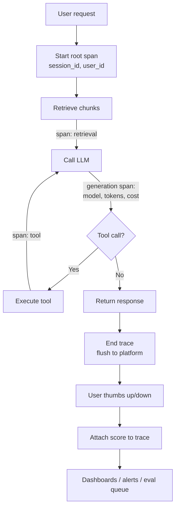

# LLM Observability

## TL;DR

**LLM observability = being able to answer "what the hell just happened?" for any AI-powered request in production.** It means capturing a full trace of every LLM call (prompt, response, model, tokens, cost, latency, errors), linking it to the user/session/feature that triggered it, and being able to search, aggregate, and debug across those traces. Tools like **Langfuse, Helicone, LangSmith, Phoenix/Arize** make this turnkey — they are to AI apps what Datadog is to web backends.

> 💡 **Key Insight:** Without observability, LLM debugging is forensic archaeology. *"User says the bot lied yesterday."* Which model? Which prompt version? Which retrieval chunk? Which tool call failed? Traces answer all of that in one click.

---

## The Mental Model

**Think of LLM observability like flight recorders (black boxes) on aircraft.**

Every flight records what the pilot did, what the instruments read, what the engines output, and what the flight computer decided — so when something goes wrong, investigators can reconstruct the full flight. An LLM trace is the same: every prompt, every retrieval, every tool call, every model response is recorded and linkable back to the user session that triggered it.

| Real world (aviation black box) | Observability concept |
|--------------------------------|----------------------|
| Cockpit voice recorder | Full prompt + response text |
| Instrument data | Tokens, latency, cost, model version |
| Flight path | Trace (session of linked spans) |
| One maneuver | Span (one LLM/retrieval/tool call) |
| Incident investigation | Trace search & replay |
| Fleet-wide pattern analysis | Aggregated dashboards |

---

## Why It Exists (Problem → Solution)

**Problem:** Something in your AI feature is wrong. A user complains. You check your web logs — you see the HTTP request. You see the response body. You have *no idea*:
- Which model version answered?
- What was in the system prompt at that moment?
- What RAG chunks were retrieved?
- Did any tool call fail silently?
- How many tokens did it cost?
- Why did it take 14 seconds?

**What came before:**
- `print(prompt); print(response)` — doesn't scale, no search, no structure
- Web-app APM (Datadog, Sentry) — designed for HTTP spans, no first-class awareness of tokens, prompts, embeddings, chains
- Raw DB dumps of every call — data exists, but no UX to debug a single user session

**What changed:** A generation of LLM-native observability platforms (Langfuse, Helicone, LangSmith, Phoenix/Arize) built first-class concepts for **traces**, **generations** (LLM spans), **retrievals**, **evals**, **costs**, and **prompt versions**. They speak OpenTelemetry so they integrate with your existing stack. Now it's a solved problem — if you use them.

---

## Core Concepts

### 1. Traces & Spans

**One-liner:** A **trace** is one end-to-end request; a **span** is one step inside it.

**Analogy:** A trace is a whole conversation; spans are individual utterances. A RAG-powered chat reply might be: `retrieve → rerank → LLM call → tool call → LLM call → render`. That's 1 trace, 6 spans.

**Technical:** Standard distributed-tracing model from OpenTelemetry. Each span has `start_time`, `end_time`, `attributes` (model, tokens, cost), `status` (ok/error), and a parent span ID (forming a tree).

```
Trace: user_query_abc123 (2.4s)
├── span: retrieve (120ms)       [chunks=8, top_k=20]
├── span: rerank (80ms)           [ranker=cohere]
├── span: llm_call (1800ms)       [model=claude-sonnet-4-6, in=3200, out=450]
│   └── span: tool_call: search_db (300ms)
└── span: render (50ms)
```

**Common misconception:** ❌ "A trace is just a log line." ✅ A trace is a tree of timed spans with typed attributes — much richer than a log line.

---

### 2. Generations (LLM-Specific Spans)

**One-liner:** A **generation** is a span that represents one LLM call, with LLM-specific fields.

**Technical fields unique to generations:**
- `model` — e.g., `claude-sonnet-4-6`
- `prompt` / `messages` — full input
- `completion` — full output
- `usage.input_tokens`, `usage.output_tokens`, `usage.cached_tokens`
- `cost_usd` — computed per provider pricing
- `temperature`, `top_p`, `max_tokens` — sampling params
- `time_to_first_token` (for streaming)

**Why it matters:** you don't want tokens/costs buried in generic "attributes" — you want them first-class so dashboards can aggregate cost per user, per feature, per model.

---

### 3. Sessions & Users

**One-liner:** Traces are grouped into **sessions** (a conversation) and tagged with a **user** (and optional metadata).

**Analogy:** Web analytics: pageview (trace) → session (visit) → user (account). Same hierarchy.

**Technical:** Every trace carries `session_id`, `user_id`, and free-form `tags`/`metadata` (feature, plan tier, experiment group). This lets you answer:
- "Show me all traces for user X yesterday"
- "What's the failure rate for the 'onboarding' feature?"
- "Is the 'free tier' burning more tokens than the 'pro tier'?"

---

### 4. Prompt Versioning

**One-liner:** Your prompt text is a **deployed asset** — version it and attach the version ID to every trace.

**Analogy:** Like source code commit SHAs. You'd never deploy without them; same for prompts.

**Technical:** Observability platforms support a prompt registry with versioned, named prompts. Your code fetches `customer_support_system_v7`, and every trace records that version. When quality drops, you can tie it to a specific prompt change.

```python
# Langfuse-style prompt management
prompt = langfuse.get_prompt("support_system", label="production")
messages = [{"role": "system", "content": prompt.compile(plan="pro")}]
# prompt.version is auto-attached to the trace
```

---

### 5. Cost & Latency Tracking

**One-liner:** Every request's cost and latency should be aggregatable by any dimension you care about.

**Analogy:** AWS Cost Explorer for LLM calls. Slice by user / feature / model / day.

**Technical:** Platforms auto-compute cost from tokens × provider pricing. Dashboards show:
- Cost per day / per user / per feature
- Latency P50 / P95 / P99
- Cache hit rate (cached vs uncached input tokens)
- Cost per successful resolution (with evals)

**Key metric unique to LLMs:** **time-to-first-token (TTFT)** for streaming endpoints. End-to-end latency alone hides perceived-latency regressions.

---

### 6. Linked Evals & Feedback

**One-liner:** Grades (from LLM-as-judge or users) attach to traces, turning observability into a quality signal source.

**Technical:**
- **Online evals:** run LLM-as-judge on a sample of production traces, score them, display scores alongside traces
- **User feedback:** thumbs up/down in your UI writes back to the trace
- **Annotation queues:** send ambiguous traces to humans for labeling; labels feed your golden dataset

This closes the loop: production failures become eval examples automatically.

---

### 7. OpenTelemetry (OTel) Compatibility

**One-liner:** OTel is the industry-standard tracing protocol; modern LLM observability platforms speak it.

**Why it matters:** Your web backend already traces via OTel (probably). LLM observability becomes part of the same trace tree — a single user action flows from HTTP request → DB query → LLM call → tool call, all linked.

**Semantic conventions:** OTel has standardized LLM attributes (`gen_ai.request.model`, `gen_ai.usage.input_tokens`, etc.) so different platforms interoperate.

---

## How It Actually Works (Step-by-Step)

Adding observability to an LLM feature:



1. **Start a trace** at the entry of the feature (HTTP handler, WebSocket message)
2. **Tag** with `user_id`, `session_id`, feature name, experiment group
3. **Wrap** each step — retrieval, LLM call, tool call — in a child span
4. **Capture** prompts, responses, tokens, cost on each span
5. **End** spans as steps complete, end the trace at the response
6. **Flush** asynchronously to the observability backend (non-blocking!)
7. **Attach** any post-hoc signals: user feedback, LLM-judge scores, eval results
8. **Dashboard / alert / debug** — that's the payoff

---

## Code in Practice

### Example 1: Langfuse — fastest to add

```python
# pip install langfuse anthropic
import os
from langfuse.decorators import observe, langfuse_context
from langfuse.anthropic import Anthropic  # drop-in wrapper

os.environ["LANGFUSE_PUBLIC_KEY"] = "..."
os.environ["LANGFUSE_SECRET_KEY"] = "..."

client = Anthropic()  # auto-instruments generations

@observe()
def answer_question(user_id: str, question: str) -> str:
    langfuse_context.update_current_trace(user_id=user_id, tags=["support"])
    resp = client.messages.create(
        model="claude-sonnet-4-6",
        max_tokens=512,
        messages=[{"role": "user", "content": question}],
    )
    return resp.content[0].text

answer_question("user_42", "What's your refund policy?")
# → trace with generation span, tokens, cost, latency auto-captured
```

### Example 2: Helicone — zero code change (proxy)

Helicone is a proxy — set one base URL and you're done:

```python
from anthropic import Anthropic

client = Anthropic(
    base_url="https://anthropic.helicone.ai",
    default_headers={
        "Helicone-Auth": f"Bearer {HELICONE_KEY}",
        "Helicone-User-Id": "user_42",
        "Helicone-Property-Feature": "support_bot",
    },
)
# Every request is now logged with tokens, cost, latency, tags.
# Zero application code changes beyond the constructor.
```

### Example 3: Manual OTel instrumentation (portable)

```python
from opentelemetry import trace
from opentelemetry.trace import Status, StatusCode

tracer = trace.get_tracer(__name__)

def answer(user_id: str, question: str) -> str:
    with tracer.start_as_current_span("answer_question") as root:
        root.set_attributes({
            "user.id": user_id,
            "feature": "support_bot",
        })
        with tracer.start_as_current_span("llm.generate") as gen:
            gen.set_attributes({
                "gen_ai.system": "anthropic",
                "gen_ai.request.model": "claude-sonnet-4-6",
                "gen_ai.request.max_tokens": 512,
            })
            try:
                resp = client.messages.create(...)
                gen.set_attributes({
                    "gen_ai.usage.input_tokens": resp.usage.input_tokens,
                    "gen_ai.usage.output_tokens": resp.usage.output_tokens,
                })
                return resp.content[0].text
            except Exception as e:
                gen.set_status(Status(StatusCode.ERROR, str(e)))
                raise
```

Send to any OTel backend: Langfuse, Phoenix, Honeycomb, Datadog, Jaeger.

---

## Gotchas & Pitfalls

- ❌ "I'll add observability after we ship." → ✅ Add it **before** the first user. Without it, early bug reports are unreproducible and you waste days.
- ❌ "Logging prompts and responses is enough." → ✅ You also need **linkage** (session/user), **costs**, **versions**, **tool calls**, and **search UX**. Raw logs in Loki/S3 don't give you that.
- ❌ "I'll send traces synchronously so nothing is lost." → ✅ Sync flushing blocks user-facing latency. Use **async batching** (all major SDKs do by default) and accept rare drops.
- ❌ "Full prompts in traces = no big deal." → ✅ Prompts often contain user PII. Apply **redaction/PII scrubbing** before export, and respect retention policy.
- ❌ "End-to-end latency is my latency metric." → ✅ For streaming, **time-to-first-token** matters far more for perceived UX. Track both.
- ❌ "I use LangChain, I'm covered by LangSmith." → ✅ Only if every call path goes through LangChain. Non-LangChain code paths need explicit instrumentation.
- ❌ "My platform handles eval + observability, so I don't need CI evals." → ✅ Online eval on production traces catches drift. **Offline eval on a golden set** catches regressions *before* deploy. Different jobs.

---

## When to Use / When NOT to Use

**Use LLM observability (always, basically) when:**
- You have any user-facing LLM feature
- You're iterating on prompts and need to tie quality changes to prompt versions
- You need to explain cost spikes
- You're debugging hallucinations / bad answers / user complaints
- You're running experiments (A/B) and need per-arm metrics

**You can skip (for now) when:**
- Pure one-shot script run from your laptop
- Very early prototype with no users (but add it *before* launch)
- Offline batch processing where you log directly to DB and don't need trace search

---

## Related Concepts (The Map)

- **OpenTelemetry** — the protocol; LLM platforms speak it. If you know OTel from web backends, LLM tracing is the same shape.
- **APM (Datadog/Sentry/New Relic)** — web-app analog; many now have LLM modules, or pair them with LLM-native platforms.
- **Evals** — observability collects the data; evals *score* the data. They compose.
- **Feature flags / experimentation** — use tags on traces to slice by experiment arm.
- **Prompt engineering** — prompt versioning in observability platforms is the infrastructure for disciplined prompt iteration.

---

## Cheat Sheet

**Key terms:**
- **Trace** — one end-to-end user request (tree of spans)
- **Span** — one step inside a trace
- **Generation** — a span specialized for an LLM call
- **Session** — group of related traces (a conversation)
- **TTFT** — time to first token (streaming latency)

**Platforms to know (pick one to be fluent in):**
- **Langfuse** — OSS + hosted, prompt mgmt + evals + traces, strong docs
- **Helicone** — proxy-first, zero-code integration, strong caching features
- **LangSmith** — tightest LangChain integration, first-party from LangChain
- **Phoenix (Arize)** — OSS, strong embeddings/RAG debugging, OTel native
- **Braintrust** — eval-first platform with observability alongside

**Dashboards you want on day one:**
```
• Cost per day (by model, feature, user)
• P50/P95/P99 latency (end-to-end + TTFT)
• Token usage trend (input/output/cached)
• Error rate (by error type)
• Eval score trend (from online LLM-judge sampling)
• Top-N most expensive traces / most erroring traces
```

**Remember this (top 3):**
1. **Trace everything, link by user/session.** Unlinked logs = useless at 3am.
2. **Version prompts like code.** Attach version IDs to every generation.
3. **Observability + evals are a flywheel.** Prod failures → eval set → fixes → better prod.

---

## Self-Check Questions

1. Your LLM feature's P50 latency looks fine but users say it feels slow. What metric are you probably missing?
2. A user reports the bot hallucinated yesterday. What's the minimum data you need in a trace to debug it?
3. Cost doubled last week. What dimensions do you slice by to find the cause?
4. Why is sending traces synchronously a footgun?
5. You have an OSS app with strict privacy requirements. What do you need to do before exporting traces?

<details>
<summary>Answers</summary>

1. **Time-to-first-token (TTFT)** for streaming endpoints. End-to-end latency can look healthy while TTFT has regressed — users perceive TTFT.
2. At minimum: full prompt (including system), full response, model + prompt version, retrieved chunks (for RAG), any tool calls + their outputs, timestamp, and the user/session IDs. Without any of those, debugging is guesswork.
3. Slice by **model** (did we upgrade?), **feature** (did one feature get more traffic?), **user/tier** (is one user abusing?), **prompt version** (did a new prompt balloon tokens?), **cache hit rate** (did caching break?). One of these almost always explains it.
4. It blocks user-facing latency and creates a hard dependency on the observability backend being up. Use async batching; rare drops are acceptable, latency spikes for users are not.
5. **PII redaction** before export, respect retention policies, consider self-hosted options (Langfuse, Phoenix support this), ensure DPA/contracts are in place with any SaaS platform.
</details>

---

## Go Deeper

- **Langfuse docs (langfuse.com/docs)** — the most comprehensive practitioner reference; covers traces, prompts, evals, datasets
- **OpenTelemetry GenAI semantic conventions** — official attribute names for LLM spans; enables portability across platforms
- **Helicone blog — "LLM Observability 101"** — good pitch + mental model piece
- **Phoenix by Arize — embedding/RAG debugging guide** — shows observability patterns specific to RAG (retrieval quality, chunk coverage)
- **"Emerging architectures for LLM applications" — a16z** — positions observability inside the broader AI app stack
