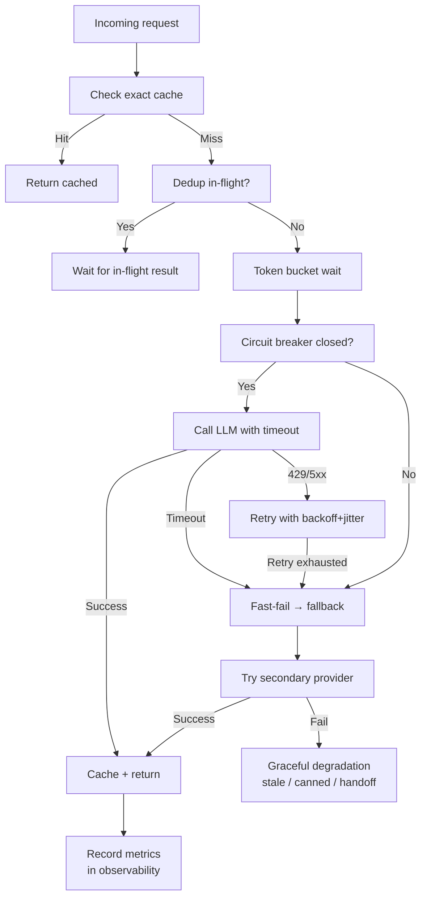

# Reliability Patterns for LLM Apps

## TL;DR

LLM providers go down, rate-limit you, return 5xx errors, and occasionally respond in 60 seconds when they usually take 2. **Reliability patterns** make your LLM app survive all of that without the user noticing. The core moves: **retries with exponential backoff + jitter**, **timeouts** at every layer, **rate limit handling** (bucket-aware), **provider fallback**, **circuit breakers** to stop hammering a dead dependency, **caching** (exact + semantic), and **request coalescing / idempotency**. These are not LLM-specific — they're standard distributed-systems patterns applied to a particularly flaky dependency.

> 💡 **Key Insight:** Your LLM provider is an external dependency with SLA like any other — except more expensive per call, slower to respond, and prone to capacity incidents. Engineer for it as you would for a flaky third-party API. Because that's what it is.

---

## The Mental Model

**Think of reliability patterns like a delivery service dispatching packages.**

One driver might be stuck in traffic (retry later), a depot might be closed (fallback to another), a route might be jammed (circuit break and reroute), a package might be duplicate (idempotency key), and a customer might tolerate a short delay but not a 10-minute wait (timeouts). Good dispatch keeps the customer happy without exposing any of this chaos.

| Real world (delivery) | Reliability pattern |
|-----------------------|---------------------|
| Stuck driver → try again | Retry with backoff |
| Depot closed → use another | Provider fallback |
| Route broken, stop sending | Circuit breaker |
| "Don't double-charge me" | Idempotency key |
| Package delay > 2h → cancel | Timeout |
| Same question twice → same answer | Cache |
| Two orders for same item | Request coalescing |

---

## Why It Exists (Problem → Solution)

**Problem:** Naive LLM code:
```python
response = client.messages.create(...)  # 💥 throws, app breaks
```
In production, this throws regularly: 429s during provider incidents, 5xx during rolling deploys, timeouts under load, context-window errors on edge cases. One call in every few thousand dies. At 1M calls/day, that's thousands of broken user experiences.

**What came before:**
- No handling → outages visible to users
- Blanket `try/except` → silent failures, no recovery, hidden bugs
- Aggressive retry loops → retry storms that make incidents worse (thundering herd)

**What changed:** The SRE playbook for reliability — decades old in web infra — now applies to LLM calls. Libraries like `tenacity` (Python), `cockatiel` (TS), `resilience4j` (Java) give you these patterns off the shelf. Modern LLM SDKs (Anthropic, OpenAI) ship with sensible default retries; you layer on fallback, circuit breaking, and caching yourself.

---

## Core Concepts

### 1. Retries with Exponential Backoff + Jitter

**One-liner:** When a call fails transiently, wait a bit and try again — each retry waits longer, with randomness.

**Analogy:** Calling someone whose line is busy. You don't redial instantly 50 times. You wait 30s, then 1min, then 2min. And if five other people are also trying, you each wait a *slightly different* amount so you don't all reconnect at once.

**Technical:**
- **Exponential backoff** — delay doubles each attempt: `base * 2^attempt`
- **Jitter** — add randomness so retries from many clients don't all sync up (the "thundering herd")
- **Retry only retryable errors** — 429 (rate limit), 5xx, connection/read timeouts. *Not* 400, 401, 403, 422 (client errors won't succeed on retry).
- **Cap attempts** — usually 3–5
- **Respect `Retry-After`** header when present

```python
import asyncio, random
from anthropic import AsyncAnthropic, RateLimitError, APIStatusError

client = AsyncAnthropic()

async def call_with_retry(**kwargs):
    for attempt in range(5):
        try:
            return await client.messages.create(**kwargs)
        except RateLimitError as e:
            retry_after = int(e.response.headers.get("retry-after", 0))
            delay = retry_after or min(2 ** attempt, 30)
        except APIStatusError as e:
            if e.status_code >= 500:
                delay = min(2 ** attempt, 30)
            else:
                raise  # don't retry 4xx
        delay *= 0.5 + random.random()  # jitter: 0.5×–1.5×
        await asyncio.sleep(delay)
    raise RuntimeError("exhausted retries")
```

**Common misconception:** ❌ "Just retry immediately — it's fast." ✅ Immediate retries of a failing service make the problem worse. Backoff + jitter are mandatory.

---

### 2. Timeouts (Per Layer)

**One-liner:** Set a timeout at every network layer. LLM calls can take 60+ seconds — without caps, a stuck call holds a connection forever.

**Analogy:** A kettle with no auto-shutoff. Most times it's fine. Occasionally it boils dry and burns down the kitchen.

**Technical:** Configure at every boundary:
- **Client SDK timeout** — per HTTP request
- **Async task / worker timeout** — outer cap on the whole job
- **Web handler timeout** — return a friendly error if the LLM is slow

```python
client = Anthropic(timeout=30.0)  # SDK-level
# or per-request:
resp = client.messages.create(..., timeout=30.0)
```

**Rule of thumb:**
- Non-streaming short replies: 30s
- Non-streaming long replies: 60–120s
- Streaming: no overall timeout, but an **inactivity timeout** (no tokens for 20s → abort)

---

### 3. Rate Limit Handling

**One-liner:** Providers rate-limit by requests/min, tokens/min, and daily token quotas. Treat limits as first-class, not exceptions.

**Patterns:**
- **Token bucket on your side** — pre-emptively throttle outbound calls under the provider's limit
- **Queue + backpressure** — incoming users wait in a queue when the bucket is dry
- **Tier-aware scheduling** — high-priority requests go to the front
- **Provider fanout** — split traffic across keys/accounts if contractually allowed

```python
# Rough token bucket (aiolimiter)
from aiolimiter import AsyncLimiter

# e.g., 1M tokens/min = 16,666/s; conservatively 10k/s bucket
token_limiter = AsyncLimiter(max_rate=10_000, time_period=1)

async def call_budget(prompt_tokens: int, **kwargs):
    await token_limiter.acquire(prompt_tokens)
    return await call_with_retry(**kwargs)
```

**Common misconception:** ❌ "The SDK retries on 429 so I'm covered." ✅ Blind retries on 429 burn more quota. Coordinate across your processes (Redis-based bucket) so you don't all hammer the limit simultaneously.

---

### 4. Provider Fallback

**One-liner:** When your primary provider is down, fall over to a secondary (different vendor, different model family).

**Analogy:** A restaurant with a backup gas supplier. When one line fails, service continues — food may taste slightly different, but guests eat.

**Technical:**
- Have adapters so the same "call LLM" interface works across Anthropic, OpenAI, Bedrock, Vertex
- On repeated failures from primary, route to secondary
- Feature-flag the fallback (off by default; on during incident)
- Accept **quality delta** — responses will differ; evals tell you if the fallback is acceptable

```python
PROVIDERS = [anthropic_call, openai_call, bedrock_call]

async def call_any(prompt: str):
    last = None
    for provider in PROVIDERS:
        try:
            return await provider(prompt)
        except (RateLimitError, APIStatusError) as e:
            last = e
            continue
    raise last
```

**Gotcha:** Prompts are not portable across providers without tuning. Run evals on each before trusting fallback in production.

---

### 5. Circuit Breaker

**One-liner:** After N consecutive failures, **stop trying** for a cool-down period — protects both you and the failing upstream.

**Analogy:** The electrical breaker in your house. When a circuit shorts, the breaker trips and stays open until you reset it. Otherwise the wires catch fire.

**States:**
- **Closed** — normal, requests go through
- **Open** — too many failures, fast-fail all requests
- **Half-open** — cool-down passed, send one probe request; success → closed, failure → open again

```python
# Simplified; use pybreaker or resilience4j in prod
import time

class CircuitBreaker:
    def __init__(self, max_fails=5, cooldown=30):
        self.max_fails = max_fails
        self.cooldown = cooldown
        self.fails = 0
        self.opened_at = 0

    def before(self):
        if self.fails >= self.max_fails:
            if time.time() - self.opened_at < self.cooldown:
                raise RuntimeError("circuit open — failing fast")
            self.fails = self.max_fails - 1  # half-open probe

    def on_success(self):
        self.fails = 0

    def on_failure(self):
        self.fails += 1
        if self.fails == self.max_fails:
            self.opened_at = time.time()
```

---

### 6. Caching (Exact + Semantic)

**One-liner:** Don't re-ask the model what it just answered.

**Three layers:**
- **Exact-match cache** — same prompt → same response. Keyed on a hash of `(model, messages, params)`.
- **Semantic cache** — "close enough" prompt → cached response. Keyed on embedding similarity. Lower hit quality but broader hits.
- **Provider-side prompt cache** — the stable-prefix KV-cache discount (see production-llm-patterns.md).

```python
import hashlib, json, redis

r = redis.Redis()

def cache_key(model: str, messages: list, params: dict) -> str:
    payload = json.dumps({"m": model, "msg": messages, "p": params},
                          sort_keys=True)
    return "llm:" + hashlib.sha256(payload.encode()).hexdigest()

def cached_call(model, messages, params):
    key = cache_key(model, messages, params)
    hit = r.get(key)
    if hit:
        return json.loads(hit)
    resp = call_with_retry(model=model, messages=messages, **params)
    r.set(key, json.dumps({"text": resp.content[0].text}), ex=3600)
    return {"text": resp.content[0].text}
```

**Gotchas:**
- Cache only when deterministic (`temperature=0`) or when variance doesn't matter
- Include personalization in the key (user_id / tier) or you'll cross-contaminate responses
- Never cache on shared keys when outputs contain PII
- Semantic cache can return **stale or wrong** answers; validate before trusting for critical paths

---

### 7. Request Coalescing / Idempotency

**One-liner:** If two identical requests come in at once, run one — return the same result to both. And if a user retries, don't duplicate side effects.

**Coalescing** (in-flight dedup):
```python
import asyncio

_inflight: dict[str, asyncio.Future] = {}

async def dedup_call(key: str, fn):
    if key in _inflight:
        return await _inflight[key]  # piggyback on existing call
    fut = asyncio.ensure_future(fn())
    _inflight[key] = fut
    try:
        return await fut
    finally:
        _inflight.pop(key, None)
```

**Idempotency keys** (for tool calls with side effects):
- Generate a UUID per user action
- Pass to downstream APIs that accept `Idempotency-Key`
- If the agent retries, the second call is a no-op

---

### 8. Graceful Degradation

**One-liner:** When the LLM can't answer in time, return *something useful* instead of an error.

**Patterns:**
- **Stale cache** — return the last known answer with a "this may be outdated" note
- **Smaller model** — primary fails → retry with Haiku / smaller model
- **Canned response** — "Sorry, our AI is busy — here's a relevant help article"
- **Human handoff** — route to support ticket queue

---

## How It Actually Works (Step-by-Step)

Request lifecycle through a resilient stack:



1. Exact cache check — return immediately on hit
2. Coalesce duplicate in-flight requests
3. Wait for token budget (rate limiter)
4. Check circuit breaker — fast-fail to fallback if open
5. Issue call with per-request timeout
6. Retry on 429/5xx with backoff + jitter, respecting `Retry-After`
7. On repeated failure, fall back to secondary provider
8. On fallback exhaustion, degrade gracefully (stale cache, canned, handoff)
9. Cache successful response; emit metrics (attempt count, latency, circuit state)

---

## Code in Practice

### Example 1: Production-shaped wrapper

```python
import asyncio, random, hashlib, json
from anthropic import AsyncAnthropic, RateLimitError, APIStatusError, APITimeoutError

client = AsyncAnthropic(timeout=30.0)

class LLMClient:
    def __init__(self, cache):
        self.cache = cache
        self.fails = 0
        self.breaker_open_until = 0

    async def call(self, model, messages, max_tokens=512, **kw):
        key = self._key(model, messages, kw)
        if (c := self.cache.get(key)):
            return c

        if asyncio.get_event_loop().time() < self.breaker_open_until:
            return await self._fallback(model, messages, max_tokens, **kw)

        for attempt in range(4):
            try:
                resp = await client.messages.create(
                    model=model, messages=messages,
                    max_tokens=max_tokens, **kw,
                )
                self.fails = 0
                out = {"text": resp.content[0].text, "usage": dict(resp.usage)}
                self.cache.set(key, out, ttl=3600)
                return out
            except (RateLimitError, APIStatusError, APITimeoutError) as e:
                if isinstance(e, APIStatusError) and e.status_code < 500:
                    raise
                delay = (2 ** attempt) * (0.5 + random.random())
                await asyncio.sleep(delay)

        self.fails += 1
        if self.fails >= 5:
            self.breaker_open_until = asyncio.get_event_loop().time() + 30
        return await self._fallback(model, messages, max_tokens, **kw)

    async def _fallback(self, *args, **kw):
        # Call OpenAI / Bedrock / canned response
        return {"text": "Our AI is temporarily unavailable. Please try again shortly.",
                "usage": {}}

    @staticmethod
    def _key(model, messages, params):
        payload = json.dumps({"m": model, "msg": messages, "p": params},
                              sort_keys=True)
        return "llm:" + hashlib.sha256(payload.encode()).hexdigest()
```

### Example 2: With `tenacity` (simpler)

```python
from tenacity import retry, stop_after_attempt, wait_random_exponential, retry_if_exception_type
from anthropic import RateLimitError, APIStatusError

@retry(
    reraise=True,
    stop=stop_after_attempt(4),
    wait=wait_random_exponential(multiplier=1, max=30),
    retry=retry_if_exception_type((RateLimitError, APIStatusError)),
)
def call(prompt: str):
    return client.messages.create(
        model="claude-sonnet-4-6",
        max_tokens=512,
        messages=[{"role": "user", "content": prompt}],
        timeout=30.0,
    )
```

### Example 3: Semantic cache with embeddings

```python
# Very sketched; real impls use vector DBs (e.g., Redis Vector, pgvector)
import numpy as np

SIM_THRESHOLD = 0.95
cache: list[tuple[np.ndarray, str]] = []  # (embedding, response)

def embed(text: str) -> np.ndarray:
    ...  # call an embedding model

def semantic_get(prompt: str) -> str | None:
    q = embed(prompt)
    for emb, resp in cache:
        if float(q @ emb) >= SIM_THRESHOLD:
            return resp
    return None

def semantic_put(prompt: str, resp: str):
    cache.append((embed(prompt), resp))
```

---

## Gotchas & Pitfalls

- ❌ "SDK retries are enough." → ✅ SDK retries handle per-request transients. They don't do circuit breaking, fallback, semantic cache, or rate-limit coordination across processes.
- ❌ "Retry everything." → ✅ Retrying 4xx (400/401/403/422) wastes budget and delays the real fix. Retry only transients.
- ❌ "Set a timeout of 5 min to be safe." → ✅ Long timeouts mask broken calls and pile up connections. Use realistic timeouts + inactivity timeouts on streams.
- ❌ "Cache everything." → ✅ Cache carefully. Personalized / time-sensitive / non-deterministic responses are dangerous to cache. Include user/session in keys.
- ❌ "Fallback to OpenAI — prompts are the same." → ✅ Behavior differs. Run evals on the fallback prompt + model and accept (or reject) the quality delta before enabling.
- ❌ "Once the circuit breaker opens, everything breaks." → ✅ That's the point — it *shouldn't* keep hammering. Pair it with fallback / graceful degradation so users still get *something*.
- ❌ "My app retries, but during incidents everyone retries and it gets worse." → ✅ You have a thundering-herd problem. Jitter + coordinated backoff + circuit breaker mitigate it.

---

## When to Use / When NOT to Use

**Always apply (even on small apps):**
- Timeouts at the SDK level
- Retry with backoff + jitter on transients
- Basic exact-match cache (very high ROI)

**Add when scaling:**
- Rate-limit coordination (multi-process / multi-region)
- Circuit breaker
- Provider fallback
- Semantic caching
- Request coalescing

**Skip / defer:**
- One-shot internal scripts — basic SDK retries are plenty
- Batch pipelines with relaxed latency — prefer correctness over aggressive retries
- Highly personalized outputs — skip cache (or carefully scope keys)

---

## Related Concepts (The Map)

- **Observability** — reliability patterns emit metrics (attempt counts, circuit state, fallback rate) — you debug them there
- **Production LLM patterns** — streaming, caching, cost management overlap heavily; reliability is the "keep it running" angle
- **SRE practices** — retries, circuit breakers, backoff are from classic distributed-systems playbooks (SRE book)
- **Web backend reliability** — same patterns you'd apply to any third-party HTTP dependency
- **Evals** — needed to *know* whether your fallback provider/model is acceptable quality

---

## Cheat Sheet

**Key terms:**
- **Exponential backoff** — delay doubles each retry
- **Jitter** — add randomness to prevent thundering herd
- **Circuit breaker** — stop calling failing dep for a cool-down window
- **Idempotency key** — dedupes side effects across retries
- **Request coalescing** — in-flight dedup of identical concurrent calls
- **Graceful degradation** — return *something* useful on failure
- **Retry-After** — provider's suggested wait time on 429

**Per-error playbook:**
```
429 (rate limit)   → backoff (respect Retry-After), check bucket, maybe fallback
500/502/503/504    → backoff + retry, then fallback
408 / Timeout      → retry once, then fallback; tighten caller timeout
400/401/403/422    → do NOT retry; surface real error
ContextLength      → trim / summarize and retry once
```

**Libraries:**
- **Python:** `tenacity` (retries), `aiolimiter` (rate), `pybreaker` / `purgatory` (circuit), `cachetools` / `redis` (cache)
- **TypeScript:** `cockatiel`, `p-retry`, `bottleneck`, `opossum` (circuit)

**Remember this (top 3):**
1. **Only retry transients.** Retry 429/5xx/timeouts; never 4xx.
2. **Timeouts at every layer** — SDK, worker, handler. Cap everything.
3. **Graceful degradation > hard failure.** A canned answer beats an error page.

---

## Self-Check Questions

1. You add retries with exponential backoff. During a real incident, traffic spikes and makes it worse. What's missing?
2. What's the difference between a circuit breaker and a rate limiter?
3. Why is it risky to cache LLM responses by prompt hash alone?
4. Your fallback provider is OpenAI. Tests pass but production quality tanks after failover. Why?
5. A user double-clicks a "send" button and two identical LLM-backed emails go out. What pattern would have prevented that?

<details>
<summary>Answers</summary>

1. **Jitter.** Without it, every client retries at the exact same intervals, creating synchronized spikes (thundering herd). Adding random jitter spreads retry attempts across the backoff window.
2. **Rate limiter** preemptively throttles outbound requests to stay within a budget (tokens/min). **Circuit breaker** reacts to observed failures — after N errors, it trips and fast-fails until a cool-down passes. They compose: rate limiter keeps you under quota; breaker protects you when the upstream is actually down.
3. Responses can be personalized (user context in system prompt), time-sensitive (prices, schedules), or non-deterministic (temperature > 0). Also, PII may land in the response — caching it under a shared key leaks across users. Always include relevant context (user_id, tier, time bucket) in the cache key, and only cache where determinism + non-sensitivity are safe.
4. Prompts don't transfer 1:1. Tone, instruction-following, refusal behavior, and structured-output quality differ across model families. Fix: adjust prompts per provider, and run evals on each to know the quality delta before production failover.
5. **Idempotency keys.** Generate a key per user action; the email-sending service dedupes by it. Also, **request coalescing** at your API layer for identical concurrent requests.
</details>

---

## Go Deeper

- **"The Tail at Scale" — Jeff Dean & Luiz André Barroso (2013)** — classic paper on why latency outliers dominate and how hedging/fallback help
- **AWS Architecture Blog — "Exponential Backoff and Jitter"** — the canonical short read; the Full Jitter algorithm
- **Google SRE Book — chapters on Overload, Cascading Failures, Handling Overload** — free online; every pattern here comes from these
- **OpenAI / Anthropic docs — rate limits and error handling** — provider-specific numbers, headers, behavior
- **`tenacity` library docs (Python)** — easiest way to add robust retries without writing the primitives yourself
