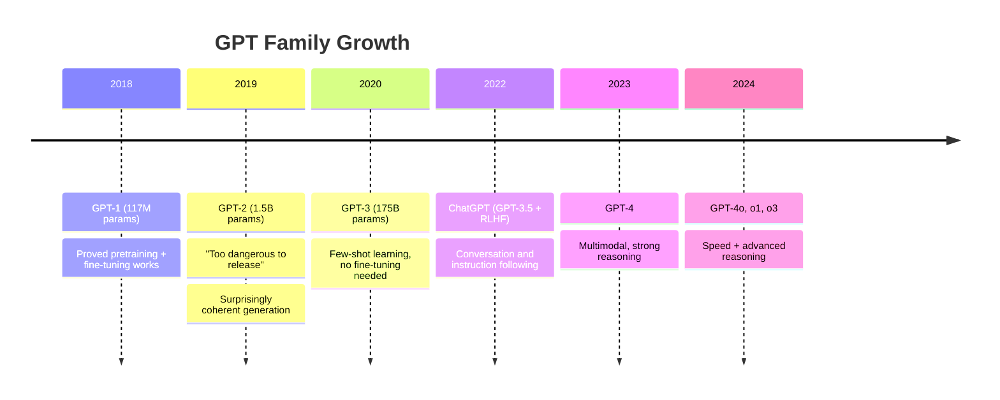

# GPT & Decoder Models

## 1. TL;DR

GPT-style models generate text by predicting **one token at a time, left to right**. They're pre-trained on massive text to learn language, then aligned with human preferences to be helpful. The key superpower is **in-context learning** — teach them new tasks with just a few examples in the prompt, no retraining. As an AI Engineer, you'll mostly call these via API (Claude, GPT-4) and control them with prompt engineering, temperature, and sampling parameters.

---

## 2. The Mental Model

> 💡 **Think of it like this:** GPT is like **autocomplete that actually understands you**.

Your phone's autocomplete suggests the next word based on the last few words you typed. GPT does the same, but it "read" the entire internet first — so when it predicts the next word, it can draw on everything from Shakespearean prose to Python documentation to medical textbooks.

| Real world | Technical concept |
|---|---|
| Phone autocomplete predicting the next word | GPT predicting the next token |
| Read 10,000 books before writing | Pre-training on 1T+ tokens |
| Professional training changing how you think | RLHF aligning behavior to human preferences |
| You can only read words you've already seen in a sentence | Causal (left-to-right) attention mask |
| SSE/streaming chunks arriving one at a time | Autoregressive token generation |

---

## Build the Intuition From Zero

The thing that surprises people: **"just predicting the next word" somehow produces reasoning, code, and essays.** How does so simple a goal create something so capable? And what does "autoregressive" actually mean mechanically?

### Idea 1: Generation = predict next token, append, repeat

A GPT only ever does one thing: given the text so far, output a **probability for every possible next token**, pick one, stick it on the end, and feed the whole thing back in. That loop is **autoregressive** ("regressing on its own output"):

```
"The capital of France is"        → next-token probs: {"Paris":0.92, "a":0.01, ...} → pick "Paris"
"The capital of France is Paris"  → next: {".":0.6, ",":0.2, ...}                    → pick "."
"The capital of France is Paris." → next: {<end>:0.8}                                → stop
```

Each step it sees only what came before (the **causal mask** — it can't peek ahead, because the future doesn't exist yet). That's the one mechanical difference from [BERT](bert.md), which sees both directions.

### Idea 2: Why "next word" forces real understanding

Here's the leap. To predict the next word *well* across the entire internet, you can't just memorize — you're forced to learn whatever the text depends on:

```
"The murderer turned out to be the ___"   → must track the whole plot to fill this in
"2 + 2 = ___"                              → must do arithmetic
"def add(a, b): return ___"                → must understand code
"The opposite of hot is ___"               → must know concepts
```

Predicting the next token in *all* human text means modeling the things that generate that text — facts, logic, syntax, cause and effect. Capability is a **side effect** of getting good at the prediction game on a hard enough dataset. Then a second phase (**RLHF**) nudges this raw predictor toward being helpful and following instructions rather than just continuing text.

### Idea 3: The temperature dial — how it picks

At each step the model has a *distribution* over next tokens. **Temperature** controls how boldly it samples:

```
temperature 0   → always take the most likely token   → deterministic, focused (good for code/facts)
temperature 0.7 → sample, mild randomness              → natural, varied (good for chat/writing)
temperature 1.5 → flatten the odds, take risks         → creative but often incoherent
```

> 💡 **One line:** a GPT just predicts the next token from everything before it, one at a time, in a loop — but doing that well across all human text forces it to learn facts and reasoning, and temperature tunes how predictable its choices are. As an AI engineer you mostly drive this via API + prompts; this is the engine under [prompt engineering](../llms/prompt-engineering.md) and [LLM fundamentals](../llms/llm-fundamentals.md).

---

## 3. Why It Exists

**The problem:** Before 2018, NLP models were task-specific — a spam classifier couldn't also do translation. Building every task required separate data collection, training, and deployment. Expensive and inflexible.

**What came before:** RNNs and LSTMs trained from scratch on each task. Earlier Transformers (like the original 2017 paper) were mostly used as encoder-decoders for translation.

**The insight:** What if you trained one huge language model on all the world's text, then fine-tuned it for tasks? GPT-1 (2018) proved this worked. GPT-2 (2019) showed it scaled dramatically. GPT-3 (2020) showed you barely even need fine-tuning — just describe the task in the prompt.

**What changed:** The AI field shifted from "train a model per task" to "prompt a foundation model." Every major chatbot, code assistant, and AI agent today descends from this architecture.

---

## 4. Core Concepts

### Autoregressive Generation

**One-line definition:** Generate text by predicting one token at a time, feeding each output back as the next input.

**Analogy:** Writing a story word by word, where each word you write becomes part of the context for the next word.

```
Input:  "The recipe for chocolate cake starts with"

Step 1: Input → predict "pre"
Step 2: Input + "pre" → predict "heating"
Step 3: Input + "pre" + "heating" → predict "the"
Step 4: Input + "pre" + "heating" + "the" → predict "oven"
...continues until [end] token or max_tokens reached
```

**Common misconception:** ❌ "GPT generates the entire response at once" → ✅ It generates one token at a time in a loop. That's why streaming works — the model genuinely produces tokens sequentially.

---

### Causal (Left-to-Right) Attention

**One-line definition:** Each token can only attend to itself and tokens before it — never future tokens.

**Analogy:** Reading a book where you're not allowed to peek ahead. You can only use what you've seen so far to understand the current word.

```
Sequence: "The cat sat on the mat"

Attention mask (✓ = can see, ✗ = cannot):
         The  cat  sat  on   the  mat
The:      ✓    ✗    ✗    ✗    ✗    ✗
cat:      ✓    ✓    ✗    ✗    ✗    ✗
sat:      ✓    ✓    ✓    ✗    ✗    ✗
on:       ✓    ✓    ✓    ✓    ✗    ✗
the:      ✓    ✓    ✓    ✓    ✓    ✗
mat:      ✓    ✓    ✓    ✓    ✓    ✓
```

This triangular mask is what makes training possible — you can train on all positions simultaneously during training, even though inference is sequential.

**Common misconception:** ❌ "Causal attention is a limitation of GPT" → ✅ It's intentional. Left-to-right attention is what makes generation possible. BERT's bidirectional attention means it can't generate — it would need to see the future tokens it's trying to generate.

---

### Pre-training + Alignment (3-Step Pipeline)

**One-line definition:** GPT goes from "text completer" to "helpful assistant" in three stages.

**Analogy:** Think of it like training a brilliant intern:
1. They read every book in the library (pre-training)
2. They practice following specific instructions with worked examples (instruction fine-tuning)
3. They get feedback from people about what "helpful" means and adjust (RLHF)

```
Stage 1: Pre-training (unsupervised)
  Data: ~1 trillion tokens of internet text
  Task: predict next token
  Result: knows facts, grammar, code, reasoning — but just completes text

Stage 2: Instruction Fine-tuning (supervised)
  Data: 10K-100K human-written (prompt, response) pairs
  Task: learn to follow instructions
  Result: responds to "explain X" instead of just completing the sentence

Stage 3: RLHF (Reinforcement Learning from Human Feedback)
  Data: human rankings of model outputs
  Task: learn which responses humans prefer
  Result: helpful, harmless, honest behavior
```

**Common misconception:** ❌ "ChatGPT is just a bigger language model" → ✅ The base GPT model is not ChatGPT. RLHF fundamentally changes behavior — the same weights, differently trained, refuse harmful requests and format responses helpfully.

---

### In-Context Learning

**One-line definition:** GPT can learn new tasks from examples written directly in the prompt — no weight updates required.

**Analogy:** Like a consultant who reads a briefing document and immediately applies its guidelines, without needing months of training.

```
Zero-shot (no examples):
  "Classify: 'The battery life is incredible' → "

Few-shot (with examples):
  "Classify:
  'Great product!' → positive
  'Terrible quality' → negative
  'Works perfectly' → positive
  'The battery life is incredible' → "

Chain-of-thought (show reasoning):
  "Q: A shirt costs $25, 20% off. Final price?
  A: Discount = 20% × $25 = $5. Price = $25 - $5 = $20."
```

Adding "Let me think step by step" to a prompt can improve accuracy on reasoning tasks by 20-40%.

**Common misconception:** ❌ "Few-shot examples update the model's weights" → ✅ No weights change. The model processes examples as context and pattern-matches at inference time. Weights only change during actual training.

---

### KV Cache (Why Streaming Is Cheap)

**One-line definition:** A memory optimization that stores attention's Keys and Values from previous tokens so the model doesn't recompute them at every generation step.

**Analogy:** Imagine writing a story where, before each new word, you had to re-read the entire story from the beginning. Exhausting. Instead, you keep a running summary in your head and just append the new word's context. The KV cache is that running summary.

```
Without KV cache (naive):
  Step 1: compute attention for 1 token  → 1 unit of work
  Step 2: compute attention for 2 tokens → 4 units  (recomputes token 1)
  Step 3: compute attention for 3 tokens → 9 units  (recomputes 1, 2)
  ...
  Total for N tokens: O(N³) — quadratic explosion

With KV cache:
  Step 1: compute K,V for token 1, store in cache       → 1 unit
  Step 2: compute K,V for token 2, append to cache      → 1 unit
  Step 3: compute K,V for token 3, append to cache      → 1 unit
  Total for N tokens: O(N²) — linear per step
```

**Why you care as an AI engineer:**
- **Streaming speed:** the fast token-by-token response you see in ChatGPT/Claude depends on KV caching. Without it, every new token would take longer than the last.
- **Prompt caching (Anthropic, OpenAI):** these APIs let you cache the KV for a large system prompt across requests — you pay full price once, then a fraction for reuses. Huge cost savings for RAG and agent systems.
- **Memory limits:** the cache grows linearly with context length. A 100K-token conversation needs a big KV cache — this is why long context is expensive even when the *response* is short.

**Common misconception:** ❌ "Long prompts are slow because the model 'thinks harder' about them" → ✅ Long prompts are slow because the prefill step (building the initial KV cache) is O(N²) in prompt length. Once the cache is built, each new generated token is cheap.

---

### Temperature & Sampling

**One-line definition:** Parameters that control how creative/random vs. focused/deterministic the output is.

**Analogy:** A temperature dial on a mood ring — low temperature = calm and predictable, high temperature = wild and random.

```
At each step, GPT outputs a probability distribution over all tokens:
  "The cat sat on the" → [mat: 40%, floor: 30%, rug: 20%, chair: 10%]

Temperature=0.0 (greedy): always pick highest prob → "mat" every time
Temperature=0.5 (focused): flatten distribution slightly, mostly picks "mat"
Temperature=1.0 (balanced): sample from original distribution
Temperature=2.0 (creative): flatten so random tokens become more likely → unpredictable

Top-p=0.9: only sample from the tokens that together sum to 90% probability
            In this case: [mat, floor, rug] — cut "chair" which is in the tail
```

**Common misconception:** ❌ "Temperature=0 is always best for accuracy" → ✅ For deterministic factual tasks, yes. But temperature=0 produces repetitive, boring text for creative tasks. Match temperature to the task.

---

### The GPT Evolution



**Key insight:** Each jump in scale unlocked **emergent abilities** nobody predicted — reasoning, code generation, multi-step planning. These weren't programmed; they appeared from scale.

---

## 5. How It Actually Works (Step-by-Step)

Let's trace generating "Paris" as the answer to "The capital of France is":

```
INPUT: "The capital of France is"

Step 1: Tokenize
  ["The", " capital", " of", " France", " is"]
  → [464, 3139, 286, 4881, 318]

Step 2: Embed each token
  Each token ID → 768-dimensional vector (from embedding table)

Step 3: Add positional encodings
  Position 0, 1, 2, 3, 4 → each gets a learned positional vector
  Summed with token embeddings

Step 4: Pass through 12 decoder layers (causal attention)
  Each layer: tokens attend to all PREVIOUS tokens only
  After 12 layers: each position has a rich contextual vector

Step 5: Final linear + softmax
  Take the LAST position's vector → project to vocab_size (50,257 for GPT-2)
  Softmax → probability distribution over all tokens
  Top entries: [" Paris": 0.72, " Lyon": 0.05, " Rome": 0.04, ...]

Step 6: Sample (or argmax)
  Temperature=0 → pick " Paris" (highest prob)
  Temperature=0.7 → sample (usually " Paris", sometimes " Lyon")

Step 7: Append " Paris" to input, repeat from Step 1
  New input: "The capital of France is Paris"
  → predict next token → "." → stop or continue
```

> 💡 **Key Insight:** The model never "knows" the answer to a question ahead of time. It computes a probability distribution over all possible next tokens, every single step. "Knowing" the capital of France means " Paris" gets very high probability after training on millions of sentences that mention it.

---

## 6. Code in Practice

### Minimal: Text generation with Hugging Face

```python
from transformers import pipeline

generator = pipeline("text-generation", model="gpt2")

result = generator(
    "The future of artificial intelligence is",
    max_new_tokens=50,
    temperature=0.7,
    do_sample=True,
)
print(result[0]['generated_text'])
```

### Practical: Using LLM APIs (what you'll do most as AI Engineer)

```python
import anthropic

client = anthropic.Anthropic()

message = client.messages.create(
    model="claude-sonnet-4-6",
    max_tokens=1024,
    messages=[
        {"role": "user", "content": "Explain attention mechanisms in 3 sentences."}
    ]
)
print(message.content[0].text)
```

### Real-world pattern: Few-shot classification with LLM

```python
import anthropic

client = anthropic.Anthropic()

def classify_support_ticket(ticket: str) -> str:
    prompt = f"""Classify the customer support ticket into one of: billing, technical, returns, other.

Examples:
Ticket: "I was charged twice for my subscription" → billing
Ticket: "The app crashes when I open settings" → technical
Ticket: "I want to return my purchase" → returns
Ticket: "What are your business hours?" → other

Ticket: "{ticket}"
→"""

    response = client.messages.create(
        model="claude-haiku-4-5-20251001",
        max_tokens=10,
        temperature=0,   # deterministic for classification
        messages=[{"role": "user", "content": prompt}]
    )
    return response.content[0].text.strip()

print(classify_support_ticket("My payment didn't go through"))  # → billing
```

---

## 7. Gotchas & Pitfalls

❌ **Using GPT for understanding tasks (classification, NER)** → ✅ GPT can do these via prompting, but fine-tuned BERT is faster and cheaper. Use GPT for generation; BERT for classification.

❌ **Setting temperature=0 for all tasks** → ✅ Temperature=0 for deterministic factual tasks (classification, extraction). Use 0.7 for balanced generation, 0.9+ for creative writing.

❌ **Ignoring context window limits** → ✅ GPT-4 has 128K tokens. Claude has 200K. Exceeding the limit silently truncates the BEGINNING of your context — your system prompt might disappear.

❌ **Not stopping generation properly** → ✅ Without `max_tokens` or `stop` sequences, models may ramble. Always set `max_tokens`. Use `stop=["\n\n"]` for short answers.

❌ **Treating GPT's output as ground truth** → ✅ LLMs hallucinate confidently. For factual questions, use RAG or verify with external sources. High confidence score ≠ accurate.

❌ **Sending entire documents in every request** → ✅ Context window costs tokens (= money). For RAG, retrieve only the relevant chunks, not entire documents.

❌ **Forgetting that few-shot examples count toward the context window** → ✅ Each example you include takes tokens. Balance example quality vs. quantity vs. context budget.

---

## 8. When to Use / When NOT to Use

### Use GPT-style models when:
- **Text generation** — chatbots, content creation, code generation
- **Flexible classification** — zero/few-shot without training data
- **Reasoning tasks** — multi-step problems, chain-of-thought
- **Summarization** — abstractive, high-quality summaries
- **Translation** — general-purpose, especially with LLM APIs
- **Instruction following** — when the task is hard to define with labeled examples

### Don't use GPT-style models when:
- **High-volume classification** with fixed labels — fine-tuned BERT is 10-100x cheaper per call
- **Real-time streaming features** requiring <100ms latency — LLM APIs add 500ms+ overhead
- **Offline/air-gapped environments** — if you can't call an API, you need to run a local model
- **Exact/deterministic outputs** — LLMs are probabilistic; for deterministic rules, use code

---

## 9. Related Concepts (The Map)

- **BERT (Encoder)** — the opposite pole. BERT understands; GPT generates. BERT is bidirectional; GPT is causal. If you know BERT, GPT is like BERT with the right half of its attention mask blacked out.
- **Prompt Engineering** — the core skill for using GPT models. Your prompts are effectively your "training data" for zero/few-shot learning.
- **RLHF** — the process that turns a raw language model into a helpful assistant. ChatGPT and Claude both use this. It's what makes models refuse harmful requests.
- **Fine-tuning LLMs** — when few-shot prompting isn't accurate enough, you fine-tune a decoder model on your data. LoRA/QLoRA makes this feasible on consumer GPUs.
- **AI Agents** — the next level: give a GPT model tools (web search, code execution, APIs) and a loop, and it becomes an agent that can accomplish multi-step tasks autonomously.

---

## 10. Cheat Sheet

| Model | Creator | Params | Access | Best For |
|---|---|---|---|---|
| **GPT-4o / GPT-5** | OpenAI | undisclosed | API | Best quality, general use |
| **Claude Opus / Sonnet** | Anthropic | undisclosed | API | Reasoning, long context, coding |
| **Llama 3.x 70B** | Meta | 70B | Open | Self-hosted, customization |
| **Mistral / Mixtral** | Mistral | 7B–8x22B | Open | Fast, cheap, good quality |
| **GPT-2** | OpenAI | 1.5B | Open | Learning, experimentation |

> Frontier labs (OpenAI, Anthropic, Google) don't publish parameter counts for their best models anymore — treat any "~XB" number you see online as a rumor, not a fact.

**Generation parameters:**
```python
temperature=0.0    # deterministic (classification, extraction)
temperature=0.7    # balanced default
temperature=1.0    # creative (stories, brainstorming)
top_p=0.9          # cut low-probability tail tokens
max_tokens=1024    # always set this
stop=["\n\n"]      # stop on double newline
```

**Remember this:**
1. GPT = generation (one token at a time, left to right)
2. In-context learning: examples in the prompt teach without training
3. KV cache makes streaming cheap and makes prompt caching a real cost lever
4. As an AI Engineer, you mostly call APIs — master prompting first

---

## 11. Self-Check Questions

1. Why does GPT generate tokens one at a time instead of all at once?
2. What's the difference between zero-shot, few-shot, and chain-of-thought prompting?
3. Why does temperature=2.0 produce incoherent text?
4. A friend says "I'll train a GPT model from scratch for my startup." What would you say?
5. What's the purpose of RLHF, and why can't you just use supervised fine-tuning alone?

<details>
<summary>Answers</summary>

1. GPT is autoregressive — it's trained to predict the next token given all previous ones. There's no mechanism to produce the entire sequence simultaneously because each generated token must condition on all previously generated tokens. This is a fundamental architectural constraint, not a performance limitation.

2. **Zero-shot**: just give the task description, no examples. **Few-shot**: include 3-5 input-output examples in the prompt so the model learns the pattern. **Chain-of-thought**: include reasoning steps in the examples (or ask the model to "think step by step"), which dramatically improves performance on multi-step reasoning tasks.

3. At temperature=2.0, the probability distribution is flattened so that even low-probability tokens become likely candidates. This means the model frequently samples from weird, unlikely continuations. Coherent text requires the model to mostly pick high-probability, contextually appropriate tokens.

4. Training GPT from scratch requires billions of dollars, thousands of GPUs, and terabytes of data. Instead: (1) Use an existing LLM API for most tasks, (2) fine-tune an open-source model like Llama 3 if you need customization, (3) use LoRA/QLoRA for cheap domain adaptation. "Train from scratch" is almost never the right move for a startup.

5. Supervised fine-tuning (SFT) teaches the model to follow instructions by training on (prompt, response) pairs. But it doesn't teach the model *what humans actually want* — a technically correct response can still be unhelpful, harmful, or verbose. RLHF adds a second stage where human raters rank responses, and those rankings train a reward model that guides further fine-tuning. This is what makes models helpful, harmless, and honest in ways SFT alone can't achieve.

</details>

---

## 12. Go Deeper

- **["Language Models are Few-Shot Learners" (Brown 2020 — GPT-3 paper)](https://arxiv.org/abs/2005.14165)** — the paper that changed everything. Shows in-context learning working at scale. Read Sections 1 and 3; the results speak for themselves.
- **[Andrej Karpathy's "Let's build GPT from scratch"](https://www.youtube.com/watch?v=kCc8FmEb1nY)** — 2-hour video building a mini-GPT in pure PyTorch. Best way to internalize how attention and autoregressive generation work. Essential for real understanding.
- **["Training language models to follow instructions" (InstructGPT paper)](https://arxiv.org/abs/2203.02155)** — explains how ChatGPT was built from GPT-3 using RLHF. Understand why the "alignment" step matters so much.
- **[Hugging Face Text Generation docs](https://huggingface.co/docs/transformers/generation_strategies)** — comprehensive guide to generation strategies (greedy, beam search, sampling, top-k, top-p). Essential for controlling model output.
- **[Simon Willison's LLM CLI tool](https://llm.datasette.io/)** — practical command-line tool for experimenting with dozens of LLMs. Great for developing intuition about different models' behaviors without writing code.
