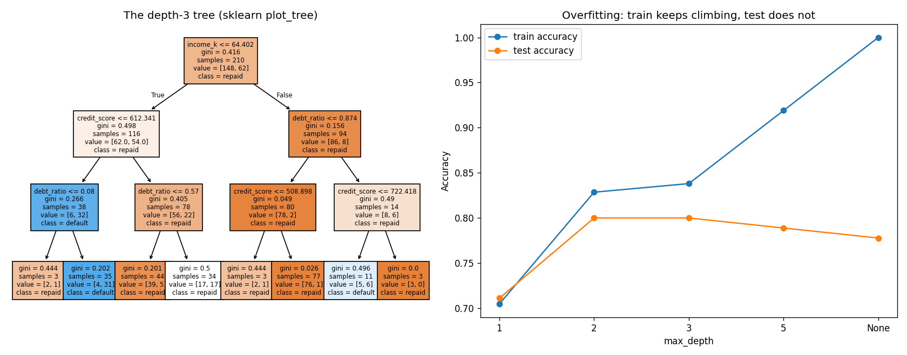

# Learn More Python by Building a Decision Tree

Part 3 of learning Python through ML. The first two parts were gradient descent twice over — this model is different: **no gradients, no learning rate, no scaling.** A tree just asks the most clarifying question, then asks again inside each answer. That "again inside each answer" is why this is the tutorial where you finally learn **recursion** — plus `collections.Counter`, self-referencing dataclasses, and `sorted(key=lambda)`.

**Theory companion:** [ml/decision-trees.md](../../../ml/decision-trees.md) — same loan dataset, same Gini numbers. Read it first.

**The final result:** [decision_trees.py](decision_trees.py)

**Want it harder?** [from-scratch.md](from-scratch.md) is the sequel: **no sklearn at all** — you replace the split, the depth sweep, `feature_importances_`, and the plots with your own code, and learn module imports, `defaultdict`, and recursion-with-accumulators doing it. This tutorial first, that one second.

```bash
# Run it (from python/ml-practice/):
uv run decision-trees/decision_trees.py
```

---

## Step 1 — The data: 6 loan applicants

```python
FEATURES = ["income_k", "credit_score"]
X_LOANS = np.array([[30, 600], [60, 750], [45, 680],
                    [25, 550], [80, 800], [35, 650]])
Y_LOANS = np.array([1, 0, 0, 1, 0, 1])    # 1 = defaulted, 0 = repaid
```

The exact dataset from the theory doc's worked example — chosen because one question (`income > 40K?`) splits it perfectly. Your code is about to *discover* that question on its own.

## Step 2 — Gini impurity with `collections.Counter`

```python
from collections import Counter

def gini(labels):
    counts = Counter(labels)              # {1: 3, 0: 3} — a dict of tallies
    n = len(labels)
    return 1.0 - sum((count / n) ** 2 for count in counts.values())
```

**`Counter`** is the stdlib's tally machine: feed it any iterable, get back a dict of counts. JS makes you write the `reduce((acc, x) => {acc[x] = (acc[x] ?? 0) + 1; ...})` dance; Python ships it. Also note `sum(... for ...)` — a **generator expression**: like a list comprehension but without building the list, fed straight into `sum`.

Real output, matching the theory doc's table exactly:

```
all one class  0.00   (pure)
50/50 mix      0.50   (maximally messy)
80/20 mix      0.32   (in between)
```

## Step 3 — The best question: brute force with a sentinel

The entire training algorithm of a decision tree is: *try every feature, every threshold, keep the split that leaves the least mess.*

```python
def best_split(X, y):
    best = (0, 0.0, float("inf"))             # sentinel: anything beats infinity

    for feature in range(X.shape[1]):
        values = np.unique(X[:, feature])     # sorted unique values
        midpoints = (values[:-1] + values[1:]) / 2   # thresholds BETWEEN data points
        for threshold in midpoints:
            mask = X[:, feature] <= threshold
            left, right = y[mask], y[~mask]   # ~ flips a boolean mask
            weighted = (len(left) * gini(left) + len(right) * gini(right)) / len(y)
            if weighted < best[2]:
                best = (feature, float(threshold), weighted)
    return best
```

New Python here:

- **`float("inf")` as a sentinel** — the "best so far" pattern. Anything is less than infinity, so the first candidate always wins; no special first-iteration case. (You met `inf` causing a bug in the linear from-scratch tutorial — here it's used *correctly*.)
- **`values[:-1] + values[1:]`** — slicing magic: the array minus its last element, plus the array minus its first, added element-wise = midpoints between neighbors. Worth staring at until it clicks.
- **`~mask`** — boolean NOT on a whole mask. `y[mask]` and `y[~mask]` are the two halves of the split.

Real output:

```
[income_k <= 40?]  → weighted Gini 0.00
→ a PERFECT split (Gini 0), exactly the theory doc's answer
```

Your nested loop found `income ≤ 40` — the midpoint between the $35K defaulter and the $45K repayer — with zero impurity on both sides. The theory doc *told* you this split; your code *derived* it.

## Step 4 — Growing the tree: recursion

A tree node is either a **question** (with two child nodes) or a **leaf** (with an answer). The children are trees themselves — the data structure refers to itself, and so does the code that builds it:

```python
@dataclass
class TreeNode:
    prediction: int | None = None
    feature: int | None = None
    threshold: float | None = None
    left: "TreeNode | None" = None       # ← the type refers to ITSELF
    right: "TreeNode | None" = None


def build_tree(X, y, depth=0, max_depth=3):
    # BASE CASES — when to stop asking and just answer:
    if len(set(y)) == 1:                       # pure group → answer
        return TreeNode(prediction=int(y[0]))
    if depth >= max_depth:                     # depth cap → answer with majority
        return TreeNode(prediction=majority(y))

    feature, threshold, weighted = best_split(X, y)
    if weighted >= gini(y):                    # no question helps → answer
        return TreeNode(prediction=majority(y))

    # RECURSIVE CASE — split, then grow each side the same way
    mask = X[:, feature] <= threshold
    return TreeNode(
        feature=feature, threshold=threshold,
        left=build_tree(X[mask], y[mask], depth + 1, max_depth),
        right=build_tree(X[~mask], y[~mask], depth + 1, max_depth),
    )
```

**Recursion, demystified:** `build_tree` calls itself on each half of the data. Every recursive function has the same skeleton —

1. **Base cases first** — the situations where you can answer immediately (pure group, depth limit, no useful question). Without them, infinite recursion.
2. **The recursive case** — do one step of work (find the best split), then trust the function to handle each smaller piece.

You've used this in JS for nested comments or file trees; here the *algorithm itself* is recursive, not just the rendering. Prediction and printing recurse the same way — `predict_one` walks one branch per question; `print_tree` indents with `"    " * depth` (string multiplication):

```
[income_k <= 40?]
  yes:
    → predict DEFAULT
  no:
    → predict repaid
new applicant $55K, 720 credit → repaid
new applicant $28K, 590 credit → DEFAULT
```

Both predictions match the theory doc's walkthrough. The quoted type hint `"TreeNode | None"` is a **forward reference** — the class is still being defined when the hint is read, so it goes in quotes. Also note `majority(y)` is one line of Counter: `Counter(labels).most_common(1)[0][0]` — the most common label, which is everything a leaf knows.

## Step 5 — Overfitting, measured (the depth sweep)

300 noisy synthetic applicants (income, credit score, debt ratio → probabilistic default), then the theory doc's depth experiment for real:

```
depth    1: train=70%  test=71%  gap=-1%
depth    2: train=83%  test=80%  gap=+3%
depth    3: train=84%  test=80%  gap=+4%
depth    5: train=92%  test=79%  gap=+13%
depth None: train=100%  test=78%  gap=+22%
```

Read the columns, not the rows: **train accuracy climbs forever; test accuracy stops at depth 2-3 and then falls.** The unconstrained tree scores 100% on training data by memorizing noise — and that memorization *costs* test accuracy. The gap column is the single most useful diagnostic in ML ([ml/model-evaluation.md](../../../ml/model-evaluation.md)), generated by your own loop.

(Python note: `depths: list[int | None] = [1, 2, 3, 5, None]` — `None` is a legitimate list element, and `str(None)` prints it; no special casing.)

## Step 6 — sklearn: a model you can read

```python
best = DecisionTreeClassifier(max_depth=3, random_state=42).fit(X_train, y_train)
print(export_text(best, feature_names=names))
```

```
|--- income_k <= 64.40
|   |--- credit_score <= 612.34
|   |   |--- debt_ratio <= 0.08
...
```

That's the trained model, printed as nested if/else — the "auto-generated routing code" from the theory doc's frontend bridge, literally on your screen. And feature importance, with one more new Python idiom:

```python
ranked = sorted(zip(names, best.feature_importances_),
                key=lambda pair: pair[1], reverse=True)
```

**`sorted(key=lambda ...)`** — exactly `arr.sort((a, b) => b[1] - a[1])`, except the key function returns *what to sort by* rather than comparing pairs. Output:

```
credit_score: 41%
    income_k: 34%
  debt_ratio: 25%
```

The plot puts both halves side by side — sklearn's `plot_tree` rendering of the depth-3 tree, and the overfitting scissors:



---

> 🧠 **Quick recall — answer out loud before the exercises** (all answers are above):
> 1. What does `Counter(labels)` return, and what JS dance does it replace?
> 2. The three base cases that stop the recursion — name them and what each prevents.
> 3. Why is the type hint written as `"TreeNode | None"`, in quotes?
> 4. What does `values[:-1] + values[1:]` compute and why are thresholds placed there?
> 5. Why does this model need no feature scaling and no learning rate?
> 6. In the depth sweep, which number tells you depth=None is overfitting — train, test, or the gap?
> 7. What does `key=lambda pair: pair[1]` do in `sorted`?

---

## Exercises

1. **Count the nodes:** write a recursive `count_nodes(node)` that returns the total number of nodes in the tree. (Base case: a leaf is 1. Recursive case: 1 + left + right.) Then grow the scratch tree on the 300-applicant data with `max_depth=20` and compare node counts at depths 3 vs 20 — overfitting, measured in nodes.
2. **`min_samples_leaf`:** add a `min_samples` parameter to `build_tree` — a new base case: if a split would leave either side with fewer than `min_samples` rows, make a leaf instead. Re-run the depth sweep equivalent: does the train/test gap shrink?
3. **Entropy variant:** implement `entropy(labels) = -Σ p·log2(p)` (use `math.log2`, skip zero counts) and swap it into `best_split`. Compare the trees — the theory doc claims they're nearly identical; verify.
4. **Tree depth, computed:** write recursive `tree_depth(node)` (leaf = 0; question = 1 + max of children). Confirm it never exceeds `max_depth`.
5. **The scratch tree vs sklearn:** fit your `build_tree` on the same 300-applicant training set (`max_depth=3`) and compute its test accuracy with the `accuracy` function from the logistic tutorial. How close do you get to sklearn's 80%?
6. **Stretch — predict in batch:** write `predict(node, X)` returning an array, using a list comprehension over rows. Then try writing it *without* recursion, using a `while` loop that walks the tree per row — some libraries do exactly this to avoid Python's recursion limit (`import sys; sys.getrecursionlimit()` — look it up, it's ~1000).

---

## What you learned

**Python:** `collections.Counter` (+ `.most_common`), recursion — base cases, recursive cases, recursive data structures — forward-reference type hints (`"TreeNode | None"`), `float("inf")` sentinels, generator expressions in `sum()`, `~mask` boolean negation, neighbor-midpoints via slicing, string multiplication for indentation, `sorted(key=lambda)`, `None` as a list element.

**ML (in your hands now):** Gini as a messiness score, training-as-search (try every question, keep the most clarifying), why trees need no scaling or learning rate, the train/test gap as the overfitting dial, depth as the first hyperparameter to tune, trees as readable models, and feature importance as "share of impurity reduction."

**Next:** [ml/random-forest.md](../../../ml/random-forest.md) for theory, then [../random-forest/](../random-forest/) — Part 4, where your `build_tree` + bootstrap sampling + a majority vote become a from-scratch random forest that fixes the +22% gap you just measured.
