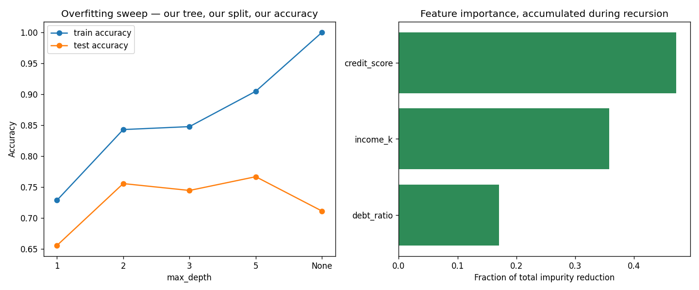

# Decision Trees From Scratch — sklearn Fully Benched

The [Part 3 tutorial](README.md) already built the *algorithm* by hand — Gini, `best_split`, the recursive `build_tree`. sklearn only supplied the workflow around it: the split, the depth sweep, `feature_importances_`, and the rendering. This sequel replaces those too, so **every number on screen comes from code you wrote.**

**The final result:** [decision_trees_from_scratch.py](decision_trees_from_scratch.py)

```bash
# Run it (from python/ml-practice/):
uv run decision-trees/decision_trees_from_scratch.py
```

What's new, Python-wise — three things Part 3 didn't teach:

| Concept | Where it appears |
|---|---|
| Importing **your own module** (+ why `if __name__ == "__main__"` exists) | Step 1 |
| `collections.defaultdict` + threading a mutable accumulator through recursion | Step 2 |
| `max()` over recursive calls, `[::-1]` reversal, `barh` charts | Steps 3–4 |

---

## Step 1 — Your own files are modules

```python
from decision_trees import TreeNode, best_split, gini, majority, make_loans, predict_one
```

No copy-paste. `decision_trees.py` sits in the same folder, so it imports like any library — your own code *is* a library the moment another file needs it.

**And here's the moment the `__main__` guard finally pays off.** Every script in this series ends with:

```python
if __name__ == "__main__":
    main()
```

When you *run* a file, Python sets `__name__` to `"main"` and the guard fires. When you *import* it, `__name__` is the module's name (`"decision_trees"`) and the guard stays silent — so this import pulls in the functions **without** running Part 3's entire demo. Without that guard, importing one tutorial would execute the other. (JS analogue: it's the `require.main === module` check, but idiomatic and everywhere.)

One honest footnote: importing `decision_trees` executes its top-level `import sklearn` lines — but none of sklearn's algorithms run. Everything computed below is ours.

## Step 2 — Feature importance: an accumulator threaded through recursion

This is the centerpiece. sklearn's `feature_importances_` looks like magic; the actual algorithm is one line of bookkeeping inside the tree builder:

> **Every time a node splits on feature *f*, credit *f* with the messiness it removed, weighted by how many rows it affected.** Sum over all nodes, normalize to fractions.

```python
def build_tree(X, y, depth=0, max_depth=3, importance=None):
    if importance is None:
        importance = defaultdict(float)      # missing keys auto-start at 0.0

    # ... same base cases as Part 3 ...

    feature, threshold, weighted = best_split(X, y)
    # the one new line: this split's impurity drop, credited to its feature
    importance[feature] += len(y) * (gini(y) - weighted)

    mask = X[:, feature] <= threshold
    return TreeNode(..., 
        left=build_tree(X[mask], y[mask], depth + 1, max_depth, importance),
        right=build_tree(X[~mask], y[~mask], depth + 1, max_depth, importance),
    )
```

Two Python lessons packed in here:

- **`defaultdict(float)`** — a dict where missing keys spring into existence with a default (`float()` is `0.0`). Kills the `if key not in d: d[key] = 0` boilerplate. JS analogue: there isn't one — it's the thing you fake with `(acc[k] ?? 0) + v`.
- **Threading a mutable accumulator.** Dicts pass by reference (like JS objects), so every recursive call writes into the *same* dict the caller owns. The recursion goes down 70 calls deep; when it returns, your one dict holds the totals. This pattern — "pass a collector through the recursion" — shows up everywhere from AST walkers to file-tree scanners.

Real output, rendered as a terminal bar chart (`"█" * round(frac * 40)` — string multiplication again):

```
credit_score:  47% ███████████████████
    income_k:  36% ██████████████
  debt_ratio:  17% ███████
```

Same *ranking* sklearn produced in Part 3 (credit > income > debt). The exact percentages differ — different train/test split (ours doesn't stratify), different tie-breaking — which is itself worth knowing: **feature importances are estimates that wobble with the data, not constants.** Trust rankings more than digits.

## Step 3 — Recursion utilities: measure the tree itself

If you did Part 3's exercises 1 and 4, you've already written these. They're three lines each, and they make overfitting *countable*:

```python
def count_nodes(node):
    if node.prediction is not None:        # a leaf counts as 1
        return 1
    return 1 + count_nodes(node.left) + count_nodes(node.right)

def tree_depth(node):
    if node.prediction is not None:        # a leaf adds no depth
        return 0
    return 1 + max(tree_depth(node.left), tree_depth(node.right))
```

`tree_depth` adds one small new move: **`max()` over recursive calls** — the depth of a tree is one more than its deeper child. Once base-case-plus-recursive-case is in your fingers, functions like these stop feeling clever and start feeling obvious. That's the goal.

## Step 4 — The sweep: overfitting, measured in nodes

The depth sweep from Part 3, now with zero sklearn — our split, our tree, our accuracy, plus the node count:

```
max_depth | train |  test |  gap | nodes
        1 |   73% |   66% |  +7% |     3
        2 |   84% |   76% |  +9% |     7
        3 |   85% |   74% | +10% |    13
        5 |   90% |   77% | +14% |    33
     None |  100% |   71% | +29% |    71
```

Read the last column with the first: to go from 90% to 100% *training* accuracy, the tree grew from 33 to **71 nodes** — and *test* accuracy fell from 77% to 71%. Those extra 38 nodes are memorized noise, and now you can literally count them. (`max_depth: int | None` with `None` meaning unlimited — handled by `if max_depth is not None and ...`, the standard optional-parameter idiom.)

The numbers differ slightly from Part 3's sklearn sweep (it showed +22% gap; ours shows +29%) — different split, different implementation details. The *shape* is identical, and the shape is the lesson.

The plot draws both panels with matplotlib alone — the sweep curve and a horizontal bar chart:

```python
ax2.barh(names[::-1], fracs[::-1])    # [::-1] = the whole list, reversed
```

**`[::-1]`** is slicing with a negative step — Python's `arr.toReversed()`. Needed here because `barh` draws bottom-up and we want the biggest bar on top.



---

> 🧠 **Quick recall — answer out loud before the exercises** (all answers are above):
> 1. Why doesn't importing `decision_trees` run Part 3's demo?
> 2. What does `defaultdict(float)` do on a missing key?
> 3. Why can a dict created by the caller end up holding totals written 70 recursive calls deep?
> 4. The importance formula in one sentence — what gets credited, weighted by what?
> 5. Why do our importance percentages differ from sklearn's, and what should you trust instead?
> 6. What does `[::-1]` do?

---

## Exercises

1. **Stratified split:** our `train_test_split` doesn't preserve the default/repaid ratio. Add `stratify` behavior: split the indices for each class separately, then concatenate (`np.concatenate`). Compare the class balance of `y_test` before and after.
2. **Importance sanity check:** add a `noise` feature — `rng.uniform(0, 1, n)`, unrelated to the labels — rebuild, and confirm it gets ~0% importance at depth 3. Then build with `max_depth=None` and watch the noise feature *gain* importance: overfitting, visible in the importance chart.
3. **The 20-line random forest:** the part 3 README promised it. Write `build_forest(X, y, n_trees=25)`: for each tree, sample `len(y)` row indices *with replacement* (`rng.integers(0, len(y), len(y))`), build a deep tree on that bootstrap sample, and predict by majority vote across trees (`Counter` again). Compare its test accuracy and gap to the single `max_depth=None` tree — you should see the +29% gap shrink. Theory: [ml/random-forest.md](../../../ml/random-forest.md).
4. **Leaves only:** write `count_leaves(node)` and verify `count_nodes == 2 × count_leaves − 1` (true for any binary tree — think about why).
5. **Module hygiene:** move the shared pieces (`gini`, `best_split`, `TreeNode`, …) into a third file `tree_core.py` and make *both* scripts import from it. You've just done your first refactor-into-a-shared-module — the most common real-world Python chore there is.

---

## What you learned

**Python:** your own files as importable modules, what `if __name__ == "__main__"` is actually for, `collections.defaultdict`, passing mutable accumulators through recursion, `max()` over recursive calls, optional parameters via `int | None`, `[::-1]` reversal, `barh` charts, terminal bars via string multiplication.

**Algorithms:** feature importance is just accumulated impurity drops (no magic), importances wobble with the data (trust rankings, not digits), overfitting is countable in nodes, and the workflow around a model — split, sweep, evaluate — is a few dozen lines you can own entirely.

**Next:** exercise 3 *is* the next tutorial in spirit — bootstrap + vote = random forest, the fix for the +29% gap. Theory first: [ml/random-forest.md](../../../ml/random-forest.md).
