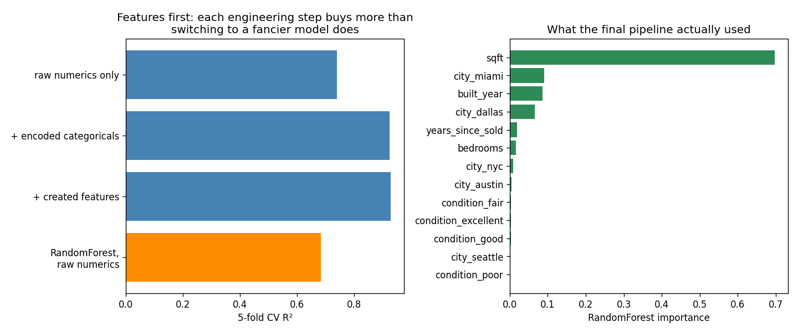

# Learn More Python by Building Feature Engineering

Part 12 — **the pandas part**, and the last stop on the ml-folder roadmap. Eleven parts ate clean NumPy arrays that a `make_*` function handed them; real work starts with a CSV full of strings, blanks, dates, and at least one row that cannot possibly be true. This part is the theory doc's end-to-end housing walkthrough executed: load → inspect → impute → encode → create → cap → pipeline, with `model.fit()` as the last 5%. The new Python is essentially **pandas itself**: `read_csv`, `isna`, `fillna`, `.map`, `get_dummies`, the `.dt` accessor, `groupby().transform`, `pd.cut`, `.clip`, `.assign` — plus sklearn's `ColumnTransformer` and `GridSearchCV`, the production wrapper this whole series has been building toward.

**Theory companion:** [ml/feature-engineering.md](../../../ml/feature-engineering.md) — the chopping board, the two sacred rules, the decision tree. Read it first.

**The final result:** [feature_engineering.py](feature_engineering.py) (~10s). It writes its own messy dataset to [houses.csv](houses.csv) on every run — open it and see the blanks.

```bash
# Run it (from python/ml-practice/):
uv run feature-engineering/feature_engineering.py
```

---

## Step 1 — Load and *look* before touching anything

```python
df = pd.read_csv(CSV_PATH, parse_dates=["last_sold"])   # strings → Timestamps
```

`parse_dates` turns `"2014-03-22"` strings into real `Timestamp` objects at load time (think `new Date(...)`, but for a whole column at once). Then the inspection ritual — three calls you'll run on every dataset for the rest of your career:

```
shape (600, 7)
missing per column: {'sqft': 27, 'last_sold': 76, ...}
city counts: {'seattle': 132, 'miami': 129, 'austin': 125, ...}
price: median $441,066, max $85,000,000  ← that max is no house
```

`df.isna().sum()` (count the blanks per column), `value_counts()` (the categorical census), `describe()`-style medians — and already the inspection has found the villain of Step 5: an $85M "house" sitting 190× above the median.

## Step 2 — Impute, and *confess* with an indicator

```python
df["sqft_was_missing"] = df["sqft"].isna().astype(int)   # confess first
df["sqft"] = df["sqft"].fillna(df["sqft"].median())      # then fill
```

```
27 blank sqft → filled with median 1982 (== SimpleImputer, asserted)
```

Two doc rules in two lines: **never fill with 0** (a 0-sqft house is a lie the model will believe) and **keep the missingness** — the flag column preserves "this was blank," which is itself sometimes signal. The assert shows `fillna(median)` is exactly what sklearn's `SimpleImputer(strategy="median")` does — pandas for exploration, the imputer for pipelines, same arithmetic.

## Step 3 — The encoding trap, finally *measured*

The doc's red=1/blue=2/green=3 warning has been theory since the series began. The dataset was built to make it measurable: the five cities' price effects are deliberately scrambled relative to alphabetical order. Now encode `city` both ways and let cross-validation judge:

```
city as 0..4 codes:  R² = 0.739   (model forced to believe austin < dallas < miami...)
city one-hot:        R² = 0.912   (each city its own column)
```

And here's the detail worth savoring: **raw numerics alone also score 0.739** — the city codes added *literally nothing*. A column holding real signal (one-hot is worth +0.17 R²!) was rendered exactly as useful as not existing, just by numbering it. That's the trap: not an error message, not a crash — silently wasted information.

The tools: **`.astype("category").cat.codes`** is how you'd label-encode (now you know when not to), **`pd.get_dummies`** is one-hot in one call (asserted equal to sklearn's `OneHotEncoder`), and **`.map({"poor": 1, "fair": 2, ...})`** handles `condition` — which *is* ordered, so ordinal encoding is correct there. The doc's test, applied: *does arithmetic on these numbers mean anything?*

## Step 4 — Created features: questions, encoded as columns

The doc's rule — if you can ask the question, encode the answer:

```python
df["house_age"] = 2026 - df["built_year"]
df["years_since_sold"] = (TODAY - df["last_sold"]).dt.days / 365.25   # Timestamp math
df["sqft_per_bedroom"] = df["sqft"] / df["bedrooms"]                  # a ratio
df["sqft_vs_city"] = df["sqft"] / df.groupby("city")["sqft"].transform("mean")
df["age_bucket"] = pd.cut(df["house_age"], bins=[0, 10, 30, 60, 130],
                          labels=["new", "modern", "older", "historic"])
```

- **The `.dt` accessor** unlocks date parts and arithmetic on a whole column (`.dt.days`, `.dt.year`, `.dt.dayofweek`) — subtracting two date columns gives a `Timedelta` column, no loop.
- **`groupby().transform("mean")`** is Part 9's `groupby().mean()` with a crucial difference: `transform` returns a value *per row* (each house gets its own city's average), not one row per group — which makes "is this big *for its city*?" a single division.
- **`pd.cut`** bins a numeric column into labeled categories — the doc's binning pattern, and the right tool when an effect is step-shaped rather than linear (this data has a modern-build premium hiding at `built_year ≥ 2000`).

These aren't decoration: the data generator includes a cramped-layout penalty keyed on exactly `sqft/bedrooms` and a renovation effect keyed on sale recency. A linear model can't invent ratios or steps — you hand them over, or it never sees them.

## Step 5 — One typo'd mansion vs the IQR fence

```
IQR fence at $914,539 → 1 row(s) beyond it, worst: $85,000,000
Ridge CV R², price raw:    -6.466  (one fake row poisons the squared loss)
Ridge CV R², price capped:  0.912  (.clip at the 99th percentile)
```

Read that first number again: **R² of −6.5** — from *one row* in six hundred. Part 1 taught why (squared loss makes big misses scream); here's the production consequence: a single data-entry error made the entire model worse than predicting the mean. The IQR fence (`Q3 + 1.5×IQR`, via `np.percentile`) finds it, **`.clip(upper=...)`** caps it, and R² resurrects to 0.912. With the doc's crucial caveat kept loud: cap *typos*, not *phenomena* — in fraud and churn, the outliers are the target.

## Step 6 — The ladder, then the leak-free pipeline

The doc's boldest claim — *good features beat fancy models* — as four bars:

```
Ridge, raw numerics only        R² = 0.739
Ridge, + encoded categoricals   R² = 0.925
Ridge, + created features       R² = 0.929
RandomForest on raw numerics    R² = 0.684   ← fancy model, garbage inputs
```

The humble linear model with engineered features beats the forest by 0.25 R² — because no model can use information it was never given. (Honest footnote: the created-features rung adds only +0.004 here; the categoricals carried most of this particular dataset. The ladder's *shape* varies per problem; the direction doesn't.)

Then everything gets rebuilt the production way — raw CSV in, predictions out, every transform learned inside the training folds only:

```python
preprocessor = ColumnTransformer([
    ("num", Pipeline([("impute", SimpleImputer(strategy="median")),
                      ("scale", StandardScaler())]), numeric_cols),
    ("cat", Pipeline([("impute", SimpleImputer(strategy="most_frequent")),
                      ("encode", OneHotEncoder(handle_unknown="ignore"))]), categorical_cols)])
pipe = Pipeline([("prep", preprocessor), ("model", RandomForestRegressor())])
search = GridSearchCV(pipe, param_grid, cv=3, scoring="r2")
```

```
GridSearchCV best: {'max_depth': None, 'n_estimators': 300} (CV R² 0.902)
test R² (one look): 0.865
```

**`ColumnTransformer`** routes columns to different treatment (numbers → impute+scale, categories → impute+encode); the **`Pipeline`** staples preprocessing to the model so they travel as one object; **`GridSearchCV`** is Part 11's `itertools.product × CV`, industrialized — and because the transforms live *inside* the pipeline, every CV fold re-fits its own imputer and scaler. Leakage isn't avoided by discipline; it's impossible by construction. This is the doc's sacred rule, enforced by architecture — and it's the deferred payoff of [ml/scikit-learn.md](../../../ml/scikit-learn.md), which now has nothing left to teach you that you haven't run.



Right panel: what the production model actually used — `sqft` dominant, then the two extreme cities (miami's +$200k and dallas's +$0 stand out most against the pack), `built_year`, `years_since_sold`. The model's accounting agrees with how the data was actually generated — which, on real data, is exactly the sanity check this chart is for.

---

> 🧠 **Quick recall — answer out loud before the exercises** (all answers are above):
> 1. The three inspection calls to run on any new dataset?
> 2. Why is filling missing sqft with 0 worse than filling with the median — and what does the indicator column preserve?
> 3. Label-encoded city scored exactly the same as *no city column at all* — what does that tell you?
> 4. `groupby().mean()` vs `groupby().transform("mean")` — what shape does each return?
> 5. One row took R² from 0.91 to −6.5 — which Part 1 lesson explains the mechanism?
> 6. When must you *not* cap outliers?
> 7. Ridge + features (0.93) beat RandomForest + raw (0.68) — state the doc's claim this proves.
> 8. How does putting transforms inside the Pipeline make leakage structurally impossible?

---

## Exercises

1. **Target encoding, fold-safe:** replace city one-hot with each city's mean *training-fold* price (the doc's technique c). First do it naively on the full data and compare CV R² — measure the leak you just created. Then do it per-fold and watch it deflate to honest.
2. **The leakage experiment, quantified:** fit `StandardScaler` on all 600 rows before splitting vs train-only, and compare test R² across 20 random splits. The doc says the inflation is real but silent — how big is it here?
3. **RobustScaler's moment:** keep the mansion uncapped and compare `StandardScaler` vs `RobustScaler` (median/IQR) on the ladder's best feature set. Which scaler shrugs off the outlier, and why?
4. **Missingness as signal:** regenerate the data so `last_sold` is missing *mostly for poor-condition houses* (not at random), rerun the final pipeline, and check whether `sold_was_missing` climbs the importance chart. The doc's "missingness itself is informative," demonstrated.
5. **`pd.qcut` vs `pd.cut`:** rebuild `age_bucket` with `qcut` (equal-*count* quartiles) instead of `cut` (fixed edges). Print both `value_counts()` — when would you want each?
6. **Real data, finally:** download the Kaggle House Prices dataset (or `fetch_openml("titanic")`), run your Step 1 inspection ritual, and build the full ColumnTransformer pipeline for it. Nothing in it will be new — that's the point.

---

## What you learned

**Python/pandas:** `read_csv(parse_dates=)`, the inspection ritual (`isna().sum()`, `value_counts()`, dtypes), `fillna` + indicator columns, `.map` for ordinal codes, `pd.get_dummies` (== `OneHotEncoder`, asserted), `.astype("category").cat.codes`, the `.dt` accessor and Timestamp arithmetic, `groupby().transform` for per-row group context, `pd.cut` binning, `.clip` capping, `.assign` chaining, and `pd.concat(axis=1)`.

**The craft:** inspect before transforming; impute and confess; the arithmetic test for ordinal vs one-hot (and the trap, measured at −0.17 R²); features as encoded questions; one typo'd row can invert a model (−6.5 R²); cap typos, not phenomena; features beat models; and the endgame — `ColumnTransformer` + `Pipeline` + `GridSearchCV`, where fit-on-train-only stops being discipline and becomes architecture.

---

## 🏁 The ml folder is done

Twelve parts: ten algorithms (Parts 1–10), the judges (Part 11), and the chopping board (Part 12). Every doc in [ml/](../../../ml/) now has either a practice companion or has been absorbed into one — [scikit-learn.md](../../../ml/scikit-learn.md)'s Pipeline workflow lives here, and [model-evaluation.md](../../../ml/model-evaluation.md)'s metrics live in Part 11. **Next frontier:** the [deep-learning track](../../../deep-learning/neural-networks-basics.md), where the gradient loop from Part 1 grows hidden layers.
