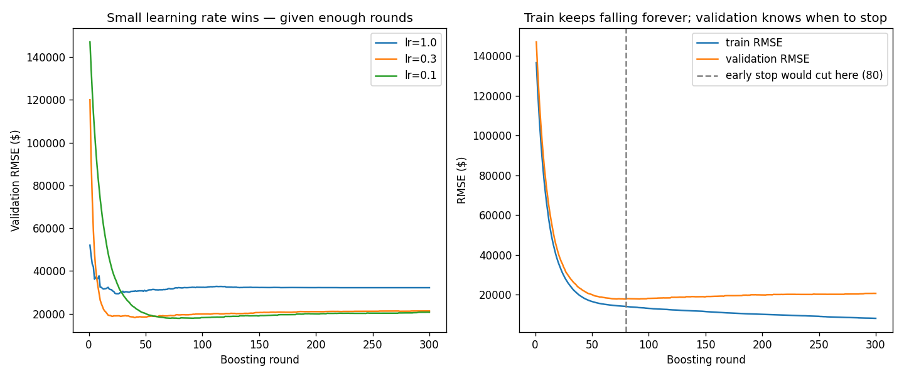

# Learn More Python by Building Gradient Boosting

Part 5, and the forest's rival. Random forest grows trees **in parallel** and averages a jury; boosting grows them **one at a time**, each tree fitting *what's still wrong* — the residuals. This is the algorithm that (as XGBoost/LightGBM) wins tabular ML in the real world, and the scratch build is the main event here — sklearn appears only as the comparison target at the end.

**Theory companion:** [ml/gradient-boosting.md](../../../ml/gradient-boosting.md) — residuals, shrinkage, early stopping, and why "gradient" boosting. Read it first; this tutorial executes its hand-trace.

**The final result:** [gradient_boosting.py](gradient_boosting.py) (~12s to run — it trains over a thousand small trees)

```bash
# Run it (from python/ml-practice/):
uv run gradient-boosting/gradient_boosting.py
```

---

## Step 1 — A regression tree is Part 3's tree with two lines swapped

Boosting fits trees to *residuals* — continuous numbers, not classes. So the classifier tree from Part 3 needs exactly two substitutions:

| | Part 3 (classifier) | Here (regressor) |
|---|---|---|
| messiness score | `gini(labels)` | `np.var(values)` |
| leaf prediction | `majority(labels)` | `values.mean()` |

Everything else — the recursion, the base cases, the best-split search over feature×threshold candidates — is character-for-character the same shape:

```python
weighted = (len(left) * np.var(left) + len(right) * np.var(right)) / len(y)
...
return RegNode(value=float(y.mean()))      # leaf = the group's MEAN
```

That's the deepest lesson of the whole series so far: **"decision tree" is one algorithm with pluggable messiness and leaf functions.** Variance *is* gini's continuous cousin — both say "how far is this group from being one answer?"

## Step 2 — The boosting loop: five lines that win Kaggle

```python
self.f0_ = float(y.mean())                  # round 0: predict the average
pred = np.full(len(y), self.f0_)

for round_no in range(1, self.n_trees + 1):
    residuals = y - pred                    # what's still wrong
    tree = build_reg_tree(X, residuals, max_depth=2)   # a SMALL tree fits the leftovers
    self.trees_.append(tree)
    pred = pred + self.lr * tree_predict(tree, X)      # add a FRACTION of the fix
```

Predict → measure the leftover → fit a weak tree to the leftover → add 10% of its correction → repeat. The final model is `f0 + lr·tree₁ + lr·tree₂ + …` — a starting guess plus three hundred small apologies. (And per the theory doc: for squared error, the residual literally *is* the negative gradient — this loop is gradient descent where each step is a whole tree.)

Note the contrast with Part 4 baked into the code: forest trees were grown *deep* and independent; boosting trees are *shallow* (`max_depth=2`) and sequential — each one only exists because of the errors of everything before it.

## Step 3 — The theory doc's hand-trace, executed

Five houses, stumps, lr=0.1 — the doc's Step-by-Step section, now with your code doing the arithmetic:

```
round 0: predict the mean for everyone → 250,000
round 1: residual RMSE 70711 → 65479
round 2: residual RMSE 65479 → 60554
round 3: residual RMSE 60554 → 56250
→ every round, a small tree eats a bite of the leftover error
```

Each round removes ~7% of the remaining error — small bites, compounding. That's shrinkage working exactly as the doc describes: with `lr=1.0` the first stump would gulp its entire correction and overshoot; at `lr=0.1` it nibbles.

## Step 4 — Early stopping (optional kwargs + slicing as rollback)

The theory doc's rule: *never guess `n_estimators` — offer too many and let validation data decide.* The implementation teaches two Python patterns:

```python
def fit(self, X, y, X_val=None, y_val=None, verbose=False):
    ...
    if val_score < best_val:
        best_val, best_iter, rounds_since_best = val_score, round_no, 0
    else:
        rounds_since_best += 1
    if self.patience is not None and rounds_since_best >= self.patience:
        break
    ...
    self.trees_ = self.trees_[:best_iter]    # slicing = roll the model back
```

- **Optional keyword arguments as API design** — `X_val=None` makes validation opt-in; `patience=None` means "feature off." `if x is not None` is the idiomatic check (not `if x:` — an empty array is falsy!). This None-as-off-switch pattern is everywhere in ML libraries; now you've built one.
- **Slicing as state rollback** — the model overshot to round 100, but round 80 was best; `self.trees_[:best_iter]` *is* the undo, because the model is just a list of trees. Real output:

```
early stop at round 100 (best was round 80)
kept 80 trees → test RMSE $24,616
```

## Step 5 — Head-to-head (with a noise floor for honesty)

The synthetic houses have a deliberately *non-linear* price process — a big-house step premium and a renovation×size interaction — plus $18K of irreducible noise:

```
 single deep tree: $ 33,435 test RMSE
 scratch boosting: $ 24,616 test RMSE
 sklearn boosting: $ 26,290 test RMSE
  noise floor (σ): $ 18,000
```

Three readings: boosting cuts the lone tree's error by ~25%; your 150-line scratch version *edges out* sklearn's on this run (different split tie-breaking — don't read too much into it, but do enjoy it); and both sit within ~$7K of a floor no model can beat. Printing the noise floor next to the scores is a habit worth keeping — Part 4 taught it, and it keeps you from chasing error that isn't there.

## Step 6 — The learning-rate tradeoff, measured

Full 300-round validation curves, no early stopping, three learning rates:

```
lr=1.0  best val RMSE $ 29,369 at round  26, final $ 32,199
lr=0.3  best val RMSE $ 18,246 at round  41, final $ 21,309
lr=0.1  best val RMSE $ 17,860 at round  80, final $ 20,731
→ lr=1.0 bottoms out early then OVERFITS; lr=0.1 keeps improving
```

The theory doc's golden rule — *lower learning rate + more trees = better* — as three rows of data: lr=1.0's **best-ever** ($29,369) is far worse than lr=0.1's ($17,860), and every rate eventually overfits (final > best), which is why early stopping isn't optional for boosting. The plot tells both stories:



The right panel is the most important chart in boosting: **train RMSE falls forever** (the machine can always memorize a bit more), while **validation bottoms at round 80 and creeps back up** — and the early-stop line sits exactly at the bottom. Compare with the forest: more forest trees never hurt (they plateau); more boosting rounds eventually *do* hurt. That asymmetry is the price of learning sequentially from your own mistakes.

---

> 🧠 **Quick recall — answer out loud before the exercises** (all answers are above):
> 1. The two-line swap that turns a classifier tree into a regression tree?
> 2. The boosting loop in one sentence — what does each new tree fit?
> 3. Why deep independent trees in a forest, but shallow sequential ones in boosting?
> 4. Why is `if X_val is not None:` correct and `if X_val:` a bug?
> 5. How does `self.trees_[:best_iter]` "undo" overtraining?
> 6. lr=1.0's *best* round was worse than lr=0.1's — why?
> 7. More trees never hurt a forest but eventually hurt boosting — what's the asymmetry?

---

## Exercises

1. **The gradient IS the residual:** for one round, compute `-(d/dpred) 0.5*(y-pred)²` numerically (nudge `pred[0]` by ±0.01, difference the loss) and confirm it equals `residuals[0]`. You've verified the theory doc's "Idea 2" with arithmetic.
2. **Stump vs depth-3 base learners:** rerun the early-stopping fit with `max_depth=1` and `max_depth=4`. Which needs more rounds? Which overfits sooner? (The doc's claim: depth 3–6 is the sweet spot; stumps underfit interactions — and this data *has* an interaction.)
3. **MAE boosting:** for absolute-error loss the "residual" becomes `np.sign(y - pred)` and the leaf value should be the **median**, not the mean. Swap both in, add three $2M outlier houses, and compare which version's predictions the outliers drag further. (Same lesson as linear regression's MSE-vs-MAE, one level up.)
4. **Subsampling (stochastic boosting):** fit each round's tree on a random 80% of rows (`rng.choice(n, int(0.8*n), replace=False)`). Does the validation minimum improve? You've implemented XGBoost's `subsample` parameter.
5. **Boosting a classifier:** for log loss, the residual is `y − sigmoid(pred)` (Part 2's `error`, negated). Boost stumps on the loan data from Parts 3–4 and compare test accuracy against your random forest. (This is real gradient boosting classification, minus the leaf-weight refinements.)
6. **The production tool:** `uv add xgboost`, fit `XGBRegressor(n_estimators=5000, learning_rate=0.1, max_depth=2, early_stopping_rounds=20)` on the same split, and compare RMSE and wall time (`time.perf_counter`) against your scratch version. Read [ml/gradient-boosting.md](../../../ml/gradient-boosting.md)'s library section while it installs.

---

## What you learned

**Python:** optional keyword arguments as feature switches (`X_val=None`, `patience=None`), why `is not None` beats truthiness for arrays, list slicing as model rollback, `np.full`, `np.var`, patience-counter loops, dataclass reuse across model families.

**Algorithms:** trees are one algorithm with pluggable impurity/leaf functions; boosting = start at the mean and compound small corrections to the leftovers; shrinkage trades rounds for generalization (and lr=1.0's best is *worse*, not just slower); train error falls forever while validation tells the truth; boosting overfits with more rounds where forests merely plateau; and the residual is the gradient — this whole machine is gradient descent in function space.

**The arc:** linear → logistic → tree → forest → boosting. You've now hand-built both ensemble philosophies — the parallel jury and the sequential editor — and the entire classical-ML practice track is done. From here: [ml/model-evaluation.md](../../../ml/model-evaluation.md) end-to-end (you've built every metric in it), or the deep-learning track, where Part 1's `w -= lr * grad` loop becomes [a neural network](../../../deep-learning/neural-networks-basics.md).
