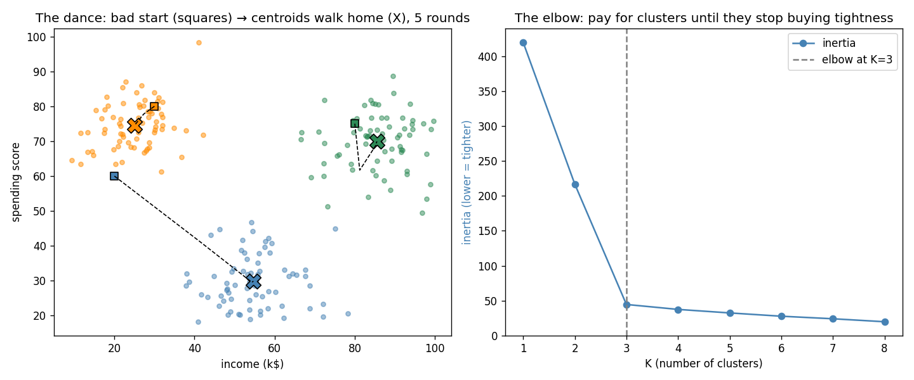

# Learn More Python by Building K-Means

Part 9 of learning Python through ML — and the series' first **unsupervised** algorithm. Notice what's missing from the script: **there is no `y`.** No labels, no accuracy, no train/test split. Eight parts of "predict the answer, compare with the truth" end here; the data sorts itself and *judging the result becomes your problem* (that's what inertia, the elbow, and the silhouette are for). The new Python: **generators with `yield`** (watch the algorithm run one frame at a time), the **walrus operator `:=`**, `while True` convergence loops, and **pandas `groupby`** — the first real pandas in the series.

**Theory companion:** [ml/k-means.md](../../../ml/k-means.md) — the assign/update dance, inertia, elbow, silhouette. Read it first; this tutorial executes both of its worked examples digit for digit.

**The final result:** [k_means.py](k_means.py)

```bash
# Run it (from python/ml-practice/):
uv run k-means/k_means.py
```

---

## Step 0 — Old tools, new job

The file opens with two reuses worth noticing: Part 4's `sys.path` trick imports Part 7's `pairwise_distances` from the knn folder — K-Means' ASSIGN step *is* a KNN-style distance scan, so the code is literally shared. And the scratch model's `fit` is built on a **generator**:

```python
def fit_steps(self, X, init=None):
    ...
    while True:                                # loop until the dance stops
        labels = pairwise_distances(X, centroids).argmin(axis=1)   # ASSIGN
        new_centroids = np.array([...means...])                    # UPDATE
        yield centroids.copy(), labels         # hand out this frame, then PAUSE
        if (shift := float(np.linalg.norm(new_centroids - centroids))) < self.tol:
            break
        centroids = new_centroids

def fit(self, X, init=None):
    for _ in self.fit_steps(X, init):          # drain the generator
        pass
    return self
```

- **`yield` makes a function a generator**: calling `fit_steps` runs *nothing* — it returns an object that executes up to the next `yield` each time you ask. The caller chooses the experience: loop over it with `enumerate` to watch every round (Steps 1–2), `list()` it to keep the history (the plot), or drain it silently (`fit`). One implementation, three consumers — that's the generator superpower, and it's how you'd stream LLM tokens too.
- **The walrus `:=`** assigns *inside* an expression: compute the centroid shift, name it, and test it in one line. New in Python 3.8; use it exactly here — when a value is needed for a condition *and* you'd otherwise compute it twice.
- **`while True` + `break`** is the honest shape for "loop until converged" — the exit condition lives mid-body, after the work that determines it. (Parts 1–2 used fixed `for epochs` with a tolerance check; this is the same idea with the loop count unknown.)

## Step 1 — The doc's 1D dance, frame by frame

Points `1, 2, 9, 10`, centers deliberately dropped badly at 3 and 6:

```
round 1: centers [3.0, 6.0] → groups [1.0, 2.0] | [9.0, 10.0]
round 2: centers [1.5, 9.5] → groups [1.0, 2.0] | [9.0, 10.0]
converged at [1.5, 9.5] — the doc's answer, and it can never un-converge
```

Two rounds, exactly as the doc traced: assign pulls `{1,2}` and `{9,10}` apart, update jumps the centers to their group means, and the second round changes nothing — so the walrus-checked shift is 0 and the loop breaks. The convergence guarantee in one sentence: each step can only reduce total point-to-center distance, and a number that only falls and can't go below zero must stop.

## Step 2 — The doc's 6-customer walkthrough, every distance asserted

```
(  15, 39) → dist to A   0.0, to B  71.7 → cluster A
(  25, 60) → dist to A  23.3, to B  51.5 → cluster A
(  60,  5) → dist to A  56.4, to B  80.6 → cluster A
(  70, 85) → dist to A  71.7, to B   0.0 → cluster B
(  40, 40) → dist to A  25.0, to B  54.1 → cluster A
(  50, 80) → dist to A  53.9, to B  20.6 → cluster B
update → A [35.0, 36.0], B [60.0, 82.5] — then nobody switches: converged
```

The full table from the doc's step-by-step section — all twelve distances reproduced by `pairwise_distances` and locked with `np.allclose` against the doc's numbers, then the doc's updated centroids `(35, 36)` and `(60, 82.5)` asserted too. (These are the very distances that were hand-audited and corrected in the theory doc — now a machine confirms them on every run.)

## Step 3 — Inertia only falls; *where* it lands depends on the start

210 unlabeled customers (three hidden blobs), standardized first — K-Means runs on Euclidean distance, so the scaling rule from Parts 2/6/7 applies unchanged. One run, inertia after every round:

```
seed 3:  395 → 214 → 213 → 212 → 212 ...  (falls every round)
10 seeds' final inertias: [44, 44, 44, 44, 44, 44, 44, 44, 44, 212]
→ same data, different starts, different traps. Keep the best: 44
```

Both doc claims, measured: the sequence *never rises* (asserted with `all(a >= b for a, b in zip(...))` — pairwise comparison via `zip` against itself shifted, a Part 1 idiom grown up), and **seed 3 is a trap**: it converges — converging is guaranteed — but to a local minimum five times worse than the other nine seeds. The fix is one line:

```python
best = min(runs, key=lambda m: m.inertia_)     # that's ALL n_init=10 is
```

sklearn's mysterious `n_init=10` demystified: run ten times, `min` by inertia.

## Step 4 — Choosing K: the elbow, then the silhouette tie-breaker

```
K=1: inertia  420.0          K=2: 216.9  (−203)
K=3: inertia   44.5  (−172)  K=4:  37.4  (−  7)
K=5: 32.3 (−5)  K=6: 27.6 (−5)  K=7: 24.0 (−4)  K=8: 19.7 (−4)
→ big drops until K=3, crumbs after: the elbow says 3
```

Inertia falls at *every* K (at K=n it would hit 0) — printing the **drops** next to the values makes the elbow numeric instead of squinted-at: −203, −172, then single digits forever. And the silhouette, built from scratch in ten lines on top of `pairwise_distances` — for each point, `a` = mean distance to its own cluster, `b` = mean distance to the best *other* cluster, score = `(b−a)/max(a,b)`:

```
K=2: 0.524   K=3: 0.731  ← best   K=4: 0.610   K=5: 0.489
→ both judges agree on K=3, and scratch == sklearn (allclose)
```

0.731 clears the doc's "> 0.5 for meaningful clusters" bar comfortably, both judges point at 3 — which is exactly how many blobs `make_customers` planted. The asserts against `sklearn.metrics.silhouette_score` hold to float precision.

## Step 5 — sklearn agreement, with a twist unique to clustering

```
inertia: scratch best 44.47  sklearn 44.47
assignments agree (after renaming): 100%
```

Same standard as Parts 7–8 — but clustering adds a wrinkle worth internalizing: **cluster numbers are arbitrary.** Your cluster 0 may be sklearn's cluster 2; only the *grouping* is real. So the comparison first builds a renaming map (each scratch cluster → the sklearn label its members most often carry, via a `Counter` dict comprehension), *then* demands 100% agreement. Forgetting this permutation step is the classic clustering-evaluation bug — raw `(labels_a == labels_b).mean()` would have reported ~33% for identical clusterings.

## Step 6 — Clusters are useless until you name them

The doc's bluntest gotcha: "3 groups" tells you nothing. Enter **pandas `groupby`** — the first time the series needs pandas to earn its import:

```python
df = pd.DataFrame(X, columns=["income_k", "spending_score"])
df["cluster"] = best.labels_
profile = df.groupby("cluster").mean().round(0)
profile["size"] = df.groupby("cluster").size()
```

```
         income_k  spending_score  size
cluster
0            55.0            30.0    70
1            25.0            74.0    70
2            86.0            70.0    70
cluster 0 → careful savers   cluster 1 → young spenders   cluster 2 → VIPs
```

`groupby("cluster").mean()` is `GROUP BY` from SQL (or `Object.groupBy` + a reduce, in recent JS): split rows by a column, aggregate each group. Three lines turn anonymous integer labels into a segmentation a marketing team could use — and the recovered profiles `(25, 74)`, `(55, 30)`, `(86, 70)` are the three blob centers `make_customers` hid, found without ever seeing a label.



The left panel is the generator's history made visible: squares are a *deliberately bad* start (two centroids dropped in the top-left blob, none near the bottom), X's are home. Watch the blue centroid's dashed path — it starts deep in orange territory and walks across the whole chart to claim the unclaimed blob, in 5 rounds. The right panel is Step 4's elbow: a cliff to K=3, crumbs after.

---

> 🧠 **Quick recall — answer out loud before the exercises** (all answers are above):
> 1. What happens when you *call* a generator function — and what are the three ways this file consumes one?
> 2. What does `(shift := ...) < self.tol` do that two separate lines wouldn't?
> 3. Why is convergence guaranteed, and what did seed 3 prove is *not* guaranteed?
> 4. `n_init=10` in one line of Python?
> 5. Why can't raw inertia pick K, and what do you look at instead?
> 6. Silhouette in a formula: what are `a`, `b`, and the score?
> 7. Two identical clusterings can show ~33% raw label agreement — why, and what's the fix?
> 8. What does `df.groupby("cluster").mean()` give you, and why is clustering incomplete without it?

---

## Exercises

1. **K-Means++ by hand:** the doc says smart initialization picks spread-out starting centers. Implement it: pick the first centroid at random, then pick each next one with probability proportional to squared distance from the nearest already-chosen centroid (`rng.choice(n, p=d2 / d2.sum())`). Rerun Step 3's ten seeds — does the 212 trap disappear?
2. **The animation you almost have:** the generator already yields every frame. Save a scatter plot per frame (`fig.savefig(f"frame_{i}.png")`) from a bad start and flip through them — your own StatQuest visualization.
3. **The album-art trick:** load any image with `plt.imread`, reshape its pixels to `(n, 3)` RGB rows, cluster with K=5, and replace every pixel with its centroid color. You've built the frontend bridge's Spotify palette extractor — and lossy image compression.
4. **Break the sphere assumption:** run your K-Means on Part 6's `make_rings` data with K=2. Plot the result — why does it cut the ring into halves instead of separating ring from core? (The doc's DBSCAN gotcha, seen with your own eyes.)
5. **Cluster-ID as a feature:** the doc's "When to Use" list says clusters can feed supervised models. Add `best.labels_` as a fourth feature to a loans-style classification (Parts 3–4 data), and measure whether the tree's test accuracy moves.
6. **Unscaled disaster, quantified:** rerun Step 4 on raw `X` but with income in *dollars* (×1000). What happens to the silhouette at K=3, and which feature do the clusters ignore? (Parts 2/6/7's scaling lesson, fourth model family.)

---

## What you learned

**Python:** generators and `yield` (lazy frame-by-frame execution; consume by looping, listing, or draining), the walrus operator for assign-and-test, `while True` + mid-loop `break` for unknown-length convergence, `np.array_equal`-style monotonicity checks with `zip(seq, seq[1:])`, and pandas `groupby` for split-apply-combine profiling.

**Algorithms:** the assign/update dance and why it must converge (a falling, bounded number); local minima as the price of greedy descent, and best-of-N restarts as the cure; inertia as a loss you can't naively minimize over K; the elbow read from *drops*, the silhouette as the tie-breaker; label permutation as a clustering-specific evaluation trap; and the unsupervised mindset shift — no ground truth means *you* must judge, profile, and name what the algorithm finds.

**Next:** [ml/pca.md](../../../ml/pca.md) for theory, then Part 10 — PCA, the final part of the classical track: compressing features instead of grouping rows, and the standard rescue for Part 7's curse of dimensionality.
