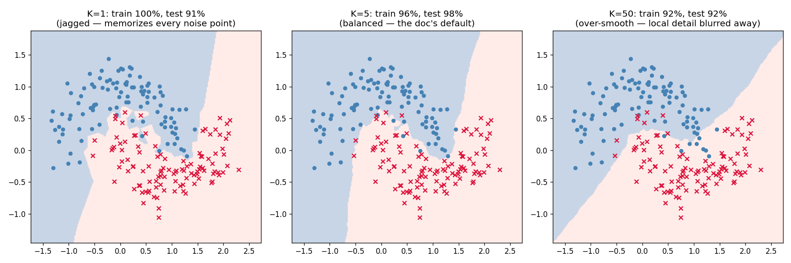

# Learn More Python by Building K-Nearest Neighbors

Part 7 of learning Python through ML — and the simplest algorithm in the whole series: **KNN doesn't train.** No gradients (Parts 1, 2, 6), no recursion (Parts 3–5) — it memorizes the data and answers every question with a distance scan and a vote. The new Python: **`np.argsort`** (sort the *indices*, not the values), **broadcasting with `None`** (the idiom behind every vectorized pairwise computation), `enumerate(start=1)`, `dict.get` accumulation with `max(d, key=d.get)`, and `Literal` type hints.

**Theory companion:** [ml/knn.md](../../../ml/knn.md) — distance metrics, choosing K, lazy learning, the curse of dimensionality. Read it first; this tutorial reruns its arithmetic and turns its claims into experiments.

**The final result:** [knn.py](knn.py)

```bash
# Run it (from python/ml-practice/):
uv run knn/knn.py
```

---

## Step 1 — Distance is Pythagoras, and `assert` says so

```python
def euclidean(a, b):
    return float(np.sqrt(((a - b) ** 2).sum()))

assert round(euclidean(np.array([1., 2.]), np.array([4., 4.])), 1) == 3.6
```

The doc's A=(1,2), B=(4,4): gaps (3, 2) → √(9+4) = √13 ≈ 3.61. Square the gaps (so −3 and +3 count the same), add, square-root (back to original units). With 50 features it's the same line of NumPy — 50 gaps instead of 2. The `assert` is Part 6's habit carried forward: the theory doc's arithmetic runs as a test on every execution.

> 🐛 **The doc had a wrong digit.** Writing this script caught it: the doc listed `d(?, D) = 3.63`, but √(10.24 + 2.89) = √13.13 = 3.62. The theory doc is now fixed — this is *why* you reproduce known answers in code. Trust, but verify.

## Step 2 — The doc's cat/dog vote: `argsort` and friends

The doc's 5-pet table, query `[1.3, 2.5]`, K=3 — every number reproduced:

```
distances: [0.58 0.73 3.36 3.62 0.51]  (doc: 0.58 0.73 3.36 3.62 0.51)
1st nearest: E (0.51) → Cat
2nd nearest: A (0.58) → Cat
3rd nearest: B (0.73) → Cat
vote: {'Cat': 3} → predict Cat (the doc's answer, 3-0)
```

Three Python moves make this six lines:

```python
dists = np.sqrt(((pets - query) ** 2).sum(axis=1))   # broadcasting: row vs all rows
order = np.argsort(dists)                            # ① indices, not values
for rank, idx in enumerate(order[:3], start=1):      # ② human-numbered ranks
    ...
vote = Counter(str(label) for label in pet_labels[order[:3]])   # ③ Part 3's tally
```

- **① `np.argsort`** answers "*which rows* are smallest?" — `[4, 0, 1, 2, 3]` — instead of sorting the distances and losing track of whose distance is whose. You then use those indices to look up names, labels, anything. `sort` gives you values; `argsort` gives you *identities*. KNN is `argsort(...)[:k]` — that's the entire algorithm.
- **② `enumerate(seq, start=1)`** — you've been writing `for i, x in enumerate(...)` mentally since Part 1's `zip`; the `start=` keyword makes rank displays 1-based without `i + 1` sprinkled around.
- **③ `Counter`** returns to do what it did for tree leaves in Part 3 — but here the vote *is* the model's entire output.

## Step 3 — `ScratchKNN`: a model whose `fit` is one assignment

```python
def fit(self, X, y):
    self.X_, self.y_ = X, y     # "training" = remembering. That's ALL of it.
    return self
```

The interesting code is in `predict`, and it teaches the biggest NumPy idea of this part — **adding axes with `None` to broadcast**:

```python
def pairwise_distances(queries, points):
    diff = queries[:, None, :] - points[None, :, :]   # (q,1,d) - (1,n,d) → (q,n,d)
    return np.sqrt((diff ** 2).sum(axis=2))           # (q, n): one row per query
```

`queries` is `(q, d)` and `points` is `(n, d)` — you can't subtract those. Slipping `None` into an index *inserts an axis of size 1* there, and NumPy stretches size-1 axes to match: `(q, 1, d)` minus `(1, n, d)` broadcasts to `(q, n, d)` — **every query minus every point, no loops**. This `[:, None, :]` move is how vectorized code computes anything pairwise (distance matrices, attention scores, kernel matrices). Then `np.argsort(dists, axis=1)[:, :k]` grabs each query's k nearest in one call.

The economics of laziness, measured with Part 4's stopwatch:

```
n=  500: fit   0.00 ms   predict(200 queries)   4.77 ms
n= 2000: fit   0.00 ms   predict(200 queries)  21.91 ms
n= 8000: fit   0.00 ms   predict(200 queries)  94.55 ms
```

Fit is free at every size; predict grows **linearly with n** (4.77 → 21.91 → 94.55 ≈ ×4 per ×4 rows). Every other model in this series paid at training time and predicted instantly; KNN moved the entire bill to query time — the doc's library-vs-textbook analogy, and the frontend bridge's unindexed table scan, in milliseconds.

Weighted voting (the doc's Q5) adds a dict idiom worth owning:

```python
votes = {}
for label, w in zip(labels, 1.0 / dists):
    votes[label] = votes.get(label, 0.0) + w      # accumulate with a default
winner = max(votes, key=votes.get)                # argmax over a dict
```

**`dict.get(key, default)`** makes the accumulator one line (JS: `votes[l] = (votes[l] ?? 0) + w`), and **`max(votes, key=votes.get)`** returns the *key* with the largest value. The doc's numbers: three A's at distance 0.1 vs two B's at 10.0 → uniform 3-2, weighted **30 to 0.2** — same winner, but never a coin flip. (`Literal["uniform", "distance"]` on the parameter is the TypeScript union type `"uniform" | "distance"`, Python spelling — typos become type errors.)

## Step 4 — The scaling disaster, with the doc's exact people

```
raw:    A→B      108  A→C   30,000  → B 'closest' (a 40-year age gap, ignored!)
scaled: A→B     2.15  A→C     2.13  → C closest: a $30K gap and a 40-year gap
                                       now weigh what they should
```

Unscaled, salary's range drowns age — person B (same salary, 40 years older) beats person C (same age, $30K richer) by 280×. After standardizing, both gaps are ~2 standard deviations and C edges ahead. Note how *close* the scaled distances are — that's correct: a $30K salary gap and a 40-year age gap are both genuinely large. Scaling doesn't pick a winner; it makes the features **commensurate** and lets the data decide. Third model family in a row where scaling is survival (Parts 2, 6, 7) — versus the tree family (3–5), which never needed it.

## Step 5 — The curse of dimensionality, as an experiment

The doc claims that in high dimensions nearest ≈ farthest. One loop, 100 random points in a unit cube, one query:

```
  2 dims: nearest  0.03, farthest  1.16, ratio 0.03
 20 dims: nearest  1.33, farthest  2.40, ratio 0.55
200 dims: nearest  5.17, farthest  6.15, ratio 0.84
```

At 2 dims the nearest point is 36× closer than the farthest — "nearest" means something. At 200 dims it's barely 1.2× closer: the ratio marches toward 1.0, and the K nearest neighbors become a nearly random handful. Voting with random neighbors is noise — that's the curse, measured in eight lines. (The fix is [ml/pca.md](../../../ml/pca.md): shrink the dimensions before trusting distances.)

## Step 6 — Scratch vs sklearn: agreement must be *exact*

```
scratch K=5 test 98%   sklearn K=5 test 98%   predictions agree: 100%
```

This comparison is stricter than any previous part, and the script enforces it with an `assert`: every earlier model had randomness (initialization, bootstrap draws, tie-breaking), so "close to sklearn" was the bar. **KNN has no randomness** — same K, same data, same metric must give the *same answer on every single point*. 100% agreement isn't luck; anything less would be a bug in your `pairwise_distances`.

Then the doc's rule — *never guess K, measure it* — via 5-fold cross-validation on the half-moons:

```
K=1   CV accuracy 93% ± 3.0%
K=5   CV accuracy 95% ± 2.6%     ← best
K=15  CV accuracy 94% ± 1.9%
K=51  CV accuracy 90% ± 4.7%
best K = 5 → test 98%
```

Small K loses to noise, huge K blurs the moons into the global majority, and the doc's default of 5 wins the measurement. The plot is the doc's ASCII K-comparison drawn for real:



Read the three titles as a bias-variance story: **K=1** scores train 100% / test 91% — those blue islands inside red territory are individual noise points each commanding their own pixel patch (high variance). **K=5** gives up train accuracy (96%) and *gains* test accuracy (98%) by smoothing over them. **K=50** flattens the moon curve into nearly a straight line — train 92% / test 92%, honest but blind to local detail (high bias). Same scissors as the depth sweep in Part 3, with K turning the dial instead of depth.

---

> 🧠 **Quick recall — answer out loud before the exercises** (all answers are above):
> 1. `np.sort` vs `np.argsort` — which one is KNN built on, and why?
> 2. What does `queries[:, None, :]` do to the shape, and what does the subtraction broadcast to?
> 3. Fit was 0.00 ms at every n while predict scaled linearly — what's the name for this, and where did the cost go?
> 4. In `votes.get(label, 0.0) + w` and `max(votes, key=votes.get)` — what does each piece do?
> 5. Unscaled, why did person B beat person C as A's nearest neighbor?
> 6. The nearest/farthest ratio went 0.03 → 0.55 → 0.84 — why does that kill KNN?
> 7. Why must scratch and sklearn agree 100% here when ~matching was fine in Parts 4–5?
> 8. K=1: train 100%, test 91%. K=50: train 92%, test 92%. Which is variance, which is bias?

---

## Exercises

1. **Manhattan distance:** the doc's second metric is `|gaps|` summed — `np.abs(diff).sum(axis=2)`. Add a `metric` parameter to `ScratchKNN` (dispatch via a dict of functions — Part 6's `KERNELS` pattern), rerun the moons, and compare. Does the boundary change shape?
2. **KNN regression:** the doc says regression = *average* the neighbors instead of voting. Write `ScratchKNNRegressor` (swap `Counter` for `labels.mean()`) and test it on Part 1's 200 noisy houses. Compare MAE against `KNeighborsRegressor(n_neighbors=7)` and against your linear regression — which wins, and why might a *line* beat neighbors here?
3. **The loop you didn't write:** implement `pairwise_distances_loop` with two nested `for` loops, and time both versions on n=2,000 with `perf_counter`. The broadcast version should win by ~100×. That ratio *is* the argument for learning NumPy.
4. **Weights on the boundary:** find a test point where `weights="uniform"` and `weights="distance"` disagree (loop over the test set comparing both models' predictions). What does its neighborhood look like?
5. **The curse, rescued:** generate 200-dim data where only the first 2 dims carry the moons and the other 198 are pure noise. Watch KNN accuracy collapse, then recover it by slicing back to `X[:, :2]`. You've just motivated PCA (Part 8 territory) with your own experiment.
6. **Build the index:** `uv add faiss-cpu`, then index the n=8,000 dataset with `faiss.IndexFlatL2` and re-run the Step 3 timing. The frontend bridge's promise — "the grown-up fix is an index" — measured. (This same index family powers RAG retrieval.)

---

## What you learned

**Python:** `np.argsort` (identities, not values), axis-insertion with `None` + broadcasting for pairwise anything, `enumerate(start=1)`, `dict.get` accumulators and `max(d, key=d.get)`, `Literal` type hints, asserting exact agreement when determinism demands it.

**Algorithms:** KNN = argsort + vote, no training; lazy learning moves the entire cost to query time (O(n·d) per prediction, measured); scaling makes features commensurate or distance lies; the curse of dimensionality as a measurable ratio marching to 1.0; K as a bias-variance dial (the doc's K=1/5/50 picture, drawn from real data); and distance-weighted votes as insurance against far-away "neighbors."

**Next:** [ml/naive-bayes.md](../../../ml/naive-bayes.md) for theory, then Part 8 — Naive Bayes, where prediction is multiplication: no distances, no gradients, just counting and Bayes' rule.
