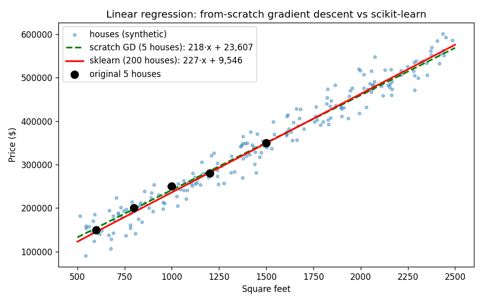

# Learn Python by Building Linear Regression

You'll build the same ML model **three times** — in pure Python, in NumPy, then with scikit-learn — and learn the Python language along the way. Every section teaches a Python concept *through* the regression, with JavaScript/TypeScript comparisons since that's where you're coming from.

**Theory companion:** [ml/linear-regression.md](../../../ml/linear-regression.md) explains *why* this works (gradient descent, MSE, learning rate). This tutorial is the *hands-on* half — same dataset, same math, real code. Read the theory doc first if you haven't.

**The final result:** [linear_regression.py](linear_regression.py) — read it after (or alongside) this tutorial.

**Want it harder?** [from-scratch.md](from-scratch.md) is the sequel: same model, **no sklearn** — you implement the closed-form solution, train/test split, R², and convergence detection yourself. Do this tutorial first, that one second.

```bash
# Run it (from python/ml-practice/):
uv run linear-regression/linear_regression.py
```

---

## Step 1 — Variables, lists, and f-strings

Our dataset: 5 houses (deliberately the same ones as the theory doc).

```python
SQFT = [600.0, 800.0, 1000.0, 1200.0, 1500.0]
PRICE = [150_000.0, 200_000.0, 250_000.0, 280_000.0, 350_000.0]
```

What's new coming from JS:

| JavaScript | Python | Notes |
|---|---|---|
| `const sqft = [600, 800]` | `SQFT = [600.0, 800.0]` | No `const`/`let` — just assign. ALL_CAPS = "treat as constant" (convention, not enforced) |
| `150_000` | `150_000` | Same digit separators! |
| `` `w is ${w}` `` | `f"w is {w}"` | f-strings = template literals. `{w:.2f}` formats to 2 decimals, `{n:,.0f}` adds thousands separators |
| `arr.length` | `len(arr)` | Function, not property |
| `null` / `undefined` | `None` | One nothing, not two |

> 💻 **The big mental shift:** Python has no `{ }` blocks — **indentation IS the syntax**. Where JS uses braces, Python uses a `:` and an indented block. Your formatter argument is over forever; 4 spaces, always.

---

## Step 2 — Functions, type hints, comprehensions, `zip`

The three building blocks of the model, in pure Python:

```python
def mean(values: list[float]) -> float:
    """Average of a list. sum() and len() are built-ins."""
    return sum(values) / len(values)

def predict(x: list[float], w: float, b: float) -> list[float]:
    """The model itself: y = w*x + b, for every x."""
    return [w * xi + b for xi in x]

def mse(actual: list[float], predicted: list[float]) -> float:
    return mean([(a - p) ** 2 for a, p in zip(actual, predicted)])
```

Unpacking the new syntax:

- **`def name(arg: type) -> type:`** — like a TS function signature. Type hints are optional and *not enforced at runtime* (think TS types, but with no compiler unless you run `mypy`). Write them anyway — editors and reviewers love you for it.
- **Docstrings** — the `"""..."""` right under `def` is the function's documentation. It's what your editor shows on hover. Python's JSDoc, but built into the language.
- **List comprehensions** — `[w * xi + b for xi in x]` is Python's `x.map(xi => w * xi + b)`. Read it right-to-left: "for each `xi` in `x`, produce `w*xi + b`, collect into a list." There's a filter form too: `[v for v in x if v > 0]` ≈ `x.filter(v => v > 0)`.
- **`zip(a, b)`** — pairs two lists element-wise so you can loop them together. JS has no built-in for this; it's the loop you always wrote with an index.
- **`**`** — exponent. `e ** 2` is `e * e` (JS also has `**`).

> 💻 **Comprehension ↔ map/filter cheat:**
> ```python
> [f(v) for v in xs]            # xs.map(f)
> [v for v in xs if cond(v)]    # xs.filter(cond)
> [f(v) for v in xs if cond(v)] # xs.filter(cond).map(f)
> ```

---

## Step 3 — The learning loop (`for`, `range`, tuples)

Gradient descent: start with a terrible line (`w=0, b=0`), measure the error, nudge both numbers downhill, repeat. This is the loop from the theory doc, now real:

```python
def train_pure_python(x, y, lr=1e-8, epochs=200):
    w, b = 0.0, 0.0                      # tuple unpacking: two assignments at once
    for epoch in range(epochs):          # range(200) = 0..199, like for(i=0; i<200; i++)
        preds = predict(x, w, b)
        errors = [yi - pi for yi, pi in zip(y, preds)]

        grad_w = -2 * mean([e * xi for e, xi in zip(errors, x)])
        grad_b = -2 * mean(errors)

        w -= lr * grad_w                 # step OPPOSITE the gradient = downhill
        b -= lr * grad_b

        if epoch % 50 == 0:
            print(f"  epoch {epoch:>3}: w={w:7.2f}  b={b:.4f}  mse={mse(y, preds):,.0f}")
    return w, b                          # returns a tuple — caller unpacks: w, b = train(...)
```

New Python here: **default arguments** (`lr=1e-8` — like JS default params), **tuple packing/unpacking** (`w, b = 0.0, 0.0` and `return w, b` — Python's array destructuring, used constantly), and **`range()`** for counted loops.

Run it and you'll see (real output):

```
epoch   0: w=   5.44  b=0.0049  mse=65,180,000,000
epoch  50: w= 165.26  b=0.1502  mse=6,584,689,425
epoch 100: w= 215.81  b=0.1975  mse=723,502,773
epoch 150: w= 231.80  b=0.2139  mse=137,218,495
after 200 epochs: price ≈ 236.8 × sqft + 0.22
```

That `w=5.44` at epoch 0 is *exactly* the hand-computed first step in the theory doc's walkthrough — the code and the math agree. But notice two problems: we needed an absurd learning rate (`1e-8`, because raw sqft values make gradients explode), and `b` has barely moved off zero. The fix is in the next step.

---

## Step 4 — NumPy: arrays, vectorization, broadcasting

NumPy is *the* reason Python owns ML. The idea: operate on **whole arrays at once** instead of looping.

```python
import numpy as np

def train_numpy(x, y, lr=0.1, epochs=500):
    mu, sigma = x.mean(), x.std()
    x_std = (x - mu) / sigma             # ← broadcasting: ONE expression, whole array

    w, b = 0.0, 0.0
    for _ in range(epochs):              # "_" = loop variable we don't use
        errors = y - (w * x_std + b)     # vectorized: no list comprehension needed
        w -= lr * (-2 * (errors * x_std).mean())
        b -= lr * (-2 * errors.mean())

    # we trained on standardized x — convert weights back to raw-sqft units
    return w / sigma, b - w * mu / sigma
```

Three things happened:

1. **Vectorization.** `errors * x_std` multiplies two arrays element-wise in C speed. Every comprehension from Step 2 collapses into one expression. Mental model: NumPy arrays are like typed arrays (`Float64Array`) with math operators that "just work" element-wise.
2. **Broadcasting.** `(x - mu) / sigma` subtracts a *scalar* from an *array* — NumPy stretches the scalar across all elements automatically.
3. **Standardization** (the actual ML lesson). Scaling x to mean 0 / std 1 tames the gradients, so `lr=0.1` works instead of `1e-8`, and *both* parameters converge in 500 quick steps:

```
price ≈ 218.0 × sqft + 23,607
```

That matches the closed-form solution from the theory doc to the dollar. **This is the "feature scaling matters for gradient descent" lesson from [ml/linear-regression.md](../../../ml/linear-regression.md), experienced firsthand.**

---

## Step 5 — Classes: package it like scikit-learn does

Every sklearn model has the same shape: construct → `fit()` → `predict()`. Build yours the same way and the whole sklearn ecosystem instantly makes sense:

```python
class ScratchLinearRegression:
    def __init__(self, lr: float = 0.1, epochs: int = 500):   # the constructor
        self.lr = lr                       # self = JS `this`, but explicit
        self.epochs = epochs
        self.coef_: float | None = None    # sklearn convention: trailing _
        self.intercept_: float | None = None  # means "learned during fit()"

    def fit(self, x, y) -> "ScratchLinearRegression":
        self.coef_, self.intercept_ = train_numpy(x, y, self.lr, self.epochs)
        return self                        # enables chaining: model.fit(x, y).predict(x)

    def predict(self, x):
        if self.coef_ is None:
            raise RuntimeError("Call fit() before predict()")   # JS: throw new Error()
        return self.coef_ * x + self.intercept_

    def __repr__(self) -> str:             # what print(model) shows — like toString()
        return f"ScratchLinearRegression(lr={self.lr}, epochs={self.epochs})"
```

Python class ↔ JS class:

| JavaScript | Python |
|---|---|
| `constructor(lr = 0.1) {}` | `def __init__(self, lr=0.1):` |
| `this.lr = lr` | `self.lr = lr` (`self` is explicit, always the first parameter) |
| `toString()` | `__repr__` (the "dunder" methods customize built-in behavior) |
| `throw new Error("...")` | `raise RuntimeError("...")` |
| `new Model()` | `Model()` — no `new` keyword |

Usage — note the chaining that `return self` buys:

```python
model = ScratchLinearRegression().fit(x, y)
model.predict(np.array([1100.0]))   # → $263,443
```

---

## Step 6 — scikit-learn: the real-world workflow

Now the 10-line version professionals write — on a *realistic* dataset (200 noisy synthetic houses), with the train/test split discipline from [ml/model-evaluation.md](../../../ml/model-evaluation.md):

```python
from sklearn.linear_model import LinearRegression
from sklearn.model_selection import train_test_split
from sklearn.metrics import r2_score

rng = np.random.default_rng(42)                      # seeded randomness = reproducible
sqft = rng.uniform(500, 2500, size=200)
price = 218.0 * sqft + 23_607 + rng.normal(0, 25_000, size=200)   # truth + noise

X = sqft.reshape(-1, 1)        # sklearn wants 2D: (n_samples, n_features)
X_train, X_test, y_train, y_test = train_test_split(X, price, test_size=0.2, random_state=42)

model = LinearRegression().fit(X_train, y_train)     # same fit() shape as OUR class
r2 = r2_score(y_test, model.predict(X_test))
```

Real output:

```
sklearn:  price ≈ 226.5 × sqft + 9,546
R² on the held-out test set: 0.955
predict(1100 sqft) → $258,739
```

Two things worth noticing:

- `LinearRegression().fit(...)`, `model.coef_`, `model.intercept_` — **identical API shape to the class you just wrote.** That was the point of Step 5: you now understand sklearn's design instead of memorizing it.
- sklearn recovered ≈226.5/9,546 instead of the true 218/23,607 — because it fit *noisy* data, and 200 noisy points only pin the line down so precisely. That gap between "true process" and "fitted model" is what test-set R² measures.

The script also saves `regression_plot.png` — the 200 noisy houses, your scratch model's line (trained on just 5 points!), and sklearn's line, nearly on top of each other. matplotlib in four moves: `fig, ax = plt.subplots()` → `ax.scatter(...)`/`ax.plot(...)` → `ax.legend()` → `fig.savefig(...)`.



---

> 🧠 **Quick recall — answer out loud before the exercises** (all answers are above):
> 1. Python's equivalents of `map`/`filter` in one syntax?
> 2. What does `zip(a, b)` do, and what's `w, b = train(x, y)` called?
> 3. Why did pure-Python GD need `lr=1e-8` while the NumPy version used `lr=0.1`?
> 4. What is broadcasting — what happens in `(x - mu) / sigma`?
> 5. In sklearn naming, what does the trailing underscore in `coef_` signify?
> 6. Why does sklearn want `X` as a 2D array even for one feature?

---

## Exercises (do these — reading isn't learning)

1. **Warm-up:** change `epochs` and `lr` in `train_numpy` — find the smallest epoch count that still lands within $1 of 218.0/23,607. Then set `lr=1.0` and watch it diverge (the theory doc's "overshooting" in real life).
2. **Python practice:** add a `score(x, y)` method to `ScratchLinearRegression` that returns R² — formula: `1 - sum((y-pred)²) / sum((y-mean(y))²)`. Check it against sklearn's `r2_score`.
3. **MAE vs MSE:** write `mae()` next to `mse()` and print both during training. Add one outlier house (`(900, 900_000)`) and watch which metric panics more — then re-read why in [ml/linear-regression.md](../../../ml/linear-regression.md).
4. **Multiple features:** extend `realistic_dataset` to add a `bedrooms` column and fit `LinearRegression` on both features. (Hint: `np.column_stack([sqft, bedrooms])` — and now `model.coef_` has two entries.)
5. **Stretch:** rewrite `train_numpy` so the loop stops early when the MSE improves by less than 0.01% between epochs (`break` — works like JS). You've just implemented convergence detection.

---

## What you learned

**Python:** variables & numeric literals, f-strings, functions with type hints + docstrings, list comprehensions, `zip`, tuple unpacking, default args, `for`/`range`, classes (`__init__`, `self`, dunder methods, chaining), exceptions, imports, seeded randomness.

**ML (now in your hands, not just your head):** the gradient descent loop, why feature scaling makes it converge, the fit/predict API pattern, train/test discipline, and R² on held-out data.

**Next:** [ml/logistic-regression.md](../../../ml/logistic-regression.md) for theory, then [../logistic-regression/](../logistic-regression/) — the hands-on sequel where this exact training loop becomes a classifier. The loop is the same; only the loss changes.
