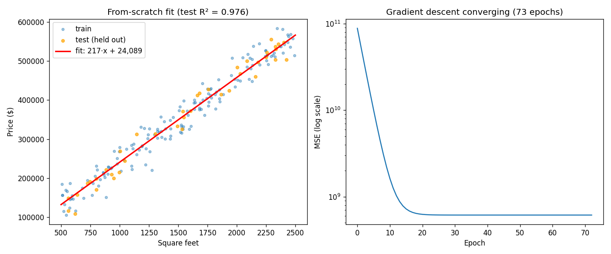

# Linear Regression From Scratch — No scikit-learn

The [first tutorial](README.md) ended with sklearn doing the work. This one **bans sklearn** and makes you build everything it was hiding: the metrics, the exact solution, the train/test split, and a gradient descent that knows when to stop. NumPy and pandas are allowed — they're the standard numeric toolkit, not the algorithm.

**Why this version exists:** when you `import sklearn`, you learn an API. When you implement `r_squared` and watch your own loss curve flatten, you learn the *algorithm* — and a lot more Python on the way.

**The final result:** [linear_regression_from_scratch.py](linear_regression_from_scratch.py)

```bash
# Run it (from python/ml-practice/):
uv run linear-regression/linear_regression_from_scratch.py
```

What's replaced:

| sklearn gave you | You now write | New Python you learn |
|---|---|---|
| `LinearRegression().fit()` | closed form + gradient descent | `@dataclass`, `break`, loss history |
| `train_test_split` | shuffle + slice indices | `rng.permutation`, fancy indexing |
| `r2_score`, `mean_squared_error` | `r_squared`, `mse`, `mae` | NumPy reductions, what R² *means* |
| (data you never looked at) | pandas exploration first | `DataFrame`, `describe`, `corr` |

---

## Step 1 — Seeded randomness (`np.random.default_rng`)

```python
def make_dataset(n: int = 200, seed: int = 7) -> tuple[np.ndarray, np.ndarray]:
    rng = np.random.default_rng(seed)        # seeded → same "random" data every run
    sqft = rng.uniform(500, 2500, size=n)
    price = 218.0 * sqft + 23_607 + rng.normal(0, 25_000, size=n)
    return sqft, price
```

> 💻 **JS gap:** `Math.random()` can't be seeded — reproducible randomness needs a library. In NumPy it's first-class: same seed, same dataset, every run. This is *the* habit that makes ML experiments debuggable — when a result changes, you know it was your code, not the dice.

Note we know the **true process** here (`218·sqft + 23,607` plus noise) because we wrote it. The whole game of regression is: given only the noisy points, how close can we get back to those two numbers?

## Step 2 — Look before you model (pandas)

```python
df = pd.DataFrame({"sqft": sqft, "price": price})   # dict of columns → table
df.head(3)                                          # first rows (like .slice(0, 3))
df["price"].mean()                                  # column access = dict-style key
df["sqft"].corr(df["price"])                        # → 0.982
```

Real output:

```
  sqft    price
1750.0 428183.0
2294.0 512402.0
2051.0 508680.0

200 houses | mean price $350,343 | sqft↔price correlation: 0.982
```

A correlation of 0.982 *before any modeling* tells you a straight line will do well here. Thirty seconds of pandas saves you from fitting models to data that has no signal. (`df.describe()` is the other one-liner worth memorizing — count/mean/std/min/max for every column.)

## Step 3 — The metrics, by hand (NumPy reductions)

```python
def mse(actual, predicted):
    return float(np.mean((actual - predicted) ** 2))

def mae(actual, predicted):
    return float(np.mean(np.abs(actual - predicted)))

def r_squared(actual, predicted):
    ss_residual = np.sum((actual - predicted) ** 2)        # error my line left over
    ss_total = np.sum((actual - actual.mean()) ** 2)       # total variation in the data
    return float(1 - ss_residual / ss_total)
```

The Python: `np.mean`, `np.sum`, `np.abs` are **reductions** — array in, single number out. The whole metric is one expression because the arithmetic broadcasts element-wise first (`actual - predicted` subtracts whole arrays), then reduces. The `float(...)` wrapper converts NumPy's `np.float64` back to a plain Python float — a small habit that keeps prints and JSON clean.

The algorithm: now you can *say* what R² is, not just report it — **"the fraction of the data's variation my line explains."** `1 −` (leftover error) / (total variation). Predicting the mean for everything gives R² = 0; your line earns its score by beating that.

## Step 4 — The closed-form solution (the answer without iteration)

Here's the thing sklearn never told you: for linear regression, **calculus already solved the problem.** Set the derivative of MSE to zero and out falls an exact formula:

```python
def fit_closed_form(x, y):
    x_dev = x - x.mean()                  # deviations from the mean
    y_dev = y - y.mean()
    slope = np.sum(x_dev * y_dev) / np.sum(x_dev**2)   # = covariance(x,y) / variance(x)
    intercept = y.mean() - slope * x.mean()            # line passes through the means
    return float(slope), float(intercept)
```

Run on the 5 verification houses from [ml/linear-regression.md](../../../ml/linear-regression.md):

```
price ≈ 218.0 × sqft + 23,607   ← the exact answer
```

To the dollar, the closed-form result from the theory doc. Two intuitions worth keeping:

- **Slope = cov/var** — "how much do x and y move together, per unit of how much x moves alone."
- **The line always passes through (x̄, ȳ)** — that's what the intercept formula says.

So why does gradient descent exist at all? Because most models (neural networks, logistic regression at scale) have **no closed form** — iterative descent is the only road. Linear regression is where you get to *check* your gradient descent against a known exact answer. That's exactly what Step 6 does.

## Step 5 — Train/test split, by hand (permutation + fancy indexing)

```python
def train_test_split(x, y, test_ratio=0.2, seed=7):
    rng = np.random.default_rng(seed)
    shuffled = rng.permutation(len(x))      # [183, 7, 42, ...] — shuffled indices
    cut = int(len(x) * (1 - test_ratio))
    train_idx, test_idx = shuffled[:cut], shuffled[cut:]   # slicing
    return x[train_idx], x[test_idx], y[train_idx], y[test_idx]
```

Two NumPy superpowers in four lines:

- **`rng.permutation(n)`** — a shuffled `[0..n-1]`. Shuffle *indices*, not the arrays, so x and y stay paired.
- **Fancy indexing** — `x[train_idx]` indexes an array *with another array* and returns all those elements at once. JS has no equivalent; it's `train_idx.map(i => x[i])` built into the brackets.

And the algorithm point: the split is just *shuffle once, cut once*. No magic — which is why forgetting to shuffle (sorted data!) or cutting before shuffling are such classic bugs.

## Step 6 — Gradient descent that knows when to stop (`@dataclass`, `break`)

The first tutorial hand-wrote `__init__`. Modern Python generates it:

```python
@dataclass
class ScratchLinearRegression:
    lr: float = 0.1
    max_epochs: int = 10_000
    tol: float = 1e-12
    slope_: float | None = None
    intercept_: float | None = None
    history_: list[float] = field(default_factory=list, repr=False)
    epochs_run_: int = 0
```

- **`@dataclass`** is a decorator — a function that transforms the class, auto-writing `__init__` and `__repr__` from the field list. Think TS class property declarations, but they also generate the constructor.
- **`field(default_factory=list, ...)`** — the mutable-default trap: `history_: list = []` would share ONE list across every instance (Python evaluates defaults once). `default_factory=list` makes a fresh list per instance. The classic Python gotcha, met safely.
- **`repr=False`** keeps the 79-element loss history out of `print(model)`.

The training loop now *records* its progress and *stops itself*:

```python
for epoch in range(1, self.max_epochs + 1):
    errors = y - (w * x_std + b)
    w -= self.lr * (-2 * (errors * x_std).mean())
    b -= self.lr * (-2 * errors.mean())

    loss = mse(y, w * x_std + b)
    self.history_.append(loss)                 # keep the loss curve

    if abs(prev_loss - loss) <= self.tol * max(loss, 1.0):
        break                                   # converged — stop early
    prev_loss = loss
```

> 🐛 **A real bug, preserved for you:** the first version of this check scaled the threshold by `prev_loss` — which starts at `float("inf")`. Since `tol × inf = inf` and `inf ≤ inf` is true, the loop "converged" after **one epoch** and produced garbage (slope 43.6, R² of −3.755 — negative R² means *worse than predicting the mean*). One symptom, traced to one comparison against infinity. Convergence checks are off-by-one country: scale by the *current* loss.

Real output, fixed:

```
price ≈ 218.0 × sqft + 23,607 (converged in 79 epochs)
→ same line as the closed form. GD works; it's just the slow road.
```

**Gradient descent verified against the exact answer** — the payoff of Step 4. The model converged itself in 79 epochs instead of burning all 10,000.

## Step 7 — The report: dicts and `.items()`

```python
report = {                              # a dict — Python's object literal
    "slope": round(model.slope_, 1),
    "test_r2": round(r_squared(y_test, preds), 3),
    ...
}
for key, value in report.items():       # .items() = Object.entries()
    print(f"  {key:>20}: {value}")
```

Real output on the 200 noisy houses:

```
             slope: 216.9
         intercept: 24,089
epochs_to_converge: 73
          test_mse: 475,559,962
          test_mae: 17,049
           test_r2: 0.976
```

Read it like a practitioner: the fit recovered ≈217/24,089 against a true process of 218/23,607 — noise costs you the last digit. Test MAE says predictions are off by ~$17K on average (vs noise σ of $25K — the model can't beat the noise floor, and shouldn't). R² 0.976 on *held-out* data: the line explains 97.6% of price variation it never trained on.

The script also saves a two-panel plot — the fit, and **the loss curve on a log scale** (`ax2.set_yscale("log")`): a cliff for ~15 epochs, then a flat line. That flat line is what your `tol` check detects.



---

> 🧠 **Quick recall — answer out loud before the exercises** (all answers are above):
> 1. Why seed the random generator, and what's the JS situation by comparison?
> 2. R² in one sentence — and what does a *negative* R² tell you?
> 3. The closed-form slope is a ratio of which two statistics?
> 4. If an exact formula exists, why learn gradient descent at all?
> 5. What does `x[train_idx]` do when `train_idx` is an array?
> 6. Why `field(default_factory=list)` instead of `history_: list = []`?
> 7. What bug made training "converge" in 1 epoch?

---

## Exercises

1. **Break it on purpose:** remove the standardization in `fit()` (use raw `x`) and keep `lr=0.1`. Watch the loss hit `inf`/`nan` within a few epochs — gradient explosion in the wild. Then find the largest `lr` that still converges on raw features and compare epoch counts.
2. **Plot the bug:** set `tol=1e-3` and look at the loss curve — it stops on the cliff, before convergence. Find the `tol` where the answer is within $1 of the closed form. (You're tuning a real hyperparameter.)
3. **Implement `score()`:** add a `score(x, y)` method to the dataclass returning R², so the API matches sklearn's. One line — you already wrote `r_squared`.
4. **MAE descent:** the gradient of MAE w.r.t. the prediction is `-sign(error)` instead of `-2·error`. Implement `fit_mae()`, add the outlier house `(900, 900_000)` to the data, and compare which fit the outlier drags further. (Theory: [ml/linear-regression.md](../../../ml/linear-regression.md), robust regression.)
5. **Two features:** generate a `bedrooms` column, stack with `np.column_stack`, and extend the closed form to the matrix version `w = (XᵀX)⁻¹Xᵀy` using `np.linalg.solve`. You've just implemented what `LinearRegression.fit` actually runs.
6. **pandas reps:** rebuild the report dict as `pd.Series(report)`, and use `df.describe()` + `df.sort_values("price").tail(5)` to find the 5 most expensive houses.

---

## What you learned

**Python:** seeded RNGs, pandas DataFrames (`head`/`describe`/`corr`), NumPy reductions and fancy indexing, `@dataclass` + `field(default_factory=...)` (and the mutable-default trap), decorators (met one in the wild), `break` with convergence conditions, dicts + `.items()`, log-scale plotting.

**Algorithms — the real haul:** what R² actually measures, the closed-form solution (slope = cov/var, line through the means), why gradient descent exists when exact answers don't, how to *verify* an iterative method against an exact one, what a loss curve's shape tells you, why convergence checks are subtle, and that a fitted model can only approach the true process as closely as the noise allows.

**Next:** the [sklearn version](README.md) of this same model — now every line of `LinearRegression().fit()`, `train_test_split`, and `r2_score` is something you've personally implemented. Then [ml/logistic-regression.md](../../../ml/logistic-regression.md): same loop, different loss.
