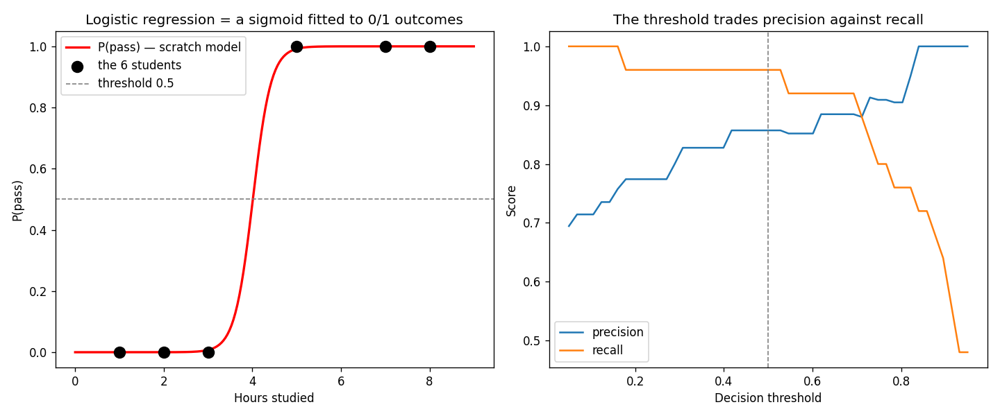

# Learn More Python by Building Logistic Regression

Part 2 of learning Python through ML. You built linear regression in [linear-regression/](../linear-regression/) — this tutorial reuses that training loop with **one change (the loss)** and gets a *classifier* out of it. Along the way you learn the Python that the first tutorial didn't cover: boolean masks, `np.clip`, dicts as counters, conditional expressions, and 2D column slicing.

**Theory companion:** [ml/logistic-regression.md](../../../ml/logistic-regression.md) — same 6 students, same math (sigmoid, log loss, thresholds). Read it first.

**The final result:** [logistic_regression.py](logistic_regression.py)

**Want it harder?** [from-scratch.md](from-scratch.md) is the sequel: **no sklearn** — multi-feature training with the `@` operator, a hand-built stratified split and `classification_report`, and the resolution of this tutorial's cliffhanger: L2 regularization, implemented as two characters of math. This tutorial first, that one second.

```bash
# Run it (from python/ml-practice/):
uv run logistic-regression/logistic_regression.py
```

---

## Step 1 — The data (and what changed since linear regression)

```python
HOURS = np.array([1.0, 2.0, 3.0, 5.0, 7.0, 8.0])
PASSED = np.array([0, 0, 0, 1, 1, 1])    # 0 = fail, 1 = pass
```

Same 6 students as the theory doc. The crucial difference from house prices: **the target is a category (0/1), not a number.** Predicting "0.7 of a pass" with a straight line makes no sense — which is the entire reason logistic regression exists.

## Step 2 — The sigmoid: one function, scalars AND arrays

```python
def sigmoid(z: float | np.ndarray) -> np.ndarray:
    return 1.0 / (1.0 + np.exp(-z))
```

Real output:

```
sigmoid(-4) = 0.018
sigmoid(-1) = 0.269
sigmoid(+0) = 0.500
sigmoid(+1) = 0.731
sigmoid(+4) = 0.982
```

Two things to notice:

- **The Python:** because `np.exp` broadcasts, this ONE definition handles a single float *and* a whole array. No overloads, no loop version — `sigmoid(0.0)` and `sigmoid(np.linspace(0, 9, 200))` both just work. (Python's stdlib `math.exp` is the scalar-only cousin; in ML code you almost always want the NumPy one.)
- **The type hint** `float | np.ndarray` — the `|` union syntax, same as TS's `number | Float64Array`.

The math is the theory doc's "volume knob": any score from −∞ to +∞ becomes a probability in (0, 1), with 0 mapping to exactly 0.5.

## Step 3 — Log loss and `np.clip`

MSE is the wrong loss for probabilities — it barely punishes a confident wrong answer (theory doc, "Why It Exists"). Log loss punishes it brutally:

```python
def log_loss(actual, prob):
    p = np.clip(prob, 1e-15, 1 - 1e-15)     # pin values into a safe range
    return float(-np.mean(actual * np.log(p) + (1 - actual) * np.log(1 - p)))
```

The new Python is **`np.clip`** — and the *reason* for it teaches a real numerical-computing lesson: `log(0)` is `-inf`, so one perfectly-confident wrong prediction (`p = 0.0` when `y = 1`) would make the average loss infinite. Clipping to `[1e-15, 1−1e-15]` is the standard guard. sklearn does this internally; now you know why.

> 💻 **JS parallel:** `Math.min(Math.max(x, lo), hi)` — the clamp you've written for scroll positions and progress bars, now protecting a logarithm instead of a UI.

## Step 4 — The classifier: linear regression's loop, one line different

Here's the payoff of having built linear regression first. Compare the training loops:

```python
# linear regression:                    # logistic regression:
errors = y - (w * x_std + b)            p = sigmoid(w * x_std + b)
                                        error = p - y
w -= lr * (-2 * (errors * x_std).mean())
                                        w -= lr * (error * x_std).mean()
```

The gradient of log loss works out to the **same shape** — `mean(error × x)` — where "error" is now `(probability − label)`: how overconfident the model was, per student. Same loop, same standardization trick, same weight-conversion at the end. *Only the loss changed.* (This is the punchline the ml folder keeps repeating: every model is this loop with a different loss.)

The class adds one genuinely new method:

```python
def predict_proba(self, x):                       # the model's REAL output
    return sigmoid(self.coef_ * x + self.intercept_)

def predict(self, x, threshold: float = 0.5):     # probabilities → hard labels
    return (self.predict_proba(x) >= threshold).astype(int)
```

**Boolean masks** — the new NumPy concept. `probs >= threshold` compares a whole array against a number and returns an array of `True`/`False`; `.astype(int)` turns it into 0s and 1s. Two operations, no loop. JS equivalent: `probs.map(p => p >= t ? 1 : 0)` — but masks also *index* (`x[mask]` keeps only the `True` positions), which you'll use constantly.

Real output on the 6 students:

```
P(pass) = sigmoid(4.85 × hours + -19.47)
3 hours → P(pass) = 0.01 → FAIL
4 hours → P(pass) = 0.49 → FAIL
5 hours → P(pass) = 0.99 → PASS
```

Same shape as the theory doc (3h fails, 5h passes, 4h is the borderline) — but notice our probabilities are more extreme than the doc's (0.01 vs its 0.06). Why: this data is **perfectly separable**, so with no regularization the weights grow as long as you train — every extra epoch makes the model more confident. sklearn's `C` parameter exists precisely to stop that. You just discovered why regularization is on by default.

## Step 5 — Metrics from scratch: dicts as counters, and the accuracy trap

```python
def accuracy(actual, predicted):
    return float((actual == predicted).mean())   # booleans average as 0s and 1s!
```

One expression: the comparison makes a boolean array, and `.mean()` treats `True` as 1 — fraction correct, no loop. The confusion matrix shows off **dicts as counters** and **conditional expressions**:

```python
def confusion_counts(actual, predicted):
    counts = {"TP": 0, "FP": 0, "TN": 0, "FN": 0}
    for a, p in zip(actual, predicted):
        key = ("T" if a == p else "F") + ("P" if p == 1 else "N")
        counts[key] += 1
    return counts
```

`("T" if a == p else "F")` is Python's ternary — `a === p ? "T" : "F"` with the words rearranged (value first, condition in the middle). Two of them concatenated build exactly the right dict key: correct-and-predicted-positive → `"TP"`.

Then the demo that justifies this whole step — **the accuracy trap** from [ml/model-evaluation.md](../../../ml/model-evaluation.md), reproduced in two lines:

```python
sick = np.array([1] * 5 + [0] * 95)      # 5% positives — like fraud, like disease
lazy = np.zeros(100, dtype=int)          # a "model" that always predicts 0
```

```
'always predict 0' on 95/5 data → accuracy=95%, recall=0%  ← 95% accurate, catches nothing
```

(`[1] * 5 + [0] * 95` — list multiplication and concatenation: Python builds the imbalanced dataset in one expression.)

## Step 6 — sklearn, `predict_proba`, and threshold tuning

200 synthetic students, two features, with *probabilistic* outcomes — a student with P(pass)=0.7 actually fails 30% of the time, like reality:

```python
p_pass = sigmoid(1.1 * study + 0.6 * sleep - 9.0)     # the true process
passed = (rng.random(n) < p_pass).astype(int)         # roll the dice per student
```

sklearn recovers the truth from the noise:

```
learned weights: study=1.29, sleep=0.58, bias=-9.68   (true: 1.1, 0.6, -9.0)

              precision    recall  f1-score   support
        fail       0.95      0.84      0.89        25
        pass       0.86      0.96      0.91        25
    accuracy                           0.90        50
```

You can now read `classification_report` because you *implemented* precision and recall in Step 5. The remaining new Python is **2D column slicing**:

```python
probs = clf.predict_proba(X_test)[:, 1]   # all rows, column 1 = P(pass)
```

`predict_proba` returns one column per class; `[:, 1]` says "every row, column 1" — NumPy's two-axis indexing (JS would need `.map(row => row[1])`).

And the threshold sweep — *your* metrics applied to *sklearn's* probabilities:

```
threshold 0.3 → precision 0.83, recall 0.96
threshold 0.5 → precision 0.86, recall 0.96
threshold 0.7 → precision 0.88, recall 0.92
```

Lower threshold → catch more passes (recall ↑) but more false alarms (precision ↓). This is the fire-alarm dial from the theory doc, measured on real predictions. The plot's right panel sweeps 50 thresholds with `np.linspace(0.05, 0.95, 50)` and draws the scissors:



---

> 🧠 **Quick recall — answer out loud before the exercises** (all answers are above):
> 1. Why does one `sigmoid` definition work on both a float and an array?
> 2. What does `np.clip` prevent in `log_loss`, exactly?
> 3. How does logistic regression's gradient compare to linear regression's?
> 4. Why were our scratch probabilities more extreme than the theory doc's — and which sklearn parameter prevents it?
> 5. What does `(actual == predicted).mean()` compute, and why does it work?
> 6. What does `[:, 1]` select from `predict_proba`'s output?
> 7. 95% accuracy, 0% recall — what does that combination tell you about the data and the model?

---

## Exercises

1. **Regularization, discovered:** train the scratch model with `epochs=500`, `5_000`, and `50_000` and print the 4-hour probability each time. Watch the confidence grow without bound — then read about `C` in [ml/logistic-regression.md](../../../ml/logistic-regression.md).
2. **F1 from scratch:** add `f1(actual, predicted)` — the harmonic mean `2·P·R/(P+R)` — and verify it against the `classification_report` output. Handle the zero-division case with a conditional expression.
3. **The medical threshold:** using the threshold sweep, find the *highest* threshold that still gives recall ≥ 0.95 on the test set, and report the precision you must accept there. (This is exercise 3 from the theory doc's code section, done with your own metrics.)
4. **Boolean mask indexing:** print the study/sleep hours of every test student the model got *wrong* — `X_test[clf.predict(X_test) != y_test]`. Look at them: are they borderline cases? (One mask expression, no loop.)
5. **log-odds reading:** sklearn learned `study=1.29`. Per the theory doc, that's the change in *log-odds* per extra hour. Compute how the odds of passing multiply per study hour (`np.exp(1.29)` ≈ ?) and write the sentence: "each extra study hour multiplies the odds of passing by ___."
6. **Stretch — decision boundary plot:** scatter the 200 students as study (x) vs sleep (y), colored by pass/fail, and draw the line where `1.29·study + 0.58·sleep − 9.68 = 0`. You're visualizing the "straight-line boundary" limitation the theory doc warns about.

---

## What you learned

**Python:** union type hints (`float | np.ndarray`), broadcasting as polymorphism (one function for scalars/arrays), `np.clip`, boolean masks + `.astype(int)` + mask indexing, the `(a == b).mean()` accuracy idiom, conditional expressions, dicts as counters, list multiplication (`[1] * 5`), `np.column_stack`, 2D slicing (`[:, 1]`), `np.linspace`.

**ML (in your hands now):** sigmoid → probability → threshold → label is a pipeline of *choices*, not one step; the same gradient loop trains both regressors and classifiers; separable data + no regularization = unbounded confidence; accuracy lies on imbalanced data; the threshold is a product decision that trades precision against recall.

**Next:** [ml/decision-trees.md](../../../ml/decision-trees.md) for theory, then [../decision-trees/](../decision-trees/) — the hands-on sequel: no gradient descent at all, and the tutorial where you learn recursion. Or repeat the from-scratch pattern: a no-sklearn version of this tutorial, like [../linear-regression/from-scratch.md](../linear-regression/from-scratch.md).
