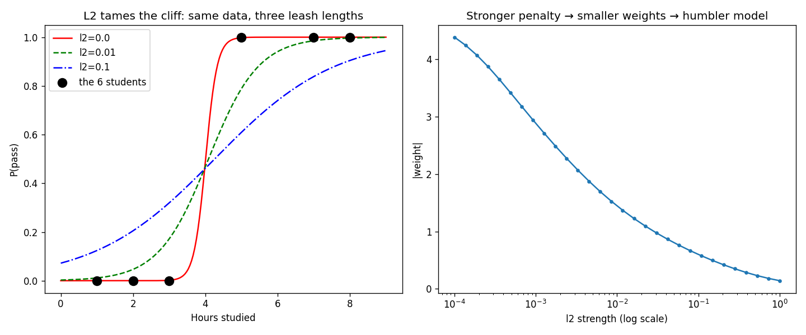

# Logistic Regression From Scratch — sklearn Fully Benched

The [Part 2 tutorial](README.md) ended on a cliffhanger: on separable data, the scratch model's confidence grew without bound, and we said *"sklearn's `C` parameter exists precisely to stop that."* This sequel **builds the thing that stops it** — L2 regularization — plus everything else sklearn supplied: the multi-feature model, the stratified split, and `classification_report`.

**The final result:** [logistic_regression_from_scratch.py](logistic_regression_from_scratch.py)

```bash
# Run it (from python/ml-practice/):
uv run logistic-regression/logistic_regression_from_scratch.py
```

What's new, Python/NumPy-wise:

| Concept | Where |
|---|---|
| The `@` operator (matrix × vector) and `.T` transpose | Step 2 |
| `axis=0` reductions — per-column statistics | Step 2 |
| `np.where`, `np.concatenate` | Step 1 |
| `np.logspace` + a hyperparameter sweep | Step 4 |
| Relabeling trick: binary metrics → per-class report | Step 3 |

---

## Step 1 — Stratified split (`np.where` + `np.concatenate`)

A plain shuffle-and-cut can hand you a test set that's 70% passes by bad luck. Stratification removes the luck: shuffle and cut *within each class*, then glue:

```python
for cls in np.unique(y):
    idx = np.where(y == cls)[0]        # indices of THIS class's rows
    idx = rng.permutation(idx)
    cut = int(len(idx) * (1 - test_ratio))
    train_parts.append(idx[:cut])
    test_parts.append(idx[cut:])

train = rng.permutation(np.concatenate(train_parts))   # glue + reshuffle
```

**`np.where(condition)[0]`** turns a boolean mask into the *positions* where it's true — the bridge between "which rows" (mask) and "where are they" (indices). **`np.concatenate`** is `[...a, ...b]` for arrays. The check prints itself:

```
stratification check: train 51% pass, test 51% pass (matched ratios)
```

## Step 2 — Multi-feature + the `@` operator

Part 2's model handled one feature with scalar `w`. Real data has columns, so the weights become a vector, and three new NumPy ideas appear at once:

```python
mu = X.mean(axis=0)                 # axis=0 → one mean PER COLUMN, not one overall
sigma = X.std(axis=0)
X_std = (X - mu) / sigma            # (n×k) − (k,) broadcasts row by row

w = np.zeros(X.shape[1])            # one weight per feature
for _ in range(self.epochs):
    p = sigmoid(X_std @ w + b)      # (n×k) @ (k,) → (n,): every score in one multiply
    error = p - y
    grad_w = X_std.T @ error / n + self.l2 * w    # ← the regularizer
    grad_b = error.mean()
```

- **`axis=0`** — the most important argument in NumPy. Reductions collapse an axis; `axis=0` collapses *rows*, leaving one statistic per column. (Mnemonic: the axis you name is the one that disappears.)
- **`X @ w`** — matrix-vector multiply. Every student's score `w₁·study + w₂·sleep + b`, computed for all 200 students in one expression. This is the line that replaces "loop over rows."
- **`X.T @ error`** — the transpose flips (n×k) to (k×n), so the multiply produces one gradient *per feature*. The single-feature `(error * x).mean()` from Part 2, grown up.

And the headline act — **the regularizer is two characters of math**: `+ self.l2 * w` in the gradient. Every step, each weight gets pulled toward zero in proportion to its size. Big weights pay rent; confidence is no longer free. (This is exactly the weight decay from [deep-learning/regularization.md](../../../deep-learning/regularization.md) — same `+λw`, same reason, now hand-built.)

## Step 3 — Part 2's cliffhanger, resolved

Same 6 students, 20,000 epochs, three leash lengths. Real output:

```
    l2 |    coef |  P(3h) |  P(4h) |  P(5h)
   0.0 |    6.22 |   0.00 |   0.49 |   1.00
  0.01 |    1.45 |   0.17 |   0.47 |   0.79
   0.1 |    0.60 |   0.32 |   0.46 |   0.61
```

Read it as three personalities:

- **l2=0** — the zealot. Separable data, no penalty: the weight hit 6.22 and is still growing; P(3h)=0.00 means *certain*, which 6 data points can't justify.
- **l2=0.01** — calibrated. P(3h)=0.17, P(5h)=0.79 — almost exactly the theory doc's converged model (0.06/0.82). The penalty found the same "reasonable confidence" the doc's early stopping did.
- **l2=0.1** — over-regularized. The leash is so short the model won't commit: P(5h)=0.61 when every 5+ hour student passed. Too much humility is also wrong.

The left panel of the plot shows all three sigmoids on the same axes — the cliff flattening as l2 grows, all crossing near the 4-hour borderline:



The right panel is a **hyperparameter sweep** with `np.logspace(-4, 0, 30)` — 30 values evenly spaced *in exponent* from 0.0001 to 1 (the right way to sweep a parameter that matters multiplicatively). |weight| shrinks monotonically as the penalty grows: stronger leash, humbler model. One number per fit, 30 fits, one chart — that's what "tuning a hyperparameter" actually is.

## Step 4 — `classification_report`, from scratch

The trick that makes this tiny: our `precision`/`recall` from Part 2 only understand binary 0/1. To report *per class*, **relabel the problem for each class** — "is it this class, yes or no?" — and the binary metrics work unchanged:

```python
for cls, name in enumerate(names):
    a = (actual == cls).astype(int)        # this class vs everything else
    p = (predicted == cls).astype(int)
    lines.append(f"{name:>10} {precision(a, p):>9.2f} {recall(a, p):>9.2f} ...")
```

Real output — same format as sklearn's, every number ours:

```
         precision    recall        f1   support
    fail      0.81      0.88      0.85        25
    pass      0.88      0.81      0.84        26
accuracy                          0.84        51
```

And the learned weights, against the truth we baked into the data generator:

```
learned: study=1.39, sleep=0.55, bias=-10.22   (true: 1.1, 0.6, -9.0)
```

(F-string note: `{name:>10}` right-aligns in 10 characters — `padStart`, inline. The whole table is alignment specifiers; no library.)

---

> 🧠 **Quick recall — answer out loud before the exercises** (all answers are above):
> 1. What does `axis=0` collapse, and what's left after?
> 2. What shapes go into `X_std @ w`, and what comes out?
> 3. The L2 regularizer in the gradient is which term, and what does it do every step?
> 4. Why was l2=0.01 "right" and l2=0.1 "wrong" for the 6 students — what did each curve look like?
> 5. What does `np.where(y == cls)[0]` return, and why does stratification need it?
> 6. How do binary precision/recall produce a per-class report?
> 7. Why sweep l2 with `logspace` instead of `linspace`?

---

## Exercises

1. **Find your C:** sklearn's `C` is `1/regularization`. Fit sklearn's `LogisticRegression(C=...)` (allowed for *comparison*) on the 6 students for a few C values and find the one whose curve matches your `l2=0.01` model. You've calibrated your scratch knob against the industry one.
2. **L1 from scratch:** swap the penalty to L1 — the gradient term becomes `self.l2 * np.sign(w)`. Sweep it like the right panel: unlike L2's smooth shrink, watch weights hit *exactly zero*. (Theory: Lasso vs Ridge in [ml/linear-regression.md](../../../ml/linear-regression.md).)
3. **Macro-F1:** extend the report with a `macro avg` row — the unweighted mean of the per-class scores. One `np.mean` over a list comprehension.
4. **Break the decay step:** the sweep stops at l2=1.0 for a reason. Run a fit with `lr=0.5, l2=10` and watch the warnings: the update `w -= lr·l2·w` multiplies `w` by `(1 − lr·l2) = −4` each epoch — oscillating divergence. Derive the stability condition (|1 − lr·l2| < 1) and verify the boundary experimentally.
5. **Log-loss history:** record `log_loss` per epoch (import it from Part 2) for l2=0 vs l2=0.01 on the 6 students, and plot both curves. l2=0's loss keeps creeping toward 0 forever (memorization); l2=0.01's flattens at a floor (the penalty holds). You're watching regularization refuse to overfit.
6. **Stretch — softmax:** three classes (fail/pass/honors) need one weight *vector per class* and softmax instead of sigmoid: `W` becomes (k×3), scores `X @ W` are (n×3), and `softmax(scores)` rows sum to 1. Generate 3-class data and extend the model. (Theory: the multiclass note in [ml/logistic-regression.md](../../../ml/logistic-regression.md).)

---

## What you learned

**Python/NumPy:** `axis=` reductions, the `@` operator and `.T`, shape reasoning ((n×k) @ (k,) → (n,)), `np.where` indices vs masks, `np.concatenate`, `np.logspace` and why multiplicative parameters get log sweeps, f-string alignment tables.

**Algorithms:** regularization is one term in the gradient — weights pay rent proportional to their size; under-, well-, and over-regularized models have visibly different curves; stratification removes split luck; a per-class report is binary metrics plus relabeling; hyperparameter tuning is "30 fits and a chart"; and even the *optimizer update itself* has a stability condition you can derive and break.

**Next:** all three model families now exist in your own code — linear (exact + GD), logistic (regularized, multi-feature), trees (recursive). The from-scratch random forest ([decision-trees/from-scratch.md](../decision-trees/from-scratch.md), exercise 3) is the last 20 lines of the classical-ML arc. Then: [ml/model-evaluation.md](../../../ml/model-evaluation.md) cover to cover — you've now built every metric it discusses.
