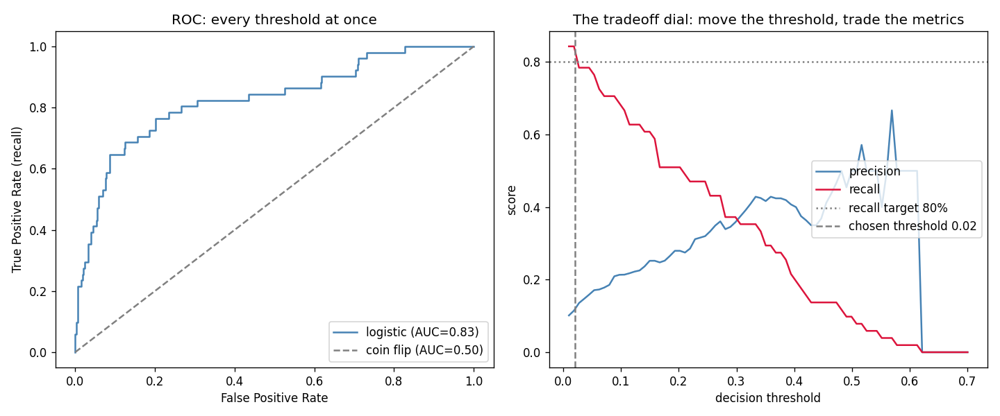

# Learn More Python by Building Model Evaluation

Part 11 — the capstone of the classical track. **No new model.** This part builds the *judges*: the metrics, splits, and curves that decided whether anything in Parts 1–10 actually worked. You've used pieces of this all along (accuracy and precision/recall in Part 2, the train/test gap since Part 3, `cross_val_score` in Part 7) — now you build the rest from scratch: **k-fold cross-validation, the ROC curve, AUC, and PR-AUC**, each asserted equal to sklearn's. The new Python: **`np.trapezoid`** (numerical integration), **`itertools.product`** (grid search demystified), and **`zip(*pairs)`** unzipping.

The narrative is the theory doc's loan-default walkthrough, executed end to end on 4,000 synthetic loans with an 8% default rate.

**Theory companion:** [ml/model-evaluation.md](../../../ml/model-evaluation.md) — the fishing net, the seesaw, the walkthrough. Read it first.

**The final result:** [model_evaluation.py](model_evaluation.py) (~15s — it fits ~30 forests)

```bash
# Run it (from python/ml-practice/):
uv run model-evaluation/model_evaluation.py
```

---

## Step 1 — The accuracy trap, with real teeth

The doc's walkthrough Step 4, reproduced almost digit for digit — baseline logistic regression on the validation set:

```
confusion: TP=3  FP=2  FN=48  TN=548
 accuracy: 0.92      ← the doc's walkthrough also said 92%!
precision: 0.60
   recall: 0.06
       f1: 0.11
→ 92% accuracy while missing 94% of all defaults.
  (always predicting 'repaid' would score 92%)
```

That last parenthesis is the kill shot: the trained model's accuracy **equals the do-nothing baseline's**. All four metrics are Part 2's functions, now generalized into reusable tools — and each one is asserted against its sklearn counterpart (`accuracy_score`, `precision_score`, `recall_score`, `f1_score`) so the formulas are certified, not believed.

## Step 2 — Five judges instead of one: CV from scratch

A fold-splitter is a **generator** (Part 9's `yield`, doing real infrastructure work now):

```python
def kfold_indices(n, k=5):
    sizes = np.full(k, n // k)
    sizes[: n % k] += 1            # first n % k folds get one extra row
    start = 0
    for size in sizes:
        test = np.arange(start, start + size)
        train = np.concatenate([np.arange(0, start), np.arange(start + size, n)])
        yield train, test
        start += size
```

This replicates sklearn's `KFold` *exactly* — same contiguous blocks, same sizes — which makes a hard assert possible:

```
fold F1s: [0.091 0.09  0.31  0.128 0.2  ]
F1 = 0.16 ± 0.08  (scratch folds == sklearn KFold, asserted)
```

Look at those five numbers, not just the mean: fold F1 ranges from 0.09 to 0.31 on the *same model* — a single train/test split would have handed you any one of them as "the score." The `± 0.08` is the doc's "stability" made visible (Part 4's mean-±-spread lesson, now institutionalized). And the stratification claim, measured on a deliberately small 600-row slice:

```
fold default-rates — plain:      ['8%', '8%', '9%', '5%', '10%']
                     stratified: ['8%', '8%', '8%', '8%', '8%']
```

Plain folds wobble by 2× on a rare class; `StratifiedKFold` pins the ratio. That's the entire argument for concept 8 in two rows.

## Step 3 — ROC and AUC: argsort + cumsum + one integral

The ROC curve sounds exotic; the construction is three lines you already know:

```python
order = np.argsort(scores)[::-1]               # most confident first  (Part 7)
hits = actual[order]
tpr = np.cumsum(hits) / hits.sum()             # recall, growing down the list (Part 10)
fpr = np.cumsum(1 - hits) / (1 - hits).sum()   # false alarms, growing too
auc = np.trapezoid(tpr, fpr)                   # area under = integral, one call
```

Walk down the ranking from most-suspicious to least; every true default you pass moves the curve **up**, every false alarm moves it **right**. The curve *is* the model's ranking ability drawn — no thresholds chosen, all thresholds shown. **`np.trapezoid`** is the new tool: numerical integration (sum of trapezoid slices), turning "area under the curve" from a phrase into a function call.

```
AUC = 0.826 (scratch == sklearn roc_auc_score, asserted)
```

0.83 sits in the doc's "good" band, and the README-worthy interpretation comes free from the construction: AUC ≈ the probability that a randomly chosen defaulter is ranked above a randomly chosen repayer.

## Step 4 — When ROC-AUC lies

The doc's sharpest gotcha, demonstrated by thinning defaults 8× (8% → 1.4%) and scoring the *same model* on both versions:

```
at 1.4% positives: ROC-AUC = 0.89  but PR-AUC = 0.10
(same model at 8% positives had PR-AUC 0.43)
```

ROC-AUC actually went *up* on the rarer data while precision collapsed — because FPR's denominator is the huge negative class, false alarms barely dent it. PR-AUC (average precision, also built from scratch and asserted against `average_precision_score`) tells the truth: at 1.4% positives, this model's flags are nearly worthless. **The headline metric must switch when the class gets rare** — that's the doc's rule, now a number you produced.

## Step 5 — Threshold tuning: the business contract

The doc's walkthrough ends with "business says recall must be > 80%." That's not a modeling task — it's reading a curve you already have:

```
threshold 0.50: precision 0.50  recall 0.10
threshold 0.20: precision 0.28  recall 0.51
threshold 0.05: precision 0.16  recall 0.76
threshold 0.02: precision 0.11  recall 0.84  ← chosen
→ every flag is now only 11% likely real — that's what 80% recall costs here
```

Same model, same probabilities — only the contract changed. Part 2 introduced the threshold dial on one model; here it's the *deliverable*: the answer to the business isn't "yes," it's "yes, **and** 9 of every 10 flags will be false alarms — staff the review team accordingly." Being able to say that sentence is the actual job skill.

## Step 6 — Grid search demystified, and the one test-set look

`GridSearchCV` sounds like machinery. It's two things you now own, composed:

```python
for depth, n_trees in itertools.product([4, 8], [50, 150]):   # every combination
    score = np.mean(cross_val_f1(make, X_temp, y_temp))       # judged by YOUR CV
```

**`itertools.product`** is nested loops as an iterator — 2×2 configs here, but the same line handles 5 hyperparameters without pyramid indentation. (`zip(*results)` then unzips the (config, score) pairs into two tuples — star-unpacking from Part 8, pointed at `zip`.) Then the moment the whole part has been protecting:

```
best: max_depth=8, n_estimators=150 (that's all GridSearchCV does)
final verdict — CV promised F1 0.12; the ONE test look: 0.10 (train was 0.38)
```

Three numbers, three lessons: **train 0.38 ≫ test 0.10** is the doc's variance diagnosis; **CV 0.12 vs test 0.10** shows mild optimism-of-selection (picking the best of 4 configs by CV inflates hopes — the once-touched test set exists to catch exactly that); and with only 51 positive test rows, F1-at-0.5 is a noisy judge — which is why Step 5's threshold work matters more than this grid did.



Left: the ROC curve hugging the corner above the coin-flip diagonal. Right: the tradeoff dial — precision and recall as scissors crossing as the threshold moves, with the 80%-recall target and the chosen 0.02 threshold marked. (The jagged precision spikes at high thresholds are real and instructive: up there the model flags only a handful of loans, and precision computed on 2–3 flags jumps wildly — small denominators, noisy metrics.)

---

> 🧠 **Quick recall — answer out loud before the exercises** (all answers are above):
> 1. The model's 92% accuracy equaled the always-predict-repaid baseline — what number exposed it?
> 2. Fold F1s ranged 0.09–0.31 — what does that say about single train/test splits?
> 3. In the ROC construction, what moves the curve up, and what moves it right?
> 4. What does `np.trapezoid(tpr, fpr)` compute, and what's the probabilistic reading of the result?
> 5. ROC-AUC *rose* when defaults got rarer while PR-AUC collapsed — why?
> 6. "Recall ≥ 80%" cost precision 0.50 → 0.11 — phrase that as a sentence to the business.
> 7. `GridSearchCV` = which two pieces you built, composed how?
> 8. CV said 0.12, test said 0.10 — name the effect, and what guards against it.

---

## Exercises

1. **Bootstrap confidence interval:** the doc warns small test sets give shaky metrics. Resample the test set 1,000 times with `rng.choice(n, n, replace=True)`, compute F1 each time, and report the 2.5th/97.5th percentiles (`np.percentile`). How wide is the interval around 0.10? Now you know why the doc says <500 examples is dicey.
2. **Stratified k-fold from scratch:** upgrade `kfold_indices` to stratify — split the positive and negative index lists separately (Part 2's stratified-split idea), then interleave. Verify fold default-rates match the `StratifiedKFold` row.
3. **The F-beta dial:** implement `f_beta(actual, predicted, beta)` = `(1+β²)PR / (β²P + R)`. Show F2 (recall-leaning) prefers the 0.05 threshold while F0.5 (precision-leaning) prefers 0.3 — the doc's cost-weighting table, computed.
4. **Evaluate your own model:** import `LogisticRegressionScratch` from [../logistic-regression/](../logistic-regression/) (Part 4's `sys.path` trick) and run it through your CV + ROC pipeline next to sklearn's. The full circle: your Part 2 model, judged by your Part 11 judges.
5. **The leakage experiment:** standardize features using the *full* dataset's mean/std before splitting, then repeat with train-only stats. Compare test F1. The doc's "leakage destroys everything" — usually a small but real inflation; measure it.
6. **TimeSeriesSplit intuition:** sort the loans by a fake `application_date`, make defaults drift upward over time, and compare random k-fold CV vs an expanding-window split (train on past, test on future). Random folds will overestimate — you trained on the future. The doc's time-series rule, felt.

---

## What you learned

**Python:** generators as data-splitting infrastructure, `np.trapezoid` for area-under-curve, `itertools.product` for combinatorial sweeps without nested-loop pyramids, `zip(*pairs)` to unzip, and guard clauses for zero-division in metrics.

**Evaluation (the real syllabus):** accuracy vs the do-nothing baseline; the confusion matrix as the source of all four lenses; fold-to-fold spread as the reason CV exists; stratification for rare classes; ROC as a drawn ranking and AUC as its probability reading; the ROC→PR switch under heavy imbalance; thresholds as business contracts with stated costs; grid search as product × CV; optimism-of-selection and the once-touched test set; and train≫test as the variance alarm — the single diagnostic that's been running through every part since the decision tree.

**Next:** [ml/feature-engineering.md](../../../ml/feature-engineering.md) for theory, then Part 12 — the pandas part: real messy data, encoding, imputation, and the full sklearn `Pipeline` + `GridSearchCV` workflow this part demystified.
