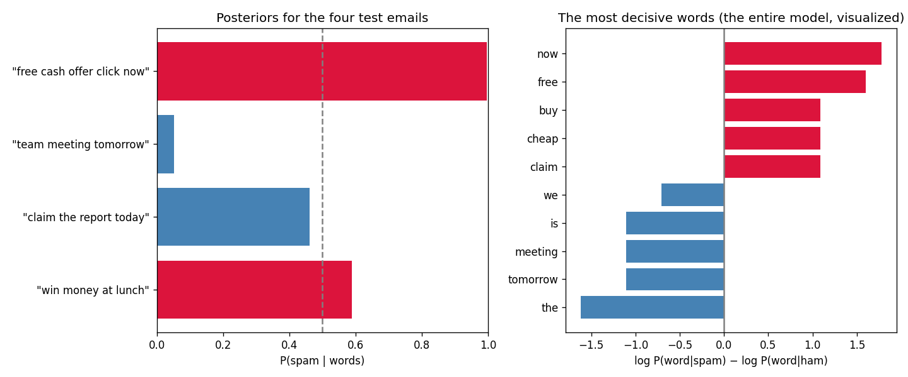

# Learn More Python by Building Naive Bayes

Part 8 of learning Python through ML — and the series' first **text** model. Every part so far ate arrays of numbers; this one eats sentences, which means Python's string tools finally enter the story. The algorithm itself is the gentlest yet: **training is counting** — no gradients (1, 2, 6), no recursion (3–5), no distance scans (7). Count words per class, multiply probabilities, pick the bigger. The new Python: **string methods** (`.lower()`, `.split()`), **dict comprehensions** (including nested ones), **`Counter.update`**, **argument star-unpacking** (`set().union(*tokenized)`), `math.isclose` / `log10` / `exp`, and the max-shift trick that keeps `exp` from underflowing.

**Theory companion:** [ml/naive-bayes.md](../../../ml/naive-bayes.md) — Bayes by counting, the naive assumption, Laplace smoothing, log probabilities. Read it first; this tutorial runs its arithmetic and then builds the real thing.

**The final result:** [naive_bayes.py](naive_bayes.py)

```bash
# Run it (from python/ml-practice/):
uv run naive-bayes/naive_bayes.py
```

---

## Step 1 — Bayes' theorem is "count the right group"

The doc's counting tree — 10,000 people, 1% sick, 90% accurate test — as integers, then as the formula, with `math.isclose` certifying they're the same number:

```
tested positive: 1,080 people, actually sick: 90
by counting 8.3%  =  by formula 8.3% — math.isclose agrees
```

Two things to keep: the **statistics** lesson (a positive test on a rare disease ≈ 8%, because 990 false alarms from the huge healthy group drown the 90 true catches — the prior matters as much as the test), and the **Python** lesson — `math.isclose(a, b)` is how you compare floats, the principled version of Part 6's tolerance habit. `90/1080` and `(0.90 * 0.01)/0.108` differ in their last bits; `==` is a trap, `isclose` is the idiom.

## Step 2 — The doc's 6-email hand-trace, in plain arithmetic

```
spam: 0.67 × 0.67 × 0.5 = 0.222   ham: 0.33 × 0.20 × 0.5 = 0.033
normalized → spam 87%, ham 13% (the doc's 87/13)
```

Prior × one likelihood per word, then normalize so the two scores sum to 1. The `0.20` is the doc's smoothing rescue: "money" never appears in ham, and without the `(0+1)/(3+2)` fix the ham score would be exactly 0 — more on that veto in Step 3. An `assert round(p_spam, 2) == 0.87` locks the doc's number in.

## Step 3 — Two ways multiplication breaks, two one-line fixes

Both of the doc's "practical fixes" demonstrated as runnable facts:

```
underflow: 0.01 ** 1000 = 0.0  (a real number, but floats give up)
with logs: 1000 * log10(0.01) = -2000  (perfectly representable)
zero-veto: P(unseen word | spam) = 0 → the WHOLE product is 0
smoothed:  (0+1)/(500+10,000) = 0.0001 — tiny, but the veto is gone
```

`0.01 ** 1000` is 10⁻²⁰⁰⁰ — a perfectly legitimate probability that floats round to literal `0.0` (the smallest float is ~5×10⁻³²⁴). Sum the logs instead and it's `-2000`, a boring everyday number — multiplication becomes addition, and addition never underflows. (Note `math.log10` here to match the doc's arithmetic vs `math.log`, natural log, in the model — know which one you're holding.) And Laplace smoothing is the doc's vocabulary example verbatim: one unseen word would otherwise veto hundreds of spammy ones.

## Step 4 — `ScratchMultinomialNB`: training is counting

Sixteen hand-written emails (8 spam, 8 ham), and a `fit` with **no loop over epochs — there's nothing to iterate.** Each line is a new Python tool:

```python
tokenized = [doc.lower().split() for doc in docs]        # strings, at last
self.vocab_ = sorted(set().union(*tokenized))            # one set from all docs

counts = {c: Counter() for c in self.classes_}
for tokens, label in zip(tokenized, labels):
    counts[label].update(tokens)                         # add counts in place

self.log_likelihood_ = {
    c: {word: math.log((counts[c][word] + self.alpha)
                       / (totals[c] + self.alpha * v))
        for word in self.vocab_}
    for c in self.classes_}
```

- **`.lower().split()`** — method chaining on strings: normalize case, then split on whitespace into a word list. This two-call pipeline is the embryo of *tokenization* — the same job [nlp/tokenization.md](../../../nlp/tokenization.md) does with BPE for LLMs.
- **`set().union(*tokenized)`** — the `*` *unpacks* the list of token-lists into separate arguments: `union(doc1_tokens, doc2_tokens, ...)`. JS spread (`new Set([...a, ...b])`), Python spelling. One line builds the vocabulary from all 16 documents.
- **`Counter.update(tokens)`** — Part 3's tally machine, incremental edition: feeds new items into an *existing* Counter. One Counter per class, updated document by document — exactly "count how often each word appears in spam."
- **The nested dict comprehension** — `{c: {word: ... for word in vocab} for c in classes}` builds the entire trained model in one expression: a table of smoothed log-probabilities, class → word → number. Dict comprehensions are list comprehensions for mappings; you've now used both.

And prediction is a sum of logs plus the max-shift trick — Step 3's lesson applied twice:

```python
scores = {c: self._log_score(doc, c) for c in self.classes_}
shift = max(scores.values())                 # subtract the max BEFORE exp,
exp_scores = {c: math.exp(s - shift) for c, s in scores.items()}   # so exp can't underflow
```

A 500-word email gives log-scores around −3000; `math.exp(-3000)` is 0.0 and you'd divide 0 by 0. Subtract the max first and the winner becomes `exp(0) = 1` — only *differences* matter after normalizing. This shift is everywhere in real ML (it's inside every softmax implementation, including the one in [deep-learning/activation-functions.md](../../../deep-learning/activation-functions.md)). Real output:

```
SPAM 99.7% spam | "free cash offer click now"
ham   5.1% spam | "team meeting tomorrow"
ham  46.2% spam | "claim the report today"
SPAM 58.9% spam | "win money at lunch"
```

The two easy emails are easy. The two middle ones are the interesting story: `"claim the report today"` has two spam-leaning words (claim, today) fighting two ham-leaning ones (the, report) and lands at 46.2% — a coin flip honestly reported. And note 99.7% on the first one: trained on *sixteen* emails, that's the doc's overconfidence gotcha live — the ranking is trustworthy, the calibration is not.

## Step 5 — sklearn must agree exactly

```
scratch spam probabilities: [0.9971 0.0509 0.462  0.5887]
sklearn spam probabilities: [0.9971 0.0509 0.462  0.5887]
→ np.allclose passed: no randomness, no optimizer — counting has exactly one answer
```

Part 7's standard, repeated for the same reason: Naive Bayes is **closed-form** — priors and likelihoods are computed, not searched for, so `CountVectorizer + MultinomialNB(alpha=1.0)` and your dict-of-Counters must produce *identical* probabilities, asserted with `np.allclose`. (The corpus was written in clean lowercase multi-letter words precisely so `.lower().split()` and CountVectorizer's tokenizer agree — tokenizer mismatch is the #1 way two text pipelines silently diverge. That's foreshadowing for the NLP folder.)

## Step 6 — The model is a table you can read

The most decisive words, by `log P(word|spam) − log P(word|ham)`:

```
spam +1.78 now        ham -1.62 the
spam +1.60 free       ham -1.11 tomorrow
spam +1.09 buy        ham -1.11 meeting
spam +1.09 cheap      ham -1.11 is
spam +1.09 claim      ham -0.70 we
```



The right panel *is* the entire model — there are no other parameters. Two readings:

- **Interpretability for free**, like Part 3's printed tree: when this classifier flags an email you can say exactly which words did it and by how much. (sklearn exposes the same table as `feature_log_prob_`.)
- **Look at the ham column: "the", "is", "we".** The model's strongest not-spam evidence is... grammar. These stop-words dominate because ham sentences are full prose while the spam snippets are imperative fragments. It works *on this corpus* but it's fragile — which is precisely why the doc's pipeline upgrades `CountVectorizer` to `TfidfVectorizer(stop_words='english')`: down-weight words that are everywhere and say nothing. You've just rediscovered the motivation for TF-IDF from your own model's failure mode.

---

> 🧠 **Quick recall — answer out loud before the exercises** (all answers are above):
> 1. 90% accurate test, 1% disease, positive result — why ≈8%, in one sentence about group sizes?
> 2. Why `math.isclose` instead of `==` for the two 8.3% computations?
> 3. What does the `*` do in `set().union(*tokenized)`?
> 4. `Counter(tokens)` vs `counter.update(tokens)` — when do you reach for each?
> 5. `0.01 ** 1000 == 0.0` — what's the fix, and what does multiplication become?
> 6. Why subtract `max(scores)` before `math.exp`?
> 7. Why must scratch and sklearn agree to the 4th decimal here, like Part 7 and unlike Parts 4–5?
> 8. The top ham words were "the", "is", "we" — what's the problem and what's the standard fix?

---

## Exercises

1. **Break it, then fix it:** set `alpha=0` and classify `"free money cryptocurrency"`. Watch the unseen word veto everything (you'll hit `math.log(0)` — handle it with `float("-inf")` and see both classes tie at impossible). Restore `alpha=1` for the rescue. The doc's "broken model" gotcha, experienced.
2. **Bernoulli variant:** the doc's table for short texts — count each word *once per document* (`set(tokens)` before updating the Counter). Implement it, compare with `BernoulliNB` on this corpus. Does `"free free free free"` score differently under the two variants?
3. **Stop words:** add a `stop_words` parameter to `fit` that skips a given set of words while counting. Remove `{"the", "is", "we", "at", "for", "from", "our", "your", "can"}` and reprint Step 6 — does the ham column finally contain *content*?
4. **The naive assumption, measured:** the doc admits "free" and "money" co-occur in spam more than independence predicts. Compute `P(free, money | spam)` from document counts and compare with `P(free|spam) × P(money|spam)`. How wrong is naive — and did it change the *ranking*?
5. **A real dataset:** download the SMS Spam Collection (the doc's Kaggle link), load it with pandas, and run your `ScratchMultinomialNB` against sklearn on 5,000 real messages. Report accuracy, and find the most spam-tilted word in real-world SMS spam.
6. **Calibration check (the doc's Q5):** bucket your test predictions by confidence (90–100%, 80–90%, …) and compare each bucket's *claimed* probability with its *actual* accuracy. Overconfident? `CalibratedClassifierCV(MultinomialNB())` is the production fix.

---

## What you learned

**Python:** string method chaining (`.lower().split()`), argument star-unpacking (`union(*lists)`), `Counter.update` for incremental tallies, dict comprehensions (nested, building a whole model in one expression), `math.isclose` / `math.log10` vs `math.log` / `math.exp`, and the subtract-the-max trick behind every softmax.

**Algorithms:** Bayes as counting the right group (priors matter as much as tests); training-as-counting — closed-form, no epochs, exactly one answer; the naive assumption as "multiply per-word evidence" and why ranking survives even when calibration doesn't (99.7% from 16 emails!); the zero-probability veto and Laplace's one-line rescue; log-space as the home of long products; and a model whose parameters you can print, read, and debug — including discovering its own stop-word weakness.

**Next:** [ml/k-means.md](../../../ml/k-means.md) for theory, then Part 9 — K-Means, the series' first *unsupervised* algorithm: no labels at all, just data sorting itself into groups.
