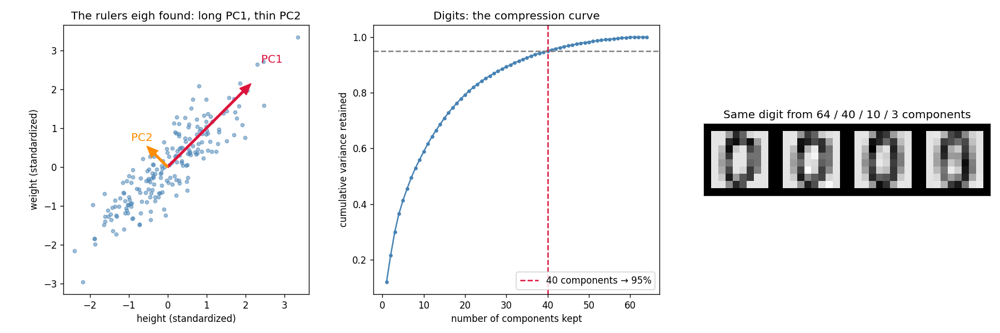

# Learn More Python by Building PCA

Part 10 — the **final part of the classical track**, and the only algorithm in the series that predicts nothing: PCA *re-describes* your data with fewer numbers. Find the directions the data is most spread along (eigenvectors of the covariance matrix), keep the long ones, drop the thin ones. The new Python: **`np.linalg.eigh`** (eigendecomposition — the actual machine), `np.cov`, **`np.cumsum` + `np.searchsorted`** for "how many components for 95%?", eigenvector **sign conventions** (a subtle float gotcha that bites everyone once), and the series' first **real datasets** — `load_iris` and `load_digits` — with `imshow` to look at images as arrays.

**Theory companion:** [ml/pca.md](../../../ml/pca.md) — rulers, shadows, eigen-pairs, explained variance. Read it first; this tutorial runs its examples on real data and (twice) corrects its numbers.

**The final result:** [pca.py](pca.py)

```bash
# Run it (from python/ml-practice/):
uv run pca/pca.py
```

---

## Step 0 — The whole algorithm is four lines

```python
def pca_scratch(X_std):
    cov = np.cov(X_std.T)                          # how every pair co-varies
    eigenvalues, eigenvectors = np.linalg.eigh(cov)
    order = np.argsort(eigenvalues)[::-1]          # biggest spread first
    return eigenvalues[order], eigenvectors[:, order]
```

- **`np.cov(X.T)`** builds the doc's covariance matrix — the table of "which features move together." (Note the `.T`: np.cov wants variables as rows. Off-by-transpose is the #1 PCA bug.)
- **`np.linalg.eigh`** — the eigen-machinery itself, demystified to one call. The `h` matters: it's for *symmetric* matrices (a covariance matrix always is), it's faster than plain `eig`, guarantees real-valued output, and returns eigenvalues in **ascending** order — hence the `argsort(...)[::-1]` (Part 7's argsort meeting Part 5's `[::-1]`) to put the longest ruler first.
- The returned pairs are exactly the doc's Idea 3: **eigenvector = the ruler's direction, eigenvalue = how much spread along it.** Sort by eigenvalue, keep the top columns, and projection is one `@`.

## Step 1 — The tilted blob: find the ruler by hand

200 synthetic people, height and weight deliberately correlated:

```
PC1 direction [0.71 0.71] carries 94% of the spread
PC2 direction [-0.71  0.71] carries 6%
person 0: (height, weight) = [0.38 0.5 ] → shadow on PC1 = 0.62
```

`[0.71, 0.71]` is the 45° diagonal — the doc's "body size" ruler, *found* by `eigh` rather than asserted by a textbook. And the shadow line is the doc's Idea 2 executed: one dot product (`x @ pc1`) replaces two numbers with one, keeping 94% of the information. That dot-product-as-projection is the same `@` you've been using since Part 2 — geometry edition.

## Step 2 — Iris: the doc's numbers from your own eigh

The series' first *real* dataset — 150 actual flowers measured in 1936:

```
explained variance ratio: [0.73 0.23 0.04 0.01]
PC1+PC2 = 96% — the doc's '2 components explain 96%'
```

Asserted against `[0.73, 0.23, 0.04, 0.01]`. 🐛 **And that last digit is a doc fix:** the theory doc previously printed `0.00` for PC4 — the true value is 0.0052, which rounds to 0.01. Second doc bug caught by this practice series (Part 7 caught the 3.63→3.62 distance); [ml/pca.md](../../../ml/pca.md) is corrected. Reproducing known answers in code keeps everyone honest — including the docs.

## Step 3 — sklearn agreement... up to sign

```
variance ratios: identical (allclose). Projections: 1 of 2 components came out sign-FLIPPED
→ align signs, then scratch == sklearn exactly
```

The deterministic-agreement standard of Parts 7–9, with a twist that's pure linear algebra: **an eigenvector and its negative are the same ruler pointing the other way.** Whether you get `v` or `-v` depends on library internals — so your PC1 scores may be sklearn's PC1 scores *negated*, and both are correct. The fix is two lines worth memorizing:

```python
signs = np.sign((ours * theirs).sum(axis=0))   # +1 where aligned, −1 where flipped
assert np.allclose(ours * signs, theirs)
```

This is the third "equality is subtler than `==`" lesson of the series: Part 6 taught tolerance, Part 9 taught label permutation, this teaches sign convention. All three are real-world bug reports waiting to happen.

## Step 4 — Skip the scaler and salary hijacks PC1

The doc's gotcha, measured on 300 synthetic employees:

```
unscaled: PC1 = [-1.e+00 -4.e-04] carrying 100.00%  ← pure salary, age invisible
scaled:   PC1 = [-0.71 -0.71] carrying 94%          ← both features get a vote
```

Unscaled, PC1 is the salary axis to four decimal places and claims 100.00% of the variance — age, with its variance of hundreds against salary's billions, doesn't even register. After standardizing, PC1 becomes the genuine diagonal. PCA *is* variance, so feature scale *is* feature importance unless you equalize it first — the scaling rule's fifth and final appearance (Parts 2, 6, 7, 9, 10). (Both directions print with minus signs — Step 3's lesson making an immediate cameo: `[-0.71, -0.71]` and `[0.71, 0.71]` are the same ruler.)

## Step 5 — Digits: how many of 64 pixels are really there?

1,797 real handwritten digits, 8×8 pixels = 64 features. The question "how many components keep 95%?" becomes two NumPy calls:

```python
cumvar = np.cumsum(eigenvalues / eigenvalues.sum())   # running total
n95 = np.searchsorted(cumvar, 0.95) + 1               # first index ≥ 0.95
```

**`np.cumsum`** turns per-component ratios into the doc's cumulative table; **`np.searchsorted`** binary-searches a sorted array for where a value would land — "find the threshold crossing" with no loop. Real output:

```
 5 components: 41.4%    10: 58.9%    20: 79.3%
40 components: 95.1% ← 95% reached   60: 99.9%
SVC on all 64 features: 98.1% in 0.04s
SVC on 40 components:   98.3% in 0.03s (including the PCA itself)
```

🐛 **Doc fix #2:** the theory doc claimed "~29 components" for 95% — but that famous figure is for *unscaled* pixels. The doc's own code scales first, and scaled digits need **40** (scaling boosts the faint border pixels, so variance spreads across more directions). [ml/pca.md](../../../ml/pca.md) now says so. And the honest reading of the SVC row: accuracy is preserved (98.1% → 98.3%) but at 1,797 samples the speedup is pocket change — PCA-before-classifier pays off at scale, not on toy data. (Note the pipeline hygiene: PCA was fitted on the **training** rows only, then applied to test — the doc's leakage gotcha, respected.)

## Step 6 — Reconstruction: the JPEG slider, for real

Compression must round-trip: project down with `digit @ W[:, :k]`, reconstruct with `z @ W[:, :k].T`, un-standardize, `reshape(8, 8)`, look at it:

```
k=64: stored 64/64 numbers, error 0.000
k=40: stored 40/64 numbers, error 0.105
k=10: stored 10/64 numbers, error 0.264
k= 3: stored  3/64 numbers, error 0.386
→ 3 numbers still look like a zero: most pixels were redundant
```



The right panel is the frontend bridge made literal: the same digit rebuilt from 64 / 40 / 10 / **3** numbers, degrading exactly like a JPEG quality slider — and even the 3-number version is recognizably a zero, because handwritten digits never really had 64 independent dimensions of variation. The middle panel shows why: the compression curve crosses the 95% line precisely at the 40-component mark. The left panel is Step 1's blob with its two rulers drawn — long PC1 along the correlation, thin PC2 across it.

---

> 🧠 **Quick recall — answer out loud before the exercises** (all answers are above):
> 1. `eigh` vs `eig` — why the `h`, and what order do its eigenvalues come back in?
> 2. Eigenvector and eigenvalue, in the doc's ruler language?
> 3. Projection onto PC1 is which single NumPy operator?
> 4. Your PC1 scores are sklearn's negated — bug or not, and what's the two-line fix?
> 5. Unscaled, PC1 claimed 100.00% of variance — what hijacked it and why?
> 6. What do `np.cumsum` and `np.searchsorted` each contribute to "n components for 95%"?
> 7. The famous "~29 components for digits" didn't reproduce — what changed the answer to 40?
> 8. Why does a digit rebuilt from 3/64 numbers still look right?

---

## Exercises

1. **PCA → K-Means, the classic pipeline:** project the digits onto 2 components, scatter-plot them colored by `digits.target`, then run Part 9's `ScratchKMeans` with K=10 on the 40-component version. How well do clusters match digit labels (use Part 9's permutation mapping)?
2. **The curse, rescued (Part 7's promise):** rerun KNN on the digits at 64 features vs 40 components vs 5 components. Where does accuracy peak, and what happened to the nearest/farthest ratio from Part 7's Step 5?
3. **Eigenfaces-lite:** each *component* is itself 64 numbers — an image. `imshow` the first 8 columns of `components_dig` reshaped to 8×8. You're looking at the "ingredient strokes" every digit is mixed from.
4. **Denoising:** add `rng.normal(0, 4, ...)` noise to a digit, then reconstruct it from 10 components. Compare the noisy and reconstructed images — why did the noise vanish? (Hint: which eigenvalues did the noise live in?)
5. **PCA can't unfurl a ring:** run your `pca_scratch` on Part 6's `make_rings` data. Plot the 1-component projection as a histogram per class — why is it useless, and which gotcha from the doc does this demonstrate? (t-SNE/UMAP is the answer the doc points to.)
6. **The 10× rule:** the doc warns PCA misbehaves when samples ≪ features. Generate 20 samples × 100 random-noise features, run PCA, and look at the explained variance of PC1. It looks impressive — why is it a lie?

---

## What you learned

**Python:** `np.linalg.eigh` (symmetric eigendecomposition, ascending order), `np.cov` and its transpose trap, `np.cumsum` + `np.searchsorted` for threshold-finding without loops, sign-convention alignment as the third kind of "equality is subtle," boolean-mask assignment for zero-variance guards, and treating images as arrays (`reshape(8, 8)`, `imshow`, `np.pad`/`np.hstack` for image strips).

**Algorithms:** variance as information and PCA as "longest rulers first"; eigenvector/eigenvalue as direction/amount; projection and reconstruction as a pair of matrix multiplies; explained-variance ratios and the cumulative curve as a compression dial; scaling as a *precondition for meaning* when the algorithm is variance-based; fit-on-train-only for transformers too, not just models; and the limits — linear rulers can't unfurl rings, and components aren't interpretable features.

---

## 🎓 The classical track is complete

Ten parts, ten algorithms, every one built from scratch and verified against sklearn (or against the theory doc's hand arithmetic — which twice turned out to need fixing):

| | supervised | the trick |
|---|---|---|
| 1–2 | linear, logistic | gradient descent on a loss |
| 3 | decision tree | recursive splitting, no gradients |
| 4–5 | forest, boosting | many trees: parallel jury vs sequential editor |
| 6 | SVM | the widest lane + the kernel trick |
| 7 | KNN | no training at all — distance is the model |
| 8 | naive bayes | counting + Bayes — the first text model |
| 9 | k-means *(unsupervised)* | the assign/update dance, no labels |
| 10 | PCA *(unsupervised)* | compress features, not rows |

**Where to next:** [../model-evaluation/](../model-evaluation/) — Part 11, the capstone: build the judges (k-fold CV, ROC/AUC, PR-AUC) that decided whether any of Parts 1–10 worked. Then the [deep-learning track](../../../deep-learning/), where Part 1's `w -= lr * grad` loop, Part 2's sigmoid, Part 8's softmax shift, and Part 10's matrix projections all reassemble into a neural network.
