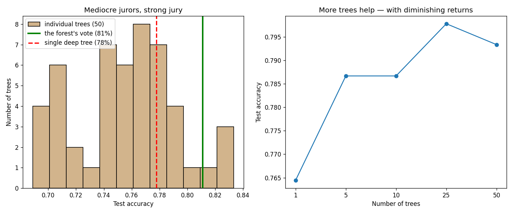

# Learn More Python by Building a Random Forest

Part 4 of learning Python through ML — and the payoff of Part 3, which ended with a single deep tree at **100% train / 78% test: a +22% overfitting gap**. The forest is the fix: many diverse trees, each wrong in its own way, voting. The new Python: **sets**, **`pathlib` + `sys.path`** (importing across folders — a thing you'll hit in every real project), `rng.choice(replace=False)`, and `time.perf_counter`.

**Theory companion:** [ml/random-forest.md](../../../ml/random-forest.md) — bagging, random features, OOB. Read it first; this tutorial turns each of its three ideas into code.

**The final result:** [random_forest.py](random_forest.py)

```bash
# Run it (from python/ml-practice/):
uv run random-forest/random_forest.py
```

---

## Step 0 — Importing from a *sibling folder* (`pathlib`, `__file__`, `sys.path`)

The decision-tree sequels imported `decision_trees` from the *same* folder, which worked because a script's own directory is on Python's import search path. This tutorial lives in `random-forest/`, one folder over — and the import breaks. The explicit fix:

```python
import sys
from pathlib import Path

sys.path.append(str(Path(__file__).parent.parent / "decision-trees"))
from decision_trees import TreeNode, gini, majority, make_loans, predict_one
```

Unpacking it:

- **`__file__`** — the path of the current script, always available. The anchor for "where am I?"
- **`pathlib.Path`** — object-oriented paths; `/` is overloaded to join segments (`parent.parent / "decision-trees"` reads like a filesystem walk). The modern replacement for `os.path.join` string surgery — think Node's `path.join(__dirname, "..", "decision-trees")`.
- **`sys.path`** — the list of directories Python searches for imports. Appending to it is the quick fix; the *proper* fix is a shared package (that's decision-trees' exercise 5, and this is the moment it becomes motivated rather than theoretical).

## Step 1 — Bootstrap sampling: sets and the 37% fact

Trick #1 from the theory doc: each tree trains on n rows drawn **with replacement** — repeats allowed, some rows never drawn. Two lines:

```python
sampled = rng.integers(0, n, size=n)        # with replacement — repeats are the point
oob = np.array(sorted(set(range(n)) - set(sampled.tolist())))   # set difference!
```

**Python sets**, finally: unordered collections of unique values, with operators — `-` difference, `&` intersection, `|` union. "Rows that exist minus rows that were drawn" *is* a set difference, so write it as one. (JS got `Set.prototype.difference` only recently; Python's had this since forever.)

Real output:

```
sampled rows: [0, 0, 0, 2, 4, 4, 6, 6, 7, 8]
never drawn (out-of-bag): [1, 3, 5, 9]
OOB fraction over 500 draws of n=300: 36.7% (theory says 1/e ≈ 36.8%)
```

Row 0 drawn three times, rows 1/3/5/9 never — that's bootstrap. And the theory doc's "~37% of rows are left out" isn't folklore: P(a row is never drawn) = (1−1/n)ⁿ → 1/e. Your 500-draw experiment lands within 0.1% of it.

## Step 2 — Trick #2: random features per split

Bagging alone isn't enough — if one feature dominates, every tree grabs it and they all look alike. So each split may only consider a random handful of features:

```python
def best_split_random(X, y, rng, max_features):
    allowed = rng.choice(X.shape[1], size=max_features, replace=False)
    # ... Part 3's loop, but only over `allowed` ...
```

**`rng.choice(..., replace=False)`** is sampling *without* replacement — pick k distinct features. Compare with Step 1's `rng.integers`, which samples *with* replacement. Two sampling modes, two idioms; mixing them up is a classic bug.

`build_random_tree` is Part 3's recursion with this split swapped in and **no depth limit** — forest trees are *deliberately* overgrown. The variance that ruins one tree is exactly what the vote cancels.

## Step 3 — The forest: a list of trees and a vote

```python
def predict(self, X):
    votes = np.stack([[predict_one(t, row) for row in X] for t in self.trees_])
    return (votes.mean(axis=0) >= 0.5).astype(int)
```

A forest is literally `list[TreeNode]`. The vote is a two-step idiom: stack per-tree predictions into an (n_trees × n_rows) array, then `mean(axis=0)` — since votes are 0/1, the mean *is* the fraction voting "default," and `>= 0.5` is majority rule. (A nested list comprehension feeding `np.stack` — comprehensions compose.)

And the OOB score — the theory doc's "free validation" — in ten lines: each row is judged only by trees that never saw it, ballots collected in a `defaultdict(list)`:

```python
for tree, oob in zip(self.trees_, self.oob_sets_):
    for i in oob:
        ballots[i].append(predict_one(tree, X[i]))
```

## Step 4 — The head-to-head (and `time.perf_counter`)

```
               model | train |  test |  gap | fit time
    single deep tree |  100% |   78% | +22% |    0.00s
 scratch forest (50) |  100% |   81% | +19% |    0.63s
forest OOB estimate: 76% (vs actual test 81%)
```

Read it honestly:

- **The vote beats the expert**: 78% → 81% on test, with the same 100% train memorization underneath. Each tree memorized *different* noise; the vote kept the shared signal.
- **Why "only" 81%?** The labels are probabilistic (a borderline applicant defaults by dice roll), so this dataset has a noise ceiling around ~82%. Forests fix *variance* — they can't beat irreducible noise. Knowing when you've hit the ceiling is a skill.
- **OOB at 76%** is a serviceable free estimate of the 81% truth — close, slightly conservative, zero test data spent. (`time.perf_counter()` is the right stopwatch for timing code — monotonic, high-resolution; `time.time()` is for wall-clock timestamps.)

## Step 5 — More trees, measured honestly (5 seeds each)

A first attempt at this sweep used one run per size — and a lucky single tree scored 81%, "beating" the forest. Small test set, high variance: one run of anything proves nothing. The fix is the same medicine the forest itself uses — average over randomness:

```
  1 trees → test 76% ± 3.5%
  5 trees → test 79% ± 2.8%
 10 trees → test 79% ± 2.8%
 25 trees → test 80% ± 3.0%
 50 trees → test 79% ± 2.5%
→ bigger juries are better AND more consistent (smaller ±)
```

Both columns matter: the mean climbs *and the spread tightens*. The left panel of the plot is the theory doc's jellybean jar made visible — 50 individual trees scattered from 69% to 83%, and the forest's vote sitting to the right of nearly all of them:



## Step 6 — sklearn's version

```
test 81%, OOB 78%
importances: income_k 36%, credit_score 33%, debt_ratio 31%
```

`RandomForestClassifier(n_estimators=200, oob_score=True, n_jobs=-1)` — same algorithm you just wrote, parallelized (`n_jobs=-1` = all CPU cores; your scratch forest builds trees one at a time, which is why it took 0.63s). Matching test accuracy with your own implementation is the certificate that you understand the thing.

---

> 🧠 **Quick recall — answer out loud before the exercises** (all answers are above):
> 1. Why doesn't `from decision_trees import ...` work from this folder, and what are the two fixes?
> 2. `rng.integers(0, n, n)` vs `rng.choice(k, size, replace=False)` — which samples with replacement, and where does each appear in a forest?
> 3. Where does the 37% OOB figure come from?
> 4. Why are forest trees grown with NO depth limit when Part 3 taught you to cap depth?
> 5. How does `votes.mean(axis=0) >= 0.5` implement majority voting?
> 6. The forest hit 81% and won't go higher on this data — why is that not a bug?
> 7. Why did the tree-count sweep need 5 seeds per size?

---

## Exercises

1. **Diversity is the point:** set `max_features` to 3 (all features — bagging only) and rerun the head-to-head. The theory doc claims bagging alone makes correlated trees; does your test accuracy drop? Then try `max_features=1` — too much randomness?
2. **OOB vs test, properly:** run 10 seeds and collect (oob_score_, test accuracy) pairs. Plot one against the other — how correlated is the free estimate with the truth?
3. **`predict_proba`:** the vote fraction `votes.mean(axis=0)` *is* a probability estimate. Expose it as `predict_proba`, then reuse Part 2's threshold sweep on the forest — precision/recall trading at thresholds other than 0.5.
4. **Feature importance for the forest:** thread the `defaultdict` accumulator from [decision-trees/from-scratch.md](../decision-trees/from-scratch.md) through `build_random_tree`, sum across all 50 trees, normalize. Compare with sklearn's 36/33/31 split.
5. **Parallel in Python:** replace the sequential tree-building loop with `concurrent.futures.ProcessPoolExecutor` and time it with `perf_counter`. (You've just discovered why `n_jobs=-1` exists — and probably Python's process-spawn overhead too.)
6. **The package refactor:** do decision-trees' exercise 5 for real now — move `gini`, `TreeNode`, `best_split`, `majority`, `predict_one` into `tree_core.py` at the `ml-practice` root, and update all three tree scripts to import it. Delete the `sys.path` hack from this file as your victory lap.

---

## What you learned

**Python:** sets and set operations, `pathlib.Path` + `__file__` + `sys.path` (and why cross-folder imports need help), sampling with vs without replacement, nested comprehensions into `np.stack`, `mean(axis=0)` as vote-counting, `time.perf_counter`, reporting mean ± spread instead of single runs.

**Algorithms:** bootstrap → ~37% OOB for free; bagging + random features = forced diversity = errors that cancel; overgrown trees are *correct* inside a forest; OOB as free validation; noise ceilings (variance is fixable, irreducible noise is not); and the meta-lesson — single runs lie, averages testify.

**Next:** [ml/gradient-boosting.md](../../../ml/gradient-boosting.md) for theory, then [../gradient-boosting/](../gradient-boosting/) — Part 5, the other ensemble philosophy: trees built *sequentially*, each fitting what the previous ones got wrong.
