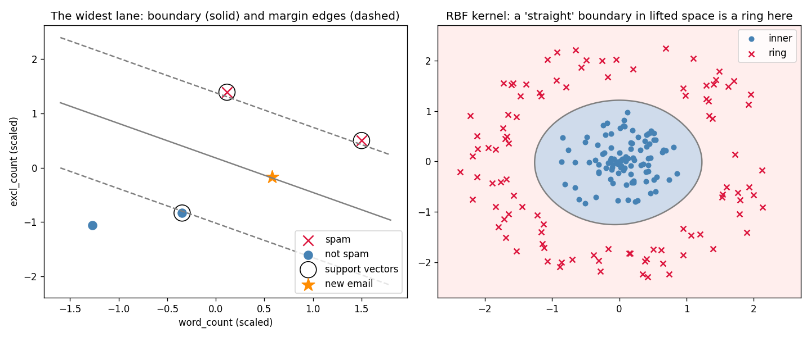

# Learn More Python by Building a Support Vector Machine

Part 6 of learning Python through ML. Back to gradient descent — but where logistic regression (Part 2) asked *"what's the probability?"*, SVM asks a geometric question: *"where is the **widest lane** between the classes?"* The new Python: **functions as values** (a dict of kernels you look up and call), **`Callable` type hints**, **`assert` as inline tests**, `np.where` as a vectorized ternary, `np.maximum`, `np.linalg.norm`, and the **meshgrid → ravel → reshape** dance behind every decision-boundary plot you've ever seen.

**Theory companion:** [ml/svm.md](../../../ml/svm.md) — margins, support vectors, the kernel trick, the C knob. Read it first; this tutorial reproduces its email arithmetic and makes its ring picture real.

**The final result:** [svm.py](svm.py)

```bash
# Run it (from python/ml-practice/):
uv run svm/svm.py
```

---

## Step 1 — Scaling: the doc's email table, reproduced

The theory doc is blunt: *scaling is mandatory for SVM, not optional* — it measures geometric distances, and an unscaled `word_count` axis (range ~300) would make the `excl_count` axis (range ~11) invisible. Standardize-by-hand is Part 2's code, and it lands on the doc's exact numbers:

```
word_count_scaled: [ 0.1 -1.3  1.5 -0.3]
excl_count_scaled: [ 1.4 -1.1  0.5 -0.8]
```

## Step 2 — The ±1 trick and the hinge loss

Two ideas that define SVM, each one line of NumPy:

```python
y_pm = np.where(SPAM == 1, 1, -1)        # labels 0/1 → -1/+1

def hinge_loss(scores, y_pm):
    return float(np.maximum(0.0, 1.0 - y_pm * scores).mean())
```

- **`np.where(cond, a, b)`** — the vectorized ternary: `cond ? a : b` for a whole array at once. (You met `np.where(mask)[0]` returning *indices* in Part 2's stratified split — same name, different mode. With three arguments it's a ternary.) Why ±1 instead of 0/1? So that `y * score` collapses both classes into one number: **positive and big = confidently right**, regardless of which class. One expression instead of two cases.
- **`np.maximum(a, b)`** — *elementwise* max of two arrays (or an array and a scalar). Python's built-in `max` would try to reduce the whole array to one value — wrong tool. This distinction (`np.maximum` vs `max`, like `np.sum` vs `sum`) is a classic NumPy gotcha.

And the hinge itself, demonstrated on three scores for a true `+1` point:

```
score +2.0, true +1 → hinge 0.0   (outside the lane — free)
score +0.4, true +1 → hinge 0.6   (inside the lane)
score -0.7, true +1 → hinge 1.7   (wrong side — expensive)
```

That's the personality difference from Part 2 in one table: **log loss never stops rewarding extra confidence; hinge loss is satisfied the moment you're outside the lane** (margin > 1) and charges nothing further. Only points in or beyond the lane matter — which is exactly why only support vectors matter.

## Step 3 — The scratch SVM: widen the lane until it leans on the data

Training minimizes `lam/2·‖w‖² + hinge`: the hinge pushes points out of the lane, and shrinking `w` *widens* the lane (width = `2/‖w‖` — small ‖w‖, fat margin). The gradient step reuses Part 2's loop with one new trick:

```python
margins = y_pm * (X @ self.w + self.b)
mask = margins < 1                            # ONLY lane-violators get a say
grad_w = lam * self.w - (y_pm[mask] @ X[mask]) / n
```

**A boolean mask as a *subgradient*:** the hinge has a kink at margin = 1 — no smooth derivative there. The fix is blunt and standard: points outside the lane contribute zero gradient (the mask drops them), points inside contribute fully. The mask *is* the derivative's case-split. Real output:

```
w = [0.53 0.83], b = -0.15
final hinge loss: 0.000  → margin width 2/||w|| = 2.03
support vectors (on the lane edge): [[0.1, 1.4], [1.5, 0.5], [-0.3, -0.8]]
new email scaled → [ 0.6 -0.2], score +0.02 → SPAM
```

Hinge 0.000 means every email is outside the lane; from there, regularization keeps widening the lane until it *leans* on its closest points — and `support_mask` finds them with a tolerance (`margin <= 1.1`, not `== 1.0`), because gradient descent settles *near* the edge, never exactly on it. Floating-point equality is a bug; tolerance is the idiom. (`np.linalg.norm(w)` is √(Σw²) — the vector length from the doc's symbol table, ‖w‖, as one call.)

Two honest footnotes, both teaching moments:

- The theory doc named **two** support vectors; the exact solver says **three** — the doc's two plus the second spam, which also ends up leaning on the lane. Your scratch model and sklearn agree with each other, point for point.
- That new-email score of `+0.02` vs the doc's `−0.04`: see Step 4.

## Step 4 — sklearn agreement, and kernels as dictionary values

```
sklearn w = [0.51 0.79], b = -0.16, support vectors per class: [1 2]
same new email, three solvers: doc -0.04, scratch +0.02, sklearn +0.0001
→ all ≈ 0: the point sits ON the boundary. The sign is noise; the tiny magnitude is the real answer
```

Three different solvers put the new email at −0.04, +0.02, and +0.0001 — it sits *on* the boundary, and which side it lands on is solver round-off. **Don't read the sign of a near-zero score; read the magnitude.** (This is the same "low |score| = low confidence" lesson as Part 2's probabilities near 0.5 — SVM just doesn't dress it up as a probability.)

Then the kernel zoo, and the Python idea it rides on — **functions are values**:

```python
KERNELS: dict[str, Callable[[np.ndarray, np.ndarray], float]] = {
    "linear": lambda a, b: float(a @ b),
    "rbf": rbf_kernel,                  # no parentheses — the function ITSELF
}
k = KERNELS["rbf"](a, b_pt)             # look it up, THEN call it
```

- Storing `rbf_kernel` without `()` stores the function object; `KERNELS["rbf"](a, b)` looks it up and calls it. Same first-class-functions story as JS (`const kernels = {rbf: (a,b) => ...}`), and exactly how sklearn's `kernel="rbf"` string dispatch works inside.
- **`Callable[[np.ndarray, np.ndarray], float]`** (from `collections.abc`) is the type hint for "a function taking two arrays, returning a float" — TypeScript's `(a: A, b: B) => number`, Python spelling.
- **`assert`** turns the theory doc's arithmetic into a test that runs every time:

```python
assert round(rbf_kernel(a, b_pt), 2) == 0.61    # the doc's K([1,2],[1,3])
assert rbf_kernel(a, c_pt) < 1e-20              # the doc's K([1,2],[9,9]) ≈ 0
```

If the doc and the code ever disagree, the script *crashes* instead of printing a wrong number. `assert` is the zero-ceremony test — pytest is industrial-strength `assert` with a runner around it.

## Step 5 — The kernel trick, performed by hand and then by magic

The doc's "picture you can't unsee": a ring of one class around the other. No straight line works — and now you can *measure* that:

```
linear SVM on raw 2D rings:        63%  (a line can't cut a ring)
SAME linear SVM + your 3rd axis:   96%  (flat plane in 3D)
sklearn RBF on raw 2D (no lift!):  100%  (the kernel lifts implicitly)
```

The middle line is the whole kernel trick, demystified — you do the lift *manually*:

```python
lifted = np.column_stack([X_ring, (X_ring ** 2).sum(axis=1)])  # height = dist²
```

One new column — distance² from center — and the *same* linear SVM jumps from 63% to 96%, because in 3D the inner blob sits low, the ring floats high, and a flat plane slips between them. The RBF kernel gets 100% without you building any column: it computes similarities *as if* the data were lifted, without ever constructing the lifted coordinates. **Manual feature engineering vs the kernel doing it implicitly — same idea, and now you've done both.**



The right panel is drawn with the standard boundary-plot dance — worth knowing by name because every ML blog post uses it:

```python
xx, yy = np.meshgrid(np.linspace(-2.7, 2.7, 300), np.linspace(-2.7, 2.7, 300))
grid = np.column_stack([xx.ravel(), yy.ravel()])     # (90000, 2) of pixels
zz = rbf_svc.decision_function(grid).reshape(xx.shape)
```

**`meshgrid`** builds a 300×300 grid of pixel coordinates; **`.ravel()`** flattens each to 90,000 values so the model can score every pixel in one vectorized call; **`.reshape(xx.shape)`** folds the scores back into the image. Flatten → predict → unflatten. The left panel, meanwhile, is the doc's wall-between-neighborhoods drawn from your own `w` and `b`: solid line at score 0, dashed lane edges at ±1, support vectors circled — and the un-circled blue point demonstrating the rubber-band rule (it could move anywhere outside the lane and nothing would change). The new-email star sits visibly *on* the wall.

## Step 6 — The C knob, on data where perfection is impossible

The 4 emails were separable, so C barely mattered. Overlapping blobs force the real tradeoff — wide forgiving lane vs punishing every mistake:

```
C=0.01   train 57%  test 51%  support vectors 224/225
C=1.0    train 86%  test 84%  support vectors  79/225
C=100.0  train 90%  test 84%  support vectors  68/225
```

Read the last column — it's the doc's claim made countable: at C=0.01 the lane is so wide that **224 of 225 points are inside it** (everything is a support vector — the model has learned almost nothing); at C=100 the model buys 4 points of train accuracy that **test never sees** — memorizing overlap noise. C=1 is the doc's recommended default, and here's why. Same train/test-gap diagnosis as Parts 3–5, third model family in a row.

---

> 🧠 **Quick recall — answer out loud before the exercises** (all answers are above):
> 1. Why ±1 labels instead of 0/1 — what does `y * score` buy you?
> 2. `np.maximum(0, x)` vs `max(0, x)` on an array — which works, and what does the other do?
> 3. Hinge vs log loss: which one stops caring once you're confidently right?
> 4. What does the boolean mask in the gradient implement, and why is it needed at the kink?
> 5. Margin width is `2/‖w‖` — so what does *shrinking* w do to the lane?
> 6. Three solvers scored the new email −0.04 / +0.02 / +0.0001 — what's the correct conclusion?
> 7. What's stored in `KERNELS["rbf"]`, and what do the parentheses add?
> 8. At C=0.01, 224/225 points were support vectors — what does that tell you about the model?

---

## Exercises

1. **The rubber-band rule, verified:** delete the un-circled email (`[-1.3, -1.1]`) and refit — confirm `w`, `b`, and the margin width barely move. Then delete a *support vector* and watch the lane swing. The doc's "remove any non-support-vector and nothing changes," tested.
2. **Gamma is C's twin:** on the rings, fit `SVC(kernel="rbf", gamma=g)` for `g in [0.01, 1, 100]` and draw the three boundaries with the meshgrid dance. The doc claims low gamma = smooth/underfit, high gamma = wiggly islands around individual points. See it.
3. **The trick, proven with arithmetic:** for 2D points, the polynomial kernel `K(a,b) = (a·b)²` equals the dot product of explicitly lifted features `[a₁², √2·a₁a₂, a₂²]`. Add `"poly2"` to the `KERNELS` dict, write the explicit lift, and `assert` they match on random pairs — you've verified that the kernel computes the high-dimensional dot product without going there.
4. **Soft margin by hand:** plant one spam email deep in not-spam territory and refit the scratch model with `c=100` vs `c=0.1`. Print the margin width and the outlier's personal hinge loss in both. Which model lets the outlier be wrong, and what does it get in exchange?
5. **SVM vs Part 2:** fit your `LogisticRegressionScratch` on the Step 6 blobs and compare test accuracy with `SVC`. Then compare what each gives you that the other can't (probabilities vs margins). The doc's "LR maximizes likelihood, SVM maximizes margin" — felt, not memorized.
6. **The O(n²) gotcha, timed:** generate blobs at n = 500 / 2,000 / 8,000 and time `SVC(kernel="rbf").fit` with `time.perf_counter` (Part 4's stopwatch). Does fit time scale ~16× when n scales 4×? You've measured why the doc says "switch to gradient boosting at scale."

---

## What you learned

**Python:** `np.where` as a vectorized ternary (vs its index-finding mode), `np.maximum` vs `max`, boolean masks as subgradients, `np.linalg.norm`, tolerance instead of float equality, functions as dict values + `Callable[...]` type hints, `assert` as zero-ceremony tests, and meshgrid → ravel → predict → reshape for decision surfaces.

**Algorithms:** the margin as empty space that buys generalization; hinge loss as "satisfied outside the lane" (vs log loss's endless appetite); support vectors as the only points the model remembers; near-zero scores mean "on the boundary" regardless of sign; the kernel trick as feature-lifting you don't have to perform (you performed it once anyway, by hand, 63%→96%); C as the wide-lane/no-mistakes dial, with support-vector counts as its gauge; and scaling as a precondition, not a preference.

**Next:** [ml/knn.md](../../../ml/knn.md) for theory, then Part 7 — K-Nearest Neighbors, the model that doesn't train at all: distances, again, but this time *they are the whole algorithm*.
